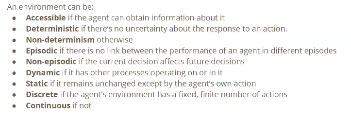
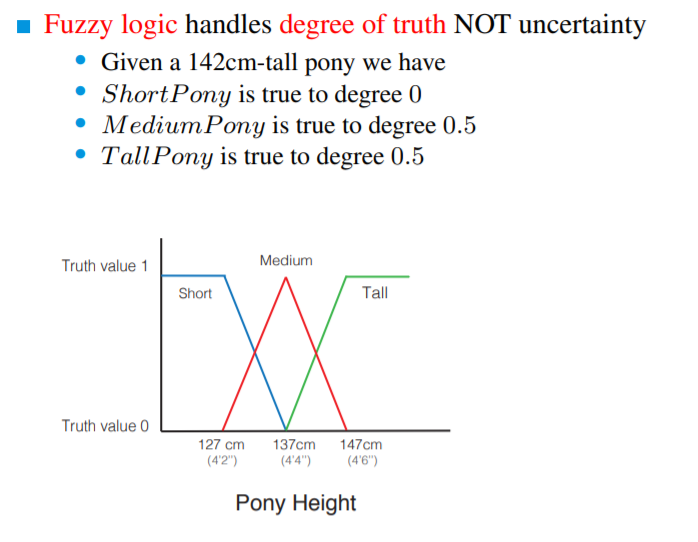
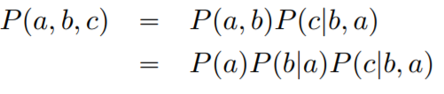
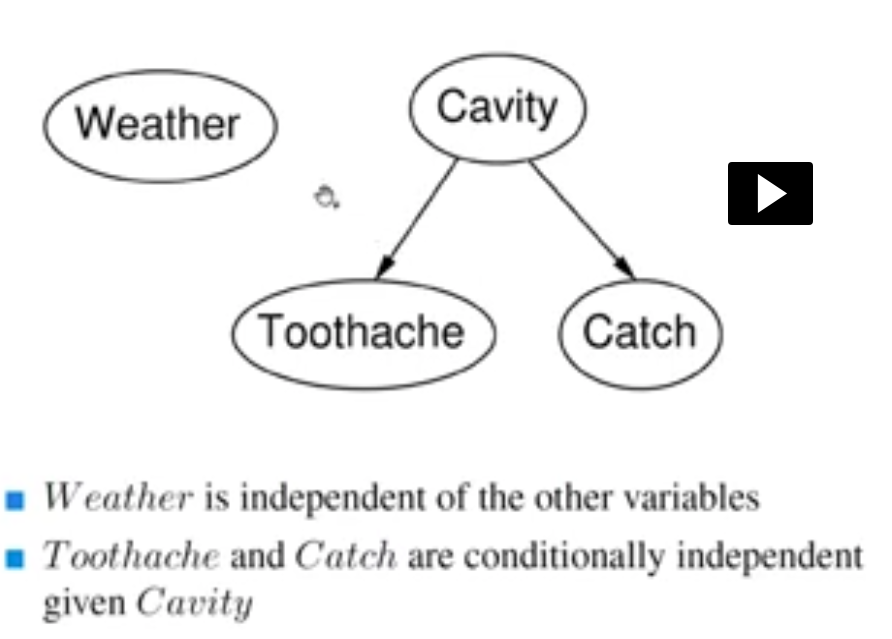

[TOC]

# Week 1

An agent, normally receives inputs (images, audios, waves from object detectors, etc.) called percepts.
These percepts are elaborated, help generate new states which, in turn, help decide the next action

## Environment Characteristics

 
 
 
 
 
 
# Week 2

## Observability

- Full observability: Everything can be observed.
    
        Chess, Go etc.
- You may get more information going on, but, at least at the beginning, not everything belonging to the environment (and about other possible agents) is known.
        
        Poker (you don't know enemies cards), a maze, real world, self-driving cars etc.

### Partial observability causes
Partial observability may depend on different things:
- The agent may **lack of some sensors**, or they are not powerful enough (physic limitations like atoms);
- There may be **noise** interferring with the sensors;
- **Computational complexity**;
- **World structure**.

 

## Uncertainty

### Handling Uncertainty
- Using **probability** (given the available evidences); probabilistic assertions summerise the effects of:
    - **laziness**: failing to enumerate exceptions, qualifications, etc.;
    - **ignorance**: lack of relevant facts, initial conditions etc. (we tend to ignore these).
    
    Nonetheless, probabilistic assumptions come with issues such as computational complexities, obtaining values, semantics etc.

> 
> **Fuzzy logic** might look like probabilistic, but it's completely deterministic

- Using **utility theory**, used to represent and infer preferences;
- Using **decision theory** (utility theory + probabilistic theory).

## Probabilistic basis

>**Notion** -> P(*h* | *e*) is the probability of the hypothesis *h* given the event *e*

**sample space** (denoted as Big-Omega) -> indicates all the possible outcomes
*small-omega belongs to Big-omega* is a simple point, atomic event (it can't be two of these events at the same time)

An **event** is a set of sample points

**Probability space** (or **model**) is a sample space with an assignment P(*w*) for every *w* *belongs to* *Big-omega* (which sum has to be 1)

**Proposition**: mathematical statements which are true or false like (Cavity = True)
    
    You can use Boolean logic operators (AND, OR ...) as well as mathematical (<, >, != ...)

P(a OR b) = P(a) + P(b) - P(a AND b) 
    
    (a AND b is basically already calculated in P(a), so P(b) calculates it again)

**Prior or unconditional probabilites** happens when two probabilities are not related to to each other. Like having a cavity (Carie) and a sunny weather.

**Posterior probabilities** happens when we have additional evidences affecting the probability fo something:

>e.g. P( cavity = true ) = 0.1  . . . . . P( cavity | toothache ) = 0.2

A nice to remember formula is:
> P(a | b) = P(a AND b) / P(b)
> (assuming p(b) > 0)

Probability distribution can be represented as a vector which has to be exhaustive (include all the possible outcomes), mutual exclusive (no option has to be repeated), and of course the sum has to be 1.
> eg. <0.72, 0.1, 0.08, 0.1>

A subtle notation to look at is P() which generates a number and **P()** (bold) which generates a vector.
In the case the formula is **P**(H | e), the resulting vector is <P(H | e), (¬H | e)>

When looking at the `given clause` (in P(a | b) b is the given clause), some components can be removed. For instance, if a: *Cavity = TRUE* and b: *Toothache & Cavity*, of course P(a | b) = 1, and the Tootache part can be removed as its contribution is less than the other or, like in other cases, meaningless (suppose rather than tootache I had *Curtains Blue = True*).
<ht</ht>
> P(a AND b) = P(a | b)`*`P(b) = p(b | a)`*`P(a)

Comma `,` is often used in place of `AND`, so `P(a,b) = P(a AND b)`

### Chain Rule

> P(a,b) = P(a,b,c) + P(a,b,¬c)

> **P**(a | b) = *alpha*\***P**(a,b) 
where *alpha* = 1 / P(b)

### Independence
When you create a matrix of the possibilities say of **P**(Cavity, Weather), the two of them are not related, so **P**(Cavity, Weather) = **P**(Cavity)\***P**(Weather). Suppose both of them have 100 possible outcomes, the matrxi resulting would be 100 * 100, but being **independent**, you can store them as 100 + 100. Furthermore, as the sum of the events always adds up to 1, you can store them as 99 + 99.

### Conditional Independence
Absolute independence is amazing, but rare. It formulates like 
>A is **conditionally independent** of B *given* C
>**P**(a | b, c) = **P**(a | b)

**ADVICE:** in case you have P(a | b) which is very high, don't automatically expect P(b | a) to be high as well    

# Week 3

## Naive Bayes & Bayesian networks

**Naive Bayes** means that you naively assume there's no correlation between 2 events.
> 
> 
> **Bayesian networks** are a vay to represent these dependences

> **CPT** (conditional probability table) are boolean table showing probabilites
> 

I AM NOT SURE WHICH IS THE CORRECT ONE *****
--
- A further way to reduce the storage is that to scompose a random variable, and then remove one of them
> e.g. **North America** <=> **Mexico** V **USA** V **Canada** (one of them can go)

- If there is a boolean random variable which is implied by other variables, this one can be omited
> e.g. **North America** <=> **Mexico** V **USA** V **Canada**, North America is already specified by the others, hence, we can omit it

## Markov Blanket
A Markov Blanket of a node X is the set of:
- parents of X
- children of X
- parents of X's children

## Inference
> **Given some evidence and reasoning, what conclusions can we draw**

### Inference by ENUMERATION
Among all the inferences, this is the only one that is **deterministic** as opposed to the others which are **probabilistic**.

When sampling, you can just take whatever sample you get, you can **reject** your samples if they are not efficient, or, as opposed to the latter, you can **weight** your samples, so you don't have to throw them away.

 
 
 
 
 
 
 
 
 
 
 
 
 
 
 