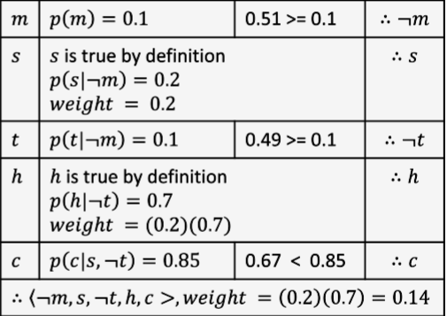
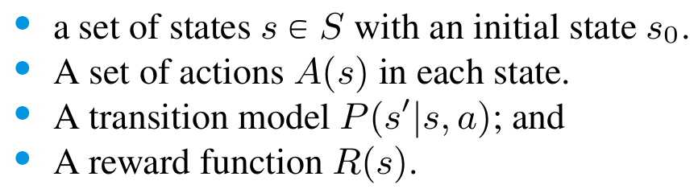
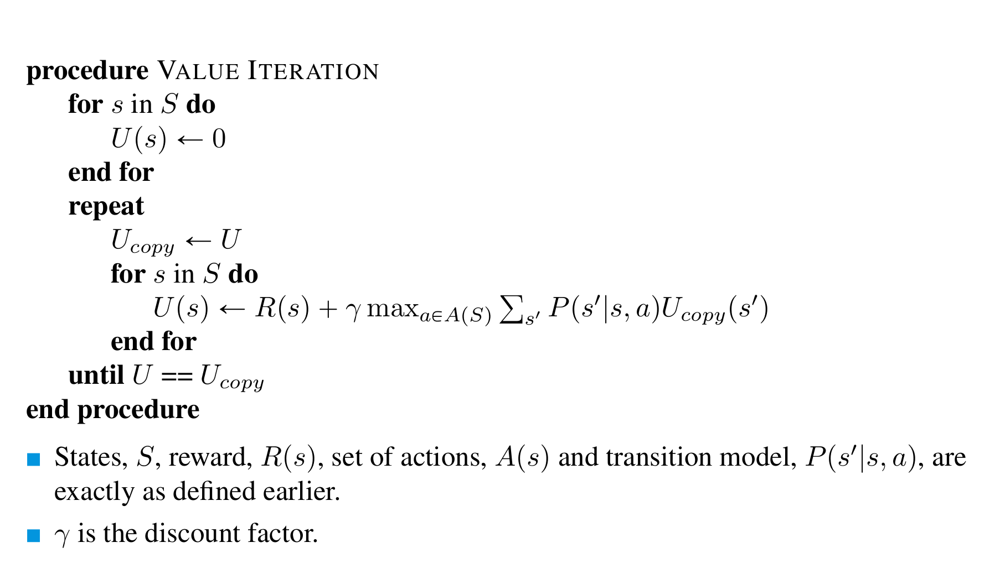
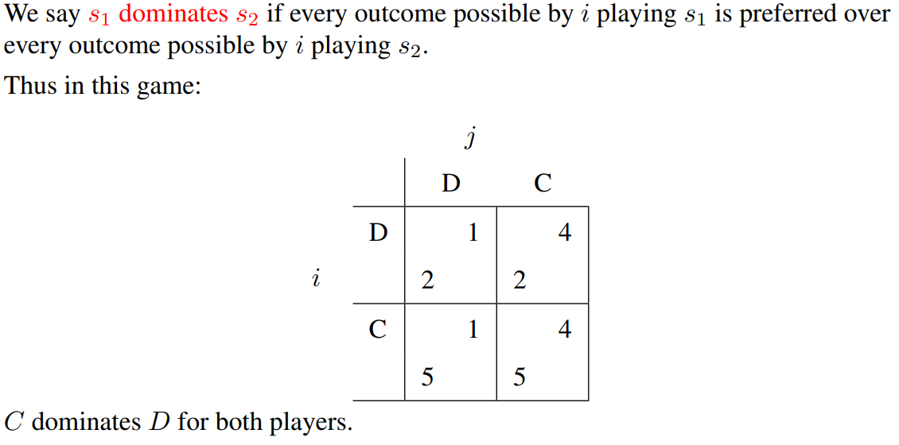

[TOC]

# Week 1

An agent, normally receives inputs (images, audios, waves from object detectors, etc.) called percepts.
These percepts are elaborated, help generate new states which, in turn, help decide the next action

## Environment Characteristics

 
 
 
 
 
 
# Week 2

## Observability

- Full observability: Everything can be observed.
    
        Chess, Go etc.
- You may get more information going on, but, at least at the beginning, not everything belonging to the environment (and about other possible agents) is known.
        
        Poker (you don't know enemies cards), a maze, real world, self-driving cars etc.

### Partial observability causes
Partial observability may depend on different things:
- The agent may **lack of some sensors**, or they are not powerful enough (physic limitations like atoms);
- There may be **noise** interferring with the sensors;
- **Computational complexity**;
- **World structure**.

 

## Uncertainty

### Handling Uncertainty
- Using **probability** (given the available evidences); probabilistic assertions summerise the effects of:
    - **laziness**: failing to enumerate exceptions, qualifications, etc.;
    - **ignorance**: lack of relevant facts, initial conditions etc. (we tend to ignore these).
    
    Nonetheless, probabilistic assumptions come with issues such as computational complexities, obtaining values, semantics etc.

> 
> **Fuzzy logic** might look like probabilistic, but it's completely deterministic

- Using **utility theory**, used to represent and infer preferences;
- Using **decision theory** (utility theory + probabilistic theory).

## Probabilistic basis

>**Notion** -> P(*h* | *e*) is the probability of the hypothesis *h* given the event *e*

**sample space** (denoted as Big-Omega) -> indicates all the possible outcomes
*small-omega belongs to Big-omega* is a simple point, atomic event (it can't be two of these events at the same time)

An **event** is a set of sample points

**Probability space** (or **model**) is a sample space with an assignment P(*w*) for every *w* *belongs to* *Big-omega* (which sum has to be 1)

**Proposition**: mathematical statements which are true or false like (Cavity = True)
    
    You can use Boolean logic operators (AND, OR ...) as well as mathematical (<, >, != ...)

P(a OR b) = P(a) + P(b) - P(a AND b) 
    
    (a AND b is basically already calculated in P(a), so P(b) calculates it again)

**Prior or unconditional probabilites** happens when two probabilities are not related to to each other. Like having a cavity (Carie) and a sunny weather.

**Posterior probabilities** happens when we have additional evidences affecting the probability fo something:

>e.g. P( cavity = true ) = 0.1  . . . . . P( cavity | toothache ) = 0.2

A nice to remember formula is:
> P(a | b) = P(a AND b) / P(b)
> (assuming p(b) > 0)

Probability distribution can be represented as a vector which has to be exhaustive (include all the possible outcomes), mutual exclusive (no option has to be repeated), and of course the sum has to be 1.
> eg. <0.72, 0.1, 0.08, 0.1>

A subtle notation to look at is P() which generates a number and **P()** (bold) which generates a vector.
In the case the formula is **P**(H | e), the resulting vector is <P(H | e), (¬H | e)>

When looking at the `given clause` (in P(a | b) b is the given clause), some components can be removed. For instance, if a: *Cavity = TRUE* and b: *Toothache & Cavity*, of course P(a | b) = 1, and the Tootache part can be removed as its contribution is less than the other or, like in other cases, meaningless (suppose rather than tootache I had *Curtains Blue = True*).
<ht</ht>
> P(a AND b) = P(a | b)`*`P(b) = p(b | a)`*`P(a)

Comma `,` is often used in place of `AND`, so `P(a,b) = P(a AND b)`

### Chain Rule

> P(a,b) = P(a,b,c) + P(a,b,¬c)

> **P**(a | b) = *alpha*\***P**(a,b) 
where *alpha* = 1 / P(b)

### Independence
When you create a matrix of the possibilities say of **P**(Cavity, Weather), the two of them are not related, so **P**(Cavity, Weather) = **P**(Cavity)\***P**(Weather). Suppose both of them have 100 possible outcomes, the matrxi resulting would be 100 * 100, but being **independent**, you can store them as 100 + 100. Furthermore, as the sum of the events always adds up to 1, you can store them as 99 + 99.

### Conditional Independence
Absolute independence is amazing, but rare. It formulates like 
>A is **conditionally independent** of B *given* C
>**P**(a | b, c) = **P**(a | b)

**ADVICE:** in case you have P(a | b) which is very high, don't automatically expect P(b | a) to be high as well    

# Week 3

## Naive Bayes & Bayesian networks

**Naive Bayes** means that you naively assume there's no correlation between 2 events.
> 
> 
> **Bayesian networks** are a xvay to represent these dependences

> **CPT** (conditional probability table) are boolean table showing probabilites
> 

I AM NOT SURE WHICH IS THE CORRECT ONE *****
--
- A further way to reduce the storage is that to scompose a random variable, and then remove one of them
> e.g. **North America** <=> **Mexico** V **USA** V **Canada** (one of them can go)

- If there is a boolean random variable which is implied by other variables, this one can be omited
> e.g. **North America** <=> **Mexico** V **USA** V **Canada**, North America is already specified by the others, hence, we can omit it

## Markov Blanket
A Markov Blanket of a node X is the set of:
- parents of X
- children of X
- parents of X's children

## Inference
> **Given some evidence and reasoning, what conclusions can we draw**

### Inference by ENUMERATION
Among all the inferences, this is the only one that is **deterministic** as opposed to the others which are **probabilistic**.

When sampling, you can just take whatever sample you get, you can **reject** your samples if they are not efficient, or, as opposed to the latter, you can **weight** your samples, so you don't have to throw them away.

### Importance Sampling
Like for sampling, you may want to calculate a probability P(h | s, t).
The difference with normal sampling is that, since you want to calculate h given **s** and **t**, you assume that **s** and **t** are both true.

However, this will make the final result (probability) falsish. To fix this, you weight the samples that are taken for granted in the $given$ clause.

Suppose you have this network:

and you want to calculate $P(h|s, t)$, then, using random sampling you calculate $P(m), P(c | s, t), P(h | t)$, `but P(t | M) you assume it's true` as well as `P(s | M)` as they both are part of the given clause. 
> Look out, **M** is neither **m** nor **¬m** yet as it has to be calculated using sampling.

Say, using sampling, that **M = m (so m = True)**, in that case **s** is still True (as it's part of the given clause), but what is the $likelihood$ of it happening, aka. $P(s | m)$?
The value (in this case **weight**) is given in the CPT and it's `0.20`.
Then we do the same for **t**, and the weight for $P(t | m)$, which is `0.70`.

Now, whatever is the probability we obtain using sampling, we wight it taking into account the given clause events weights.
$<m, c, h, s, t* 0.20 * 0.70$ 

    [always keeping in mind that we don't sample s and t] 

# Week 4

## Expected Value
Suppose you play a game with different possible outcomes, some good and some bad ones.
The so called **Expected value**(**E[X]**) is the sum of the probabilities of each possible outcome. 
> e.g. you play a dice game and:
> - win **10\$** if the result is **6**, 
> - loose **2\$** if the result is **odd**,
> - loose **1\$** if anything else.
> 
> $P(winning 10\$) = 1/6, P(loosing 2\$) = 3/6, P(loosing 1\$) = 2/6$  
> E[X] = 1/6 \* 10 + 3/6 \* -2 + 2/6 \* -1 = 1/3
> as E[X] is positive, you should take the risk.

### Linearity of expectation formula
In the example, if you play 10 times, expected value doesn't change for each game, and the total is multiplied by 10. There's a rule called Linearity of expectation which is describes as:
> **E[a\*X + Y] &nbsp; = &nbsp; E[a*X] + E[Y] &nbsp; = &nbsp; aE[X] + E[Y]**

### a* Function
We want our agent to be rational, so, given:
- a set of states **S**;
- an action **a**, and **sa** is the new state after applying a;
- an **utility function $u()$**;
  
> **a\*** = argmax $u$(sa)

The problem is that in any realistic situation, the resulting state is probabilistic. Instead we have to calculate the **expected utility** of each action and make the choice on the basis of that.

In other words, for each action **a** with a set of outcomes **sa**, the agent should calculate the **E[$u($a$)$]** for every **a** and pick the best one.

But if the action we are dealing with is **stochastic**, and the outcome in unsure?
Say for instance that both actions a1 and a2 have multiple outcomes like this:

###### video 2

Now, there are 2 approaches to this problem:
- you are optimistic, and you hope the result will be the best (**maximax**), so the output of a\* would be the max value among the best values for each sa;
    > in this case, argmax(5, 7);
- or, if the there is a risk in getting the lowest score action (to say, the agent risks its life, or something very bad is related to it), you the best score among the worst ones for each action (**maximin**)
    > in this case, argmax(4, 3); 

 

## Markov Decision Process (MDP)

This greedy approach takes into account only the next state, but in real life, agents have to take a **series of decisions**.

We can write a transition model to describe these **stochastic actions** and the model looks like:

> $P(s'| s, a)$

where $a$ is the action that takes the agent from $s$ to $s'$.

The probability, in this case, depends only on the previous and the next state, there's no "memory", i.e. the agent doesn't care about the previous states. This **transition** is known as **first order Markovian**.
This leads to a process called **Markov Decision Process (or MDP)**:

### Policy
Denoted as $\pi$, a **policy is a solution**, that is, a choice of action for every state. 
In any state $s$, $\pi(s)$ identifies what action to take.
> e.g. **$\pi$**: $\pi(s$0$)$ = left, $\pi(s$1$)$ = left, $\pi(s$2$)$ = right, etc....

Naturally we’d prefer not just any policy but the **optimum** policy which we found comparing policies by the **reward** they generate.

The optimum policy **$\pi$*** (Pi star) is the policy with the highest expected value.
At every stage the agent should perform **$\pi$*$(s$0$)$**

###### video 3

## Utility Run
Previously we have defined the utility function for a state, although this can be useful sometimes, we tend to prefer the utility for a **sequence of actions** also called a **run**.
We denote this function as 
> **$U$r([s0, s1, s2, ...., sn])**

Different type of utilty functions can be distinguished:
- based on the **horizon: finite or infinite** (how many state you consider, I think);
- based on the **reward: stationary (fixed) or non-stationary(it can change)**;
- based on **how later the agent gets the reward: additive or discounted**
  >**Additive:** R(s0, s1, ..., sn) = R(s0) + R(s1) + ... + R(sn)
  >**Discounted:** R(s0, s1, ..., sn) = R(s0) + $\gamma$ R(s0) + ... + $\gamma$n R(sn) ***[0 <= $\gamma$ < 1]***
  > What this means for discounted utilities is that, since action far away from our current state may include random factors and noise, we diminish their values.

In a "world" where utilities functions are infinite and additive, the are nou bounds on the min/max score of the function, and the output may be useless. To solve this problem there are 3 solutions:

### Proper policies
Always end up in a terminal state, so a **finite** expected utilities. A PAC-MAN whose only aim is to stay alive does not operate a proper policies as the steps can be infinite.

### Average reward
Sum the rewards of each state in the function, and then divide by $n$, aka, calculate the average score of the states.

### Discounted rewards
Scale the the reward based on the number of steps required to reach a state. Even if you have infinite steps, after a threshold, the reward will be close to 0.

###### video 4

## Bellman Equation

The formula to calculate $U(s) = R(s) + \gamma*max \sum P(s' | s, a) U(s')$. 
What this formula means, is that given a state, to calculate its utility, when to know the reward you obtain from that state + a $\gamma$ factor times the best E[X] obtained from the following states reachable from the current state. 

In the pacman example, R(s) is the cost of the action (0.04), whereas the remaining component is taken from the utility score of each possible next state. 

In the problem where the agent goes 80% of the time in the direction you specify, and 10% it goes to either traversal direction, the Bellman formula would result in:

> As you can figure out, Bellman equation is not computable in linear space, as from a state you can reach n new states, which in turn can reach n new states ($n^n$)

To reduce the space complexity, it is possible to use parallelism. In this case by creating an independent thread for each possible action. 
This process is called **value iteration** and is described by this pseudo-code: 

> [LOOK AT THE .XLS FILE TO FIGURE OUT THE ALGORITHM]

Another thing to mention is the fact that a reward is not always positive. In the case of PACMAN, for example, making a move might have a good utility score, but if no food is eaten, the moves has a cost of .4, which is in fact the reward.

This is the updated formula of Bellman

###### video 5
 
## Policy Iteration

### Policy Evaluation 
 
### Policy Improvement
Just look at one step ahead and take the best policy according to the scores given by policy evaluation.

The policy iteration process $O(n^3)$ is way faster the value iteration one $O(n^n)$, especially when using an approximation.
However, it is not guaranteed to converge. For this reason, it may be a good idea to create a first schema using `Policy `Iteration, and then converge using `Value Iteration`

# Week 5 

###### video 1 Introduction to game theory and Payoff matrix

## Payoff matrix
Suppose you have **2 agents:** $i$ and $j$. Create a matrix: 
- For each move of $i$ create a row in the matrix. 
- For each move of $j$ create a column in the matrix. 
- In each cell, write the reward for each agent, given they operate the move in that combination (row, column)

This matrix should look like this:

However, it can be decomposed and a individual matrix can be created for each agent, and contains only the cost of such agent.

###### video 2 Dominant strategy

To reduce the size of the matrix, it is possible to remove columns and row when they are dominated by at least another column or row respectively.

Say you have: 

**R** is always a **dominated strategy**, so you can get rid of it.
As we have removed a column, we should now look at the rows (again if have already done it).
Nothing can be removed, so this is it.

###### video 3 Nesh Equilibrium

## Nesh Equilibrium (NE)

In Game Theory, it's called **Nash Equilibrium** a state in which, for each agent, if **ONLY** that agent makes a move, there's no improvement in the score.

> In general, we will say that two strategies **s1** and **s2** are in **Nash equilibrium (NE)** if:
> 1. under the assumption that agent $i$ plays $s1$, agent $j$ can do no better than play $s2$; and
> 2. under the assumption that agent $j$ plays $s2$, agent $i$ can do no better than play $s1$.

Not every interaction scenario has a pure strategy NE.
Some interaction scenarios **have more than one NE**.
The optimal pair of strategies might be as well in the NE.

###### video 4 Pareto Optimality

## Pareto Optimality (or Efficiency)

A **Pareto Efficient** state is state in which no agent wants to move away from.
In other terms, you only move away from it if either 
- the payoff improves for both agents;
- one agents ends up having the same payoff, but the other one improves it (the agent not improving has to allow it tho)

## Social Welfare

Conversely to the Pareto Efficiency, **Social Welfare** aims to maximise the total payoff of both agent, regardless with the score of each individual agent. So a (9, 0) is preferable to a (4, 4)

 
 
 
 
 
 
 
 
 
 
 
 
 
 
 