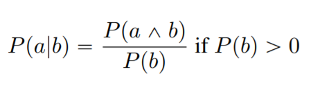
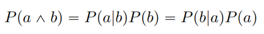
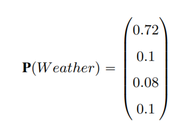
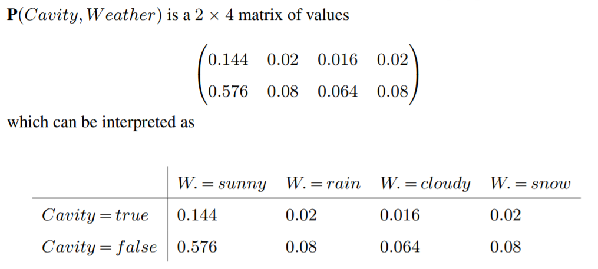
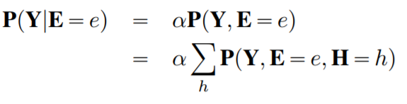
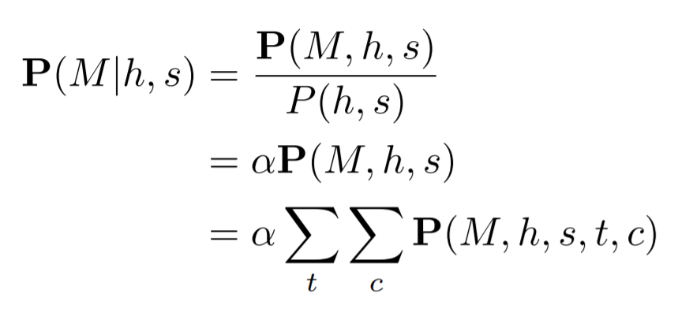

[TOC]

### PRIOR Probability
    P(h)

### POSTERIOR Probability or CONDITIONAL Probability

viceversa
##### PRODUCT RULE

### CHAIN RULE

Also

$P(h_1,h_2 | e) = P(h_1 | e)P(h_2|h_1,e)$

### Probability VECTOR
a = {sunny, windy, rainy}
[NOTE the **BOLD** notation which means it is a vector]
**P(a)** = <P(a = sunny), P(a = windy), P(a = rainy)>

> same as 
>  

### JOINT Probabilities
When there is an **AND**, often denoted by a "**,**".

### HIDDEN Variable
When a variable is hidden, but part of the probability, you compute the probability for all its values.

In a Bayesian network where $m$ is the root, aka independent variable, and you want to calculate it given its children or descendant:

 

> In this case, you have to compute the formula for the combinations of $t$ and $c$, so $(t, c), (t, ¬c), (¬t, c), (¬t, ¬c)$ 