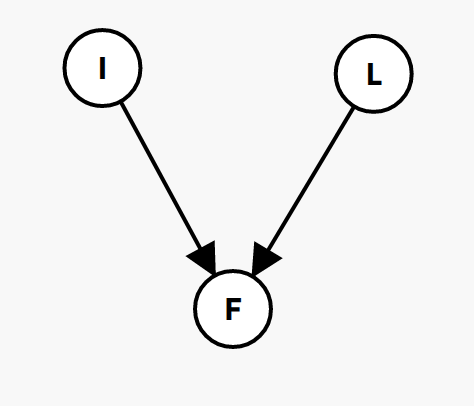

Tutorials

[TOC]

# WEEK 2 - Probability

## 1.

(a) P(cavity)    
> .108  + .012 + .072 + .008 

(b) **P**(Toothache)    
> <P(toothache), P(¬toothache)> -> <0.2, 0.8> 

(c) **P**(Toothache|cavity)    
> <P(toothache | cavity), P(¬toothache | cavity)> -> <.120, .080>
> if we normalize tho, it becomes <.6, .4>

(d) P(catch ∨ cavity)    
> .108 + .016 + .012 + .064 + .072 + .144

(e) **P**(Cavity|toothache ∨ catch)    
> <.108  + .012 + .072> / (.108 + .012 + .016 + .064 + .072 + .144)
> 0.2 / 

## 2. 
> You take a test *T* to tell whether you have a disease *D*. The test comes back positive. You know that **test is 95% accurate** (the probability of testing positive when you do have the disease is 0.95, and the probability of testing negative when you don’t have the disease is also 0.95). You also know that the disease is rare, **only 1 person is 10,000 gets the disease**. 
a) What is the probability that you have the disease?
b) How would this change if the disease was more common, say affecting 1 person in 100?

- a) P(D = True | 1/10.000) = 1 / 10.000
    *Nobody mentioned I took the test, as such, the probability I have the disease, based on the description, is that I am the 1 / 10.000 people who has it.*

- b) P(d = True | D = True | 1/100) = 1 / 100
    *Again, it's nowhere specified I took the test.*

> In my opinion, the 2 things are anyways unrelated as taking the test does not change the factor 1 / x people

## 3.
>Consider two tests, A and B, for a virus. **Test A is 95% effective at recognizing the virus when it is present** (that is 95% of the time that the virus is present, the test detects it), but has a 10% false positive rate (that is, **10% of the time it indicates the virus is present when it is not**). **Test B is 90% effective at recognizing the virus**, but has a **5% false positive rate**. The two test use different, independent, methods of indentifying the virus. 1% of all people have the virus. 

>Joe tests positive for the virus using test A. Bob tests positive using test B. Who is more likely to have the virus?

|            |  A True |  A False |  B True |  B False |
|------------|--------|-------|--------|-------|
|positive   |  95%   | 10%  | 90% | 5%
|negative   |  90%   | 5% | 95% | 10%

The formula is TP / (TP + FP)

P(A TP | A Positive) = 95 / (95 + 10) = 0.905

P(B TP | B Positive) = 90 / (90 + 5) = 0.947

**Hence, Bob has more chances of having the disease**

# Week 3

#### 1
Write down a Bayesian network that captures the knowledge that (a) Smoking causes cancer; and (b)Smoking causes bad breath. Given the information that:

    P(cancer|smoking) = 0.6
    P(badBreath|smoking) = 0.95
    P(smoking) = 0.2 
use a Naive Bayes model to determine P(smoking, cancer, badBreath). Assume that all three variables are binary: Smoking has values smoking and ¬smoking, Cancer has values cancer and ¬cancer, and BadBreath has values badBreath and ¬badBreath.

>smoking => cancer       P() = 0.6
>smoking => badBreath    P() = 0.95
>
>P(smoking) = 0.2 
>P(smoking, cancer, badBreath) = 0.2 * 0.6 * 0.95

#### 2

Write down a Bayesian network that captures the knowledge that **(a)** a `Late Start` can cause a student to `Fail their Project`, and **(b)** `Ignoring Advice` can cause a student to `Fail their Project`. Use the binary variables `Late Start`, with values **l** and **¬l**, `Ignore Advice`, with values **i** and **¬i**, and `Fail Project`, with values **f** and **¬f**. You know that `Late Start` and `Ignore Advice` are non-interacting cuases of `Fail Project`, so use a Noisy-Or model to build the conditional probability table relating the three variables from:

    P(f|l) = 0.7
    P(f|i) = 0.8

> 

#### 3 
How many numbers do we need to specify all the necessary probability values for the network in Figure 1?
> 1 + 1 + 4 = 6

How many would we need if there were no conditional independencies (if we didn’t have the network)?
> 1 + 1 + 1 = 3

##### 4
Compute the joint probability P(m, ¬t, h, s, ¬c)

>

#### 5
Use the enumeration algorithm to compute the probability of P(m|h, s).
>

#### 6
Use prior sampling to compute the joint probability over m, t, h, s and c.
Use the sequence of random numbers in Table 1. Give the results of the first 5 samples only.
If you need more random numbers than exist in Table 1, start that sequence again from the beginning.
>

#### 7
Use rejection sampling to compute P(m|h, s)
Use the sequence of random numbers in Table 1, starting at the beginning of the sequence. This time you
should show the results of the first 5 samples that aren’t rejected.
If you need more random numbers than exist in Table 1, start that sequence again from the beginning.
>

#### 8
Use importance sampling to compute P(m|h, s).
Use the sequence of random numbers in Table 1, starting at the beginning of the sequence, and again report
the results of the first five samples.
If you need more random numbers than exist in Table 1, start that sequence again from the beginning.
>

#### 9
Compute P(m|h, s) using Gibbs sampling.
Use the sequence of random numbers in Table 1, and give the results of the first 5 samples only.
If you need more random numbers than exist in Table 1, start that sequence again from the beginning.
>

#### 10
For the optional computational part of the tutorial, download the file wetGrass.py from KEATS.
This provides code, using pomegranate1, that implements the “Wet Grass” example from Lecture/Week
>

#### 3
You can run the example using:

 
 
 
 
 
 
 

