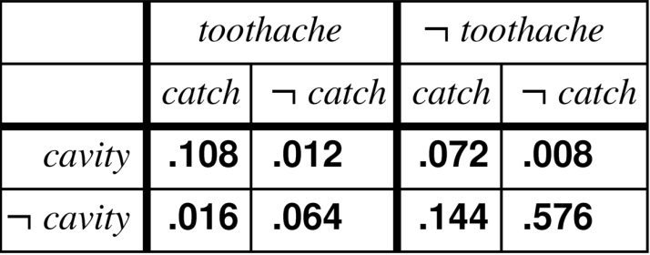

Tutorials

[TOC]

# WEEK 2 - Probability

## 1.

(a) P(cavity)    
> .108  + .012 + .072 + .008 

(b) **P**(Toothache)    
> <.108, .012, .016, .064>

(c) **P**(Toothache|cavity)    
> <.108, .012>

(d) P(catch ∨ cavity)    
> .108 + .072

(e) **P**(Cavity|toothache ∨ catch)    
> <.108, 0.12, .072> / (.108 + .012 + .016 + .064 + .072 + .144)

## 2. 
> You take a test *T* to tell whether you have a disease *D*. The test comes back positive. You know that **test is 95% accurate** (the probability of testing positive when you do have the disease is 0.95, and the probability of testing negative when you don’t have the disease is also 0.95). You also know that the disease is rare, **only 1 person is 10,000 gets the disease**. 
a) What is the probability that you have the disease?
b) How would this change if the disease was more common, say affecting 1 person in 100?

- a) P(D = True | 1/10.000) = 1 / 10.000
    *Nobody mentioned I took the test, as such, the probability I have the disease, based on the description, is that I am the 1 / 10.000 people who has it.*

- b) P(d = True | D = True | 1/100) = 1 / 100
    *Again, it's nowhere specified I took the test.

> In my opinion, the 2 things are anyways unrelated as taking the test does not change the factor 1 / x people

## 3.
>Consider two tests, A and B, for a virus. **Test A is 95% effective at recognizing the virus when it is present** (that is 95% of the time that the virus is present, the test detects it), but has a 10% false positive rate (that is, **10% of the time it indicates the virus is present when it is not**). **Test B is 90% effective at recognizing the virus**, but has a **5% false positive rate**. The two test use different, independent, methods of indentifying the virus. 1% of all people have the virus. 

>Joe tests positive for the virus using test A. Bob tests positive using test B. Who is more likely to have the virus?

|            |  A True |  A False |  B True |  B False |
|------------|--------|-------|--------|-------|
|positive   |  95%   | 10%  | 90% | 5%
|negative   |  90%   | 5% | 95% | 10%

The formula is TP / (TP + FP)

P(A TP | A Positive) = 95 / (95 + 10) = 0.905

P(B TP | B Positive) = 90 / (90 + 5) = 0.947

**Hence, Bob has more chances of having the disease**

# Week 3

## 1
smoking => cancer       P() = 0.6
smoking => badBreath    P() = 0.95

P(smoking) = 0.2 
P(smoking, cancer, badBreath) = 0.2 * 0.6 * 0.95

## 2

 
 
 
 
 
 
 

