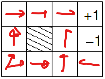
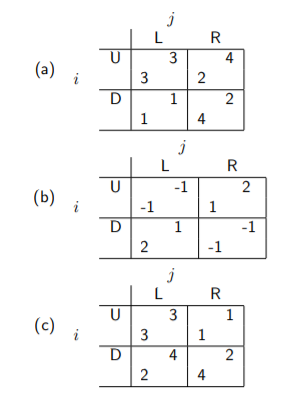
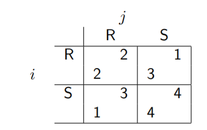
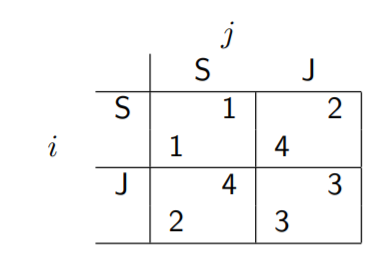
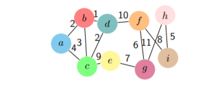

Tutorials

[TOC]

# WEEK 2 - Probability

## 1.

(a) P(cavity)    
> .108  + .012 + .072 + .008 

(b) **P**(Toothache)    
> <P(toothache), P(¬toothache)> -> <0.2, 0.8> 

(c) **P**(Toothache|cavity)    
> <P(toothache | cavity), P(¬toothache | cavity)> -> <.120, .080>
> if we normalize tho, it becomes <.6, .4>

(d) P(catch ∨ cavity)    
> .108 + .016 + .012 + .064 + .072 + .144

(e) **P**(Cavity|toothache ∨ catch)    
> <.108  + .012 + .072> / (.108 + .012 + .016 + .064 + .072 + .144)
> 0.2 / 

## 2. 
> You take a test *T* to tell whether you have a disease *D*. The test comes back positive. You know that **test is 95% accurate** (the probability of testing positive when you do have the disease is 0.95, and the probability of testing negative when you don’t have the disease is also 0.95). You also know that the disease is rare, **only 1 person is 10,000 gets the disease**. 
a) What is the probability that you have the disease?
b) How would this change if the disease was more common, say affecting 1 person in 100?

- a) P(D = True | 1/10.000) = 1 / 10.000
    *Nobody mentioned I took the test, as such, the probability I have the disease, based on the description, is that I am the 1 / 10.000 people who has it.*

- b) P(d = True | D = True | 1/100) = 1 / 100
    *Again, it's nowhere specified I took the test.*

> In my opinion, the 2 things are anyways unrelated as taking the test does not change the factor 1 / x people

## 3.
>Consider two tests, A and B, for a virus. **Test A is 95% effective at recognizing the virus when it is present** (that is 95% of the time that the virus is present, the test detects it), but has a 10% false positive rate (that is, **10% of the time it indicates the virus is present when it is not**). **Test B is 90% effective at recognizing the virus**, but has a **5% false positive rate**. The two test use different, independent, methods of indentifying the virus. 1% of all people have the virus. 

>Joe tests positive for the virus using test A. Bob tests positive using test B. Who is more likely to have the virus?

|            |  A True |  A False |  B True |  B False |
|------------|--------|-------|--------|-------|
|positive   |  95%   | 10%  | 90% | 5%
|negative   |  90%   | 5% | 95% | 10%

The formula is TP / (TP + FP)

P(A TP | A Positive) = 95 / (95 + 10) = 0.905

P(B TP | B Positive) = 90 / (90 + 5) = 0.947

**Hence, Bob has more chances of having the disease**

# Week 3

#### 1
Write down a Bayesian network that captures the knowledge that (a) Smoking causes cancer; and (b)Smoking causes bad breath. Given the information that:

    P(cancer|smoking) = 0.6
    P(badBreath|smoking) = 0.95
    P(smoking) = 0.2 
use a Naive Bayes model to determine P(smoking, cancer, badBreath). Assume that all three variables are binary: Smoking has values smoking and ¬smoking, Cancer has values cancer and ¬cancer, and BadBreath has values badBreath and ¬badBreath.

>smoking => cancer       P() = 0.6
>smoking => badBreath    P() = 0.95
>
>P(smoking) = 0.2 
>P(smoking, cancer, badBreath) = 0.2 * 0.6 * 0.95

#### 2

Write down a Bayesian network that captures the knowledge that **(a)** a `Late Start` can cause a student to `Fail their Project`, and **(b)** `Ignoring Advice` can cause a student to `Fail their Project`. Use the binary variables `Late Start`, with values **l** and **¬l**, `Ignore Advice`, with values **i** and **¬i**, and `Fail Project`, with values **f** and **¬f**. You know that `Late Start` and `Ignore Advice` are non-interacting cuases of `Fail Project`, so use a Noisy-Or model to build the conditional probability table relating the three variables from:

    P(f|l) = 0.7
    P(f|i) = 0.8

> 

#### 3 
How many numbers do we need to specify all the necessary probability values for the network in Figure 1?
> 1 + 1 + 4 = 6

How many would we need if there were no conditional independencies (if we didn’t have the network)?
> 1 + 1 + 1 = 3

##### 4
Compute the joint probability P(m, ¬t, h, s, ¬c)

>

#### 5
Use the enumeration algorithm to compute the probability of P(m|h, s).
>

#### 6
Use prior sampling to compute the joint probability over m, t, h, s and c.
Use the sequence of random numbers in Table 1. Give the results of the first 5 samples only.
If you need more random numbers than exist in Table 1, start that sequence again from the beginning.
>

#### 7
Use rejection sampling to compute P(m|h, s)
Use the sequence of random numbers in Table 1, starting at the beginning of the sequence. This time you
should show the results of the first 5 samples that aren’t rejected.
If you need more random numbers than exist in Table 1, start that sequence again from the beginning.
>

#### 8
Use importance sampling to compute P(m|h, s).
Use the sequence of random numbers in Table 1, starting at the beginning of the sequence, and again report
the results of the first five samples.
If you need more random numbers than exist in Table 1, start that sequence again from the beginning.
>

#### 9
Compute P(m|h, s) using Gibbs sampling.
Use the sequence of random numbers in Table 1, and give the results of the first 5 samples only.
If you need more random numbers than exist in Table 1, start that sequence again from the beginning.
>

#### 10
For the optional computational part of the tutorial, download the file wetGrass.py from KEATS.
This provides code, using pomegranate1, that implements the “Wet Grass” example from Lecture/Week
>

# Week 4

## 1
I have half an hour to spare in my busy schedule, and I have a choice between working quietly in my office and going out for a coffee.
If I stay in my office, three things can happen: 
- I can get some work done **(Utility = 8)**, or
- I can get distracted looking  at  the  US  mid-term  election  forecast  **(Utility = 1)**,  or 
- a  colleague  might  stop  by  to  talk  about  some work we are doing on revising the curriculum **(Utility = 5)**.

If  I  go  out  for  coffee,  I  will  most  likely  enjoy  a  good  cup  of  smooth  caffienation  **(Utility = 10)**,  but  there  is also a chance I will end up spilling coffee all over myself **(Utility = −20)**.

The  probability  of  getting  work  done  if  I  choose  to  stay  in  the  office  is **0.5**,  while  the  probabilities  of  getting distracted, and a colleague stopping by are **0.3** and **0.2** respectively.

If I go out for a coffee, my chance of enjoying my beverage is **0.95**, and the chance of spilling my drink is **0.05**.

(a)  Compute the expected utility of staying in my office and of going out for a coffee.
>E[Staying in the office] = 8 * .5 + 1 * .3  + 5 * .2 = 5.3
>E[Leaving for a coffee] = 10 * .95 -20 * .05 = 8.5

(b)  By the principle of maximum expected utility, which action should I choose?
> Going for a coffee since it has the higher expected utility
> 
(c)  Would this decision change if I use the maximin or maximax decision criteria?
> Yes, it would with the mximin as `argmin (Coffee) = -20` < ` argmin (office) = 1`, whereas for the maximax it would not as `argmax (Coffee) = 10` > ` argmax (office) = 8`

## 2
`Consider the simple world that we studied in the lecture (Figure 1).`
(a)  Write down a formal description of this as a Markov Decision Process (as in the slides).
> **MDP = $P(s|s', a)$**, what this means is calculate the pro

(b)  Assume that actions are deterministic (so the agent moves with probability 1 in the direction it is trying to move) write down a version of the Bellman equation that would work in this case.
**Hint**:  Take the Bellman equation from the slides and simplify it so that for each a, P(s′|s,a) = 1 for one pair of $s$ and $s′$ and 0 for all other pairs.
> $R(s) + \gamma*max \sum P(s' | s, a) U(s')$
> $R(s) + \gamma*max \sum U(s')$

(c)  Use this deterministic version of Bellman to run value iteration on the world, and obtain utility values foreach state.
You will need to run value iteration until it stabilises.
Assume $\lambda$= 1 and set U(s) = 0 initially.
> Knowing that the the P(a) = 1 for each action in each state, and that $\lambda$ = 1, there's no need to run the program as the solution is always <b>1 for each state - the minimum number of steps required * 0.04 </b>(with the exception of the bottom right corner, as that one uses the manhattan distance + 2 to avoid the -1)
  
(d)  Write down the optimum policy given your solution to the deterministic version of value iteration
> 

## 3
Now consider the same world, but now assume that actions are non-deterministic.  For any action, the action succeeds with probability **0.9** and the action  completely fails with probability  **0.1** (so that the agent  does  not move).For  example,  if  the  action  is Up,  the  agent  moves  up  with  probability 0.9,  and  stays  in  the  same  place  with probability 0.1.

(a)  Use the non-deterministic version of Bellman to run value iteration on the world, and obtain utility values for each state. Note that this question is asking for the values after the values for all states have converged. **Hint**:  A spreadsheet is a good way to simplify the calculation.
> -0.04 + (.9 * moves) = -0.14 * moves

(b)  Write  down  the  optimum  policy.   How  does  this  differ  from  the  optimum  policy  for  non-deterministic model that you calculated in Q2?  What does this suggest?
>  It's the same.
> That the issue non deterministic model is to end up in states that are not the same or the desired one?

## 4

a. 
> That the expected value is higher than the other state which require less actions to reach the goal.

b.
> Go UP

c.
> Go LEFT with the maximin and go UP with maximax

# week 5

## 1 - For each of the interaction scenarios below:
(i) Determine which strategies are dominated (and explain why)
> a. For $i$ there is no domination. 
> &nbsp; &nbsp; For $j$ R dominates L as (4 3) > (2 1)
> 
> b. NO domination for either agent
> 
> c. this matrix is the transposition of $matrix A$, so there is one domination and that comes from choosing L over R for $j$

(ii) Use the idea of deleting strongly dominated strategies to simplify the scenario where appropriate.
> a. For $i$ there is no domination. 
> &nbsp; &nbsp; For $j$ R dominates L as (4 3) > (2 1). 
> &nbsp; &nbsp; For $j$ Given this, now U dominate D, so we remain with only U L as a possible move.
> b. Exactly the same as a., R is deleted first and D follows.

(iii) Identify any Nash equilibria.
> a. **deleting L**, which is dominated, D dominates U, the only strategy left is (D R)
> 
> b. had no dominant strategies, so nothing happens
> 
> c. L dominates R, so we remove R. Within the remaining table, U dominates D, so the remaining strategy is only (U L)

(iv) Identify the Pareto optimal outcomes.
> a. (U L) (U R) (D R)
> 
> b. (D L) (U R)
> 
> c. (U L) (D L) (D R)

(v) Identify the outcome that maximises social welfare.
> a. (U L) (U R) (D R)
> 
> b. (D L) (U R)
> 
> c. (U L) (D L) (D R)

## 2 
In the lecture we talked about the Prisoner’s Dilemma. Another well studied game is the Stag Hunt. Here is the story which describes what it captures:
- A group of hunters goes stag hunting. If they all stay focussed on the stag, they will catch it and all have a lot of food. 
- If some of them head off to catch rabbits, the stag will escape. In this case the rabbit hunters will have some small amount of food and the (remaining) stag hunters will go hungry. 
  
What should each hunter do?
> Maximising the social welfare is a good idea in this case because they are on the same side. Furthermore, (S S) is the only Pareto optimal strategy, meaning that from any other strategies, both the agents increase or (not in this case) do not worsen their payoff

As a two player game (two hunters, each of which can choose between Rabbit and Stag) this is:

Note that S is often interpreted as “lie / cooperate” in the Prisoner’s dilemma sense, and R as “confess”. In
that sense, mutual cooperation (both hunters choose S) is the best outcome.
What are the Nash equilibria and Pareto optimal outcomes?
> Like said before, (S S) is the only pareto optimal strategy, however, two NE exist (R R) and (S S)

## 3
Another canonical 2 player game is “chicken”, probably best explained in Rebel without a Cause:
https://www.youtube.com/watch?v=u7hZ9jKrwvo
Chicken has a payoff matrix like:

where J denotes “jump” (cooperate in Prisoner’s dilemma notation) and S denotes “stay in car” (defect in Prisoner’s dilemma notation).
What are the Nash equilibria and Pareto optimal outcomes?
How do the outcomes of this game compare with those of the Prisoner’s dilemma?
> The worse case for both of the agents (S S) is not a NE, so they would both agree to move away from it. All the other strategies maximise the social welfare and they are all Pareto efficient. So, differently from the previous case, there is no actual solution which is the best `(S S) in the prisoner's dilemma`.

# Week 6
You’re given the data matrix X with n = 4 houses and d = 3 features. Your goal is to run the PCA
algorithm from the slides to X in order to reduce the number of dimensions to k = 2

$X = \begin{pmatrix}
4 & 2 & 3\\
6 & 1 & 3\\
4 & 2 & 5\\
7 & 8 & 3\\
\end{pmatrix}$

$\overline{x}^T = \begin{pmatrix}
5.25 & 3.25 & 3.5\\
\end{pmatrix}$

$\overline{X} = \begin{pmatrix}
5.25 & 3.25 & 3.5\\
5.25 & 3.25 & 3.5\\
5.25 & 3.25 & 3.5\\
5.25 & 3.25 & 3.5\\
\end{pmatrix}$

$B = X - \overline{X} = \begin{pmatrix}
-1.25  &  -1.25  &  -0.5\\
 0.75  &  -2.25  &  -0.5\\
-1.25  &  -1.25  &   1.5\\
 1.75  &   4.75  &  -0.5\\
\end{pmatrix}$

$C = B^TB = \begin{pmatrix}
-1.25 &  0.75  &  -1.25  & 1.75 \\
-1.25 &  -2.25 &  -1.25  & 4.75 \\
-0.5  &  -0.5  &   1.5   & -.05 \\
\end{pmatrix} \cdot $ $\begin{pmatrix}
-1.25  &  -1.25  &  -0.5\\
 0.75  &  -2.25  &  -0.5\\
-1.25  &  -1.25  &   1.5\\
 1.75  &   4.75  &  -0.5\\
\end{pmatrix}$

$C = \begin{pmatrix}
6.75  &  9.75 & -2.5\\
9.75 & 30.75  & -2.5\\
-2.5 & -2.5   &  3\\
\end{pmatrix}$

# Week 7
## 1 Perform k-Median
on 
$x_1 = (3, 4),$ 
$x_2 = (4, 2),$
$x_3 = (1, 2),$
$x_4 = (1, 1),$
$x_5 = (1, 3)$

$\mu_1(1, 1)$ 
$\mu_2(2, 4)$

In case of tie assign to the cluster with lower ID $\mu_{ID}$

**ITERATION 1**

|node | d to $\mu_1$ | d to $\mu_2$ |
|-|-|-|
|x1 | (2, 3) = 5 | **(1, 0) = 1** |
|x2 | **(3, 1) = 4** | (2, 2) = 4 |
|x3 | **(0, 1) = 1** | (1, 2) = 3 |
|x4 | **(0, 0) = 0** | (1, 3) = 4 |
|x5 | **(0, 2) = 2** | (1, 1) = 2 |

$μ_1 = $ ((4 + 1 + 1 + 1)/4, (2 + 2 + 1 + 3)/4) = **(1.75, 2)**
$μ_2 = $ **(3, 4)**

$x_1 = (3, 4),$ 
$x_2 = (4, 2),$
$x_3 = (1, 2),$
$x_4 = (1, 1),$
$x_5 = (1, 3)$

**ITERATION 2**

|node | d to $\mu_1$ | d to $\mu_2$ |
|-|-|-|
|x1 | (1.25, 2) = 3.25 | **(0, 0) = 0** |
|x2 | **(2.25, 0) = 2.25** | (2, 2) = 4 |
|x3 | **(0.75, 0) = 0.75** | (2, 2) = 2 |
|x4 | **(0.75, 1) = 1.75** | (2, 2) = 4 |
|x5 | (0.75, 1) = 1.75 | **(2, 1) = 1** |

$μ_1 = $ ((4 + 1 + 1)/3, (2 + 2 + 1)/3) = **(2, 1.7)**
$μ_2 = $ ((3 + 1)/2, (4 + 3)/2) = **(2, 3.5)**

$x_1 = (3, 4),$ 
$x_2 = (4, 2),$
$x_3 = (1, 2),$
$x_4 = (1, 1),$
$x_5 = (1, 3)$

**ITERATION 3**

|node | d to $\mu_1$ | d to $\mu_2$ |
|-|-|-|
|x1 | (1, 2.3) = 3.3 | **(1, 0.5) = 1.5** |
|x2 | **(2, 0.3) = 2.3** | (2, 1.5) = 3.5 |
|x3 | **(1, 0.3) = 1.3** | (1, 1.5) = 2.5 |
|x4 | **(1, 0.7) = 1.7** | (1, 2.5) = 3.5 |
|x5 | (1, 1.3) = 2.3 | **(1, 0.5) = 1.5** |

$μ_1 = $ ((4 + 1 + 1)/3, (2 + 2 + 1)/3) = **(2, 1.7)**
$μ_2 = $ ((3 + 1)/2, (4 + 3)/2) = **(2, 3.5)**

## 2. How would the first assignment and update step look if we used k-Means instead?

**ITERATION 1**

|node | d to $\mu_1$ | d to $\mu_2$ |
|-|-|-|
|x1 | (2, 3) = $\sqrt{13}$ | **(1, 0) = 1** |
|x2 | (3, 1) = $\sqrt{10}$ | **(2, 2) = $\sqrt{8}$** |
|x3 | **(0, 1) = 1** | (1, 2) = $\sqrt{5}$ |
|x4 | **(0, 0) = 0** | (1, 3) = $\sqrt{10}$ |
|x5 | (0, 2) = 2 | **(1, 1) = $\sqrt{2}$** |

$μ_1 = $ ((1 + 1)/2, (2 + 1)/2) = **(1, 1.5)**
$μ_2 = $ ((3 + 4 + 1)/3, (4 + 2 + 3)/3) = **(2.7, 3)**

## 3. Perform complete linkage on the following similarity graph. 
Note that the similarity of all edges that aren’t present is 0! Also note that 
- sim(f, g) = 6,
- sim(g, h) = 11 and 
- sim(f, i) = 8.

1. B + D => 1
2. BD + A => 2
3. BDA + C => 2
4. H + I => 5
5. F + G => 6
6. FG + E => 7
7. FGE + HI => 8
8. ABCD + FGEHI => 9

 
 
 
 
 
 
 