[TOC]

# WEEK 1 (Refresh of searching algorithms)

<b>Closed World Assumption :</b> Any fact not listed as explicitly being true in the initial state can safely be assumed as false.

In PLANNING, 3 are the **pillars** to solve a problem:
 - The initial state (what is True at the beginning);
 - The goal (what has to be True at the end to consider the problem solved);
 - The executable actions defined according to the DOMAIN

**Lifted Action:** when the :action contains :parameters

**PLANNER:** takes in an initial state and creates a plan to reach the goal state. It can be seen as an ordered list of actions
           telling what to do and when in order to reach the goal. To do this, it creates many plans and find the first or the
           most effective one.

---

## Searching Methods

When looking for the optimal plan, you can use different methods to find it:
 - **Depth First Search** (not very used as the path to the goal tends to be longer);
 - **Breadth First Search** (better than DFS, but not the best yet);
 - **Best First Search** which:
    - assigns a heuristic value h(S) to each new node;
    - puts all the not visited nodes into a sorted queue, sorted by the h(S) (in case two nodes have the same h(S),the first one generated has higher priority);
    - removes the first node in queue and visits it.
 - **A\*** which is like Best First Search, but takes into account the distance g(S) from the start, so it counts (and sum) both the distance to the goal and the distance from the initial state, that is, the number of actions performed so far (f(S) = h(S) + g(S)).

Of course, you choose between BestFS and A* based on what is most convenient for you: 
- A* -> shorter distance from the initial state (so optimal path) is guaranteed;
- BestFS -> less computations, but MIGHT result in a longer path g(S);

> ### Heuristic Cryteria 
>
A good heuristic value should be:

>
>- **ADMISSIBLE:** never overestimates the distance to a goal state;
>- **CONSISTENT** (Monotonic): at every state, the heuristic value must be less than or equal to the distance from that state to another state + the heuristic value of the other state     h(S) <= h(S') + d(S, S');
>- **ADDITIVE:** (not necessary, but good for heuristic) given 2 heuristic functions h1 & h2, their sum is **admissible** for each state s (i.e. h(s) = h1(s) + h2(s) ).

A* is very good, but also "expensive", a good trade off comes with **WA\* (Weighted A\* Search)**, which finds a solution 
more quickly than the A*, but not necessarily the optimal solution. It lays between A* and BestFS:
- the formula is: f(S) = g(S) + W*h(S)
- when W is 2, the h(S) counts twice as much as it did before, making it more relevant than g(S)
- when W tends to Inf., WA* behaves like A*
- the W is the factor than influence the worst possible solution, i.e., if W = 2, the worst solution
    we can (not necessarily the one we will) find, is at most twice as much the best solution

# WEEK 2

**Delete Relaxation:** Finding the a good heuristic can be tricky sometimes, **RPG** (or Relaxed Planning Graph) is very handy for that. It assumes that the actions only add and never delete predicates; in other words, **delete relaxations remove only the delete effects of actions**.

> i.e. an action that moves a box and outputs (on A B) (not (on A C)) would in fact only add (on A B), without deleting the other consequence. So doing, you create, step by step, the RPG, and going backward you create a possible solution. when you have al the table of facts, basically you look at the predicates, if it didn't exist in the previous state, you look at the action that generates it, and you consider it for the heuristic function

## EHC (Enforced Hill Climbing)
RPG only provides heuristic scores, it's not a search method itself. However, EHC uses it to find the optimal solution. The way EHC works is pretty simple:
1. look at h(s) of the generated states;
2. from s, find the state s' with the best h(s') which has to be better than h(s)(h of the parent node) and expand it;
3. keep doing it until no acceptable state can be found (this situation is called **tableau**);
4. use **Breadth First Search** on all the child states (even the ones with the worst heuristic) until a state that meets the criteria from rule **2** is found;

If EHC reaches a dead end, FF resorts and uses Best First Search to look for a plan.

**EHC** can find solutions pretty fast, but it is **incomplete**, that is, it is not guaranteed to find a solution.

**FF** on the other hand, is slower, but **complete**. It can be made more efficient by using the RPG and **pruning** some states; in particular, an action that leads to a goal in the first state is called **helpful**. In spite of making the algorithm faster, it also makes FF less complete.

In case EHC fails, and (as far as I got from the lecture) so did FF due to pruning, we can try one more time using the **helpful actions constraints**, and see if it can find a solution before rolling back to FF.

 the operator counting heuristic (<b>counting the number of actions used to reach the goal) isn't always admissible</b> (but that's not to say it's never admissible), <b>but the layer counting heuristic always is admissible</b>

>The **execution order** is then the following:
    1. **EHC with helpful actions**
    2. **EHC**
    3. **FF with helpful actions**
    4. **FF**

## Landmarks: Constraints-based heuristic
An alternative to using RPG is to set constraints that encapsulate facets of every possible solution of a problem.

Some of these constraints can be denoted as **landmarks** of the solution. 
- Landmarks **must be true** at some point in every plan generated. 
- They can include both facts and actions that will appear at some point.
- Landmarks can be **ordered** to dictate the order in which they should be achieved

 

## Types of landmarks

- #### Fact Landmark:
    
A variable takes a particular value in at least one state.

- #### Action Landmark:
    
An action must be applied in the solution.

- #### Disjunction Action Landmarks:
    
One of a set of possible actions must be applied.

>**PROBLEM:** Finding landmarks, however, can be demonstrated to be as hard a the problem itself, aka, **PSPACE complex**.

 

## Finding Landmarks

There are many ways to do it:

### Deletion relaxation with RPG
- Iterate through all the actions and remove one that adds a fact;
- Build the RPG;
- If the goal no longer appears in the RPG, then that action is a landmark.
>**PROBLEM:** Applying this process for all the possible actions is pretty slow.

 

### Backchaining
- Consider every goal(B) *[in the goal state, I guess]* as a landmark:
- Look at the actions required to achieve B and the preconditions needed;
- If many actions needed to achieve B require A, than A can be considered as a landmark itself;
- Also, we know that A has to be achieved before B, this gives us a hint about the order

This approach can be improved by checking whether is needed to achieve B for the first time .

 

### RPG propagation
Consider an RPG and:
- each **action** takes into account **the union** of all the preconditions (even not from the very previous state) into account;
  > e.g suppose action **5** requires facts **C {A}** and **D {A}**, which are both achieved from a state **A**. In this case, action **5** considers the union $\{A, C\} \cap \{A, D\}$ = **{A, C, D}**.
- each **fact** takes into account **the intersection** of the actions.
  >  e.g. actions **4 {A, B}** and **6 {A, D}** are both necessary to achieve fact **G**, the intersection $\{A, B, G\} \cap \{A, D, G\}$ = **{A, G}**

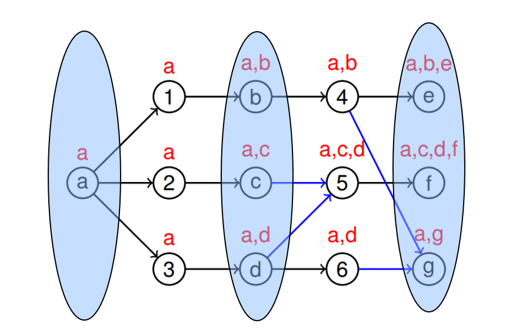

In the example above, you can see that **G** is a goal state and that, to achieve it, **A** is the only fact necessary as it appears in all the actions required (intersectioj)

---
 

## Landmarks ordering

Having landmarks is definitely useful, but if we know in which order they should appear, this can be of much help.

### Sound Ordering

 We know that A achieves B, but we don't know when exactly.

- **Necessary Ordering** A →n B : A is always TRUE one step before B becomes TRUE;
- **Greedy Necessary Ordering** A →gn B : A is TRUE one step before B becomes TRUE for the first time, rather than every time;
- **Natural Ordering** A → B : A is TRUE some time before B becomes TRUE;

>***[My Guess]*** Both in Necessary and Greedy-Necessary Ordering A is a precondition for the action that achieves B. In Natural ordering A is used to achieve intermediate state that in turns are preconditions for actions that achieve B; hence, A is not required by the action the directly achieves B, but to reach its preconditions I need to achieve A at some point.

### Unsound Orderings

 There are special conditions on the ordering of landmarks.

- **Reasonable Ordering** A →r B : If B was achieved before A, then the plan should **delete B** and re-achieve it after (or at the same time as) A;

>There are cases in which achieving B before A is a waste of time as one has to delete B, re-achieve A, and then again achieve B. However, there are cases, like the *Hanoi Tower*, where achieving,deleting, and eventually re-achieve B is necessary before reaching A.

- **Obedient Reasonable Ordering** A →or B : If B was achieved before A, then the plan should **delete B** and re-achieve it after achieving A;

>e.g.: I need to deliver a parcel to a location. If B = *reaching the location*, and A = *collecting the parcel*, it makes no sense to achieve B before A.

   - - We say that there is a reasonable ordering between A and B, written A →r B, if for every plan π where B is added at time i and A is first added at time j with i < j [*A is added after B*], 
    it holds that B is not true at some time m with m ∈ {i + 1, . . . , j} and B is true at some time k with j ≤ k.true at any time j ≤ i. 
      - We say that there is an obedient-reasonable ordering between A and B with regard to a set of orderings O, written A → or B, if for every plan π obeying O where B is added at time i and A is first added at time j with i < j, 
    it holds that B is not true at some time m with m ∈ {i + 1, . . . , j} and B is true at some time k with j ≤ k.
      - We say that a plan π obeys a set of orderings O, if for all orderings A →x B ∈ O, regardless of their type, it holds that A is first added at time i in π and B is not 

# WEEK 3 (Landmarks)

Landmarks can be used in 3 different ways:
- as **planning subgoals**;
> This is not optimal due to **Susman anomaly** which claims that 2 landmarks necessary to achieve the goal, can in a sense be mutually exclusive, and reaching one prevents us from reaching the other and vice versa.
- for **heuristic estimates**;
- for **admissible landmarks heuristic**.

## LM Count

<b>LM</b> is a <b>Path Dependent Heuristic</b>, which is not a function of the current observed state, but rather the function of path used to reach it. It is <b>inadmissible</b> as the same state (like holding B) could be used to achieve multiple landmarks, even tho it's impossible.
    

LM heuristic value`h(s,p) where s is the state and p the path` is given by the union of incomplete landmarks with the ones required again.
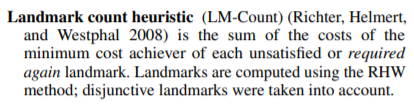

## Double Heuristic

Having 2 heuristic functions might be very good:
- When you have a plateau with one, the other one might come in and rescue you;
- Alternating 2 heuristics (even $h()$ = random picking) helps improving the overall heuristic, and, hence, solving the plan.

**EHC** & **FF** are know as **Local Search algorithms**:

>**HEURISTICS ARE USED AT POINT 3**
>Basically we are applying a <b>gradient descent</b>

##  Problems With RPG

- Not perfect;
- The right move may not lower the heuristic;
- The best move might prove to be wrong.

##  Problems With EHC

- Can lead to a dead end and not find a soltuion;
- If FF fails, resort to systematic Best first search from the START!!;
- Searching on a plateau is expensive.

## IDENTIDEM

Alternative to EHC, it uses what are know as **RESTARTS**

- When reaching a plateau, pick a random generated state (doesn't matter if it's worse than the best node so far);
- Explore it down for a maximum of d steps(d is set at the beginning);
- If it doesn't find an optimal solution, RESTART from the original node.
> If no good state is found at depth **d** , then **increase d** (d += 1)

# Week 4 - Numerical Values in Planning 

## Numerical Values Operations (Video 1)
Many planners allow for numerical values defined as functions
>e.g. **(:functions (total-cost))**

This values can be used for logical comparisons `<, <=, =, =>, >`, and mathematical operations `-, +, /, *`
> e.g. **(< (height truck) (height barrier))** or
> &nbsp;&nbsp; &nbsp; &nbsp; **(> (fuel) (\* 2 (distance ?from ?to)))**

It also possible to update values of functions with operators like `decrease, increase, assign`
>e.g. **(assign (battery-charge) (max-charge))** or
> &nbsp;&nbsp; &nbsp; &nbsp; **(decrease (fuel) (\* 2 (distance ?from ?to)))**

In the goal state, it is possible to ask the planner to either **maximise** or **minimise** one or a set of functions.
>e.g. **(minize (total-cost))**

## RPG
To calculate the RPG is bit trickier. Actions with the effect of decreasing, which can be seen as a delete effect (you delete a unit), according to the normal RPG solution, should be ignored, but this might be misleading to the solution of the problem or, even worse, make it impossible to solve. The solution is to use **bounds**.

Say we start with `(assign (money) 100)`, and operations may either decrease it or increase it. In the fact layer we write:
> money **[100, 100]**
> get-paid (gives you 10 money)
> buy-candy (takes 15 money away from you)

meaning that the minimum amount of money (**lower bound**) at the moment is 100, and the maximum (**upper bound**) is 100 as well.
Notice that there are 2 actions that can be executed, one increasing the money by 10, the other one reducing it by 15.
In the next action layer, as the RPG commands, we execute both of them, but what happens to money?
The upper bound increases by 10 and the lower bound decreases by 15.
The next fact layer should look like this:
> money **[85, 110]**
> get-paid (gives you 10 money)
> buy-candy (takes 15 money away from you)

The reason behind this is that if an action requires **money > 100**, or **money <= 50**, we look at both the upper and lower bounds, and if money required for the action falls into that range, we proceed with the execution of the action.

## Oversubscription (Video 2)

<b>Oversubscription:</b> when a planner has too many goals, and can only achieve some of them.

## Preferences
Preferences are condition we want to be true:

- **Simple Preferences**: soft goal and preconditions
> (p0 (**at end** (at rover waypoint3)))

- **Trajectory Preferences**: conditions on the plan
> (p0 ( `X` (*condition*))) where `X` can be:
> - **always** (> (fuel) 50)
> - **sometime** (at driver warehouse)
> - **at-most-once** (at driver warehouse)
> - **sometime-after** (at B'ham) (at Glasgow)
> - **sometime-before** (at B'ham) (at Glasgow)

These are known as **soft constraints**, which means the program can **violate** them, however, a cost is associated with the violation of them. This cost is calculated via the **metric function** in the formula of minimize/maximize (is-violeted p2).

> is-violated is a special function that triggers automatically at the end of the problem if a preference has not been satisfied

Preferences are written in the in the problem file rather than the domain, and the formula is like this: 
> e.g. (**:constraints** (and
> &nbsp;&nbsp; &nbsp; &nbsp; &nbsp; &nbsp; &nbsp;**(preference p0 (sometime (at amanda work)))**
> &nbsp;&nbsp; &nbsp; &nbsp; &nbsp; &nbsp; &nbsp;**(preference p1 (sometime (at amanda piano)))**
> &nbsp;&nbsp; &nbsp; &nbsp; ))

### Sometimes-before vs. Sometimes-after
First of all, the way you read these preferences is different from other actions/preconditions:
- The precondition **(at amanda work)** is read as *"Amanda is at work"*, so the name of the action is moved to between the objects;
- The preference **(sometimes-before (at amanda work) (drink coffee))** is read as *"Amanda should drink a coffee before going to work"*. So the opposite of normal actions and objects

Another thing to point out is **violance** of these two preferences:
- **sometime-before (a) (b)** requires **b** to happen before **a** has ever happened. If I reach an **E-VIO** (or eternally violated) status, then this preference will never be satisfied. Vice versa, if I accomplish **b** anytime before achieving **a**, the preference is **E-SAT**(or eternally satisfied).
- **sometime-after (a) (b)** requires **b** to happen after **a**, at any time. This means that, if I ever reach **a** before reaching **b**, I do reach an unsatisfied state, but it's not eternal. Vice versa, I can accomplish **b** after **a**, but as I can reach **a** again, the condition is satisfied, but not eternally.

So, in essence, the two preferences are not the opposite of each other. Also, think at this examples:
> (sometimes-before (at amanda work) (drink coffee))
> This means that, **IF** I Amanda goes to work, she must drink a coffee.

In this example, Amanda is free to grab a coffee whenever she wants, and she has just one coffee and then go to work as many times as she wants.

> (sometimes-after (drink coffee) (at amanda work))
> This means that, **IF** she has drunk a coffee, **then** she has to go to work

In this other example, Amanda can no longer drink coffees if she doesn't go to work afterwords, and here, if she takes a coffee, goes to work and **THEN** drinks another coffee, she will have to go to work **again**.

## LPRPG-P

<b>LTL</b> is Linear Temporal Logic

Create an automaton for each preference

**PVC** Preference violation cost of a state PVC(S) (Sum of violation cost of all the automata in E-Vio)

The way to operate is:
1. Set the best cost to ± $\infty$ (depending on the minimize/maximize metric)
2. Find a solution plan, aka, a plan that achieves all the at-end goals;
3. If the PVC(new solution) > cost of the best plan so far, update the best cost; else, prune the plan and start again. **REMEMBER:** PVC is based only on E-Vio, not on unsatisfied preferences.
4. Stop when it's clear that no more preferences can be achieved.

One thing to mention is that, conversely to what said before, the **sometime-after** preference can be violated iff the after-action/fact is no longer achievable.
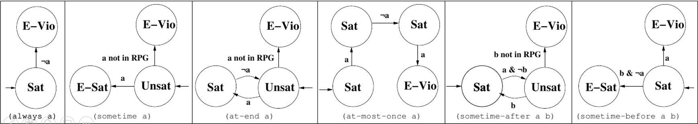

### LPRPG-P Heuristic

In a plan with no hard goals (at-end), but only soft-goals, the heuristic is 0 for each state, as no actual goal exists.

When creating the RPG, beside keeping track of true facts, we also consider the set of preferences violated by achieving this fact at this layer.

###### The preferences violation set of a subsequently appearing fact is the violation set of the action that achieved that fact and the Union of the violation set for the precondition of that action.

After achieving a fact, if we can find another path which preferences violation set has a lower cost, we use that set instead.

# Week 5 - Optimal Planning (first part is continuous of Week 3)

## The Perils of Expressivity (video 6 from week 3)

**Introducing more variables, predicates and actions exponentially increases in the number of possible states**, so the complexity of a problem grows exponentially.

Consider the **Block world** with 3 block (A, B, C), and all the possible predicates:
> A-On-B, B-On-Table, Clear-C, etc.

There are **12 predicates** that can be **either True or False**, for a total of **$12^2$ combinations**. 
Just by adding a new block **D**, the total permutations would sum up to  **$22^2$ combinations**, which is a huge number.
This meticulous description, which counts so many permutations, is known as the **PERIL OF EXPRESSIVITY**. Of course landmarks and heuristics help us canalise the planner to the right path and some configuration are not even reachable at the same time. However, this number can still be a problem, how should we deal with it?

### - Mutex (Invariants)
For example, for a object it (should be) impossible to be in 2 places at the same time, so say there are 2 places **home** and **Uni**, then
> $¬ (at-Home \enspace \bigwedge \enspace at-Uni )$ 

The above formula is an **INVARIANT**, that is something that has to hold True throughout the execution of the problem. 
Beware, finding Invariants might be as hard as solving the problem.

Referring to the blocks world, a mutex would be {A on B, C on B, clear B}, meaning that either B is clear or there's a block on top of it.

### - Finite Domain Representation (FDR)

In a **FINITE DOMAIN REPRESENTATION**, you declare a set of possible states (**domain**) a variable can assume. In the blocks world example:
 >**above-B $\in$ {a, c, nothing}
 above-C $\in$ {a, b, nothing}
 above-A $\in$ {b, c, nothing}**

And this would already drastically reduce the configuration space to $3^3$. To make it complete we should also include the below-X variables. The count would increase to $6^3$, which is still good, and besides, this number can be reduced more by adding constraints such as above-X = Y AND below-Y = X, or by checking that 2 above-X do not share the same block (nothing doesn't count, which means 2 blocks can be clear at the same time).

Given an FDR encoding you can always switch back to the normal propositions.

## SAS+
A famous planner called **SAS+** uses FDR. 
We can express our SAS+ planning problem as a 4-tuple of $Π = <𝑉, 𝑂, 𝒔0, 𝒔∗>$ comprised of…

- The **set of all state variables** **$V$** (which can also be fluent or numeric values), each with their own associated domain of possible values.
  
    Any assignment of those variables to a value in their domain is known as an atom.
- The **set of all operators**, effectively replacing the actions.
This includes the name of the operator, and the partial variable assignments covering the preconditions and effects.
    An operator is a triple **\<𝑛𝑎𝑚𝑒, 𝑝𝑟𝑒, 𝑒𝑓𝑓\>**
    - **Name** of the operator
    - **Pre** and **eff** are partial variable assignments (preconditions and effects).
  
- $S_0$ which is the **initial state** and $S$* which is the **goal state**.  In the goal state definition and the preconditions and effects, we provide partial variable assignments.  
  
Given we are only interested in a given action in changing specific variables in the current collection of assignments V.  While also in the goal we’re only interested in whether certain conditions are true, much like before in PDDL where we’re not listing the entire state that we expect to happen.

### SAS+ Operations Conditions
In SAS there are 2 types of operation condition:
- **prevail conditions**: 
    The value of a variable stays the same;
    When loading a package p1 onto a truck t1 at location l1:  <t1,at-l1>

- **pre_post conditions:** 
    The value of a variable changes from one value to another:
    When loading a package p1 onto a truck t1 at location l1: <p1,at-l1,in-t1>

### Data Transition Graph (DTG)

It's just a graph of nodes and directed edges. Each node is a state and each edge is an action. 

 What is the difference between that and a normal graph? 
Why is this relevant to SAS+?  
<b>Answer:</b> This is a way of representing the problem from the perspective of just one variable.

## Pattern Databases (PDB) (video 1 from week 5)

As we have seen, adding new variables massively increases the complexity which, however, can be reduced using constraints.

What if we set the cost of the original problem by decomposing it into a set of **sub-problems**?
- **Solution costs to sub-problems** will provide an **admissible heuristic** to solve the actual problem.  
- **Heuristic calculation** becomes **very fast** (database lookup).
- **Searching backwards** from the goal, record costs of states.
- An **expensive** albeit **one-time calculation**.

A <b>Target Pattern</b> is a partial specification of the goal state.

### Abstraction

**ABSTRACTION** is a fundamental concept wherein the problem is only **partially considered**. In hypothetic problem with:
- 2 Trucks (A, B)
- 2 Locations (L, R)
- 1 Package

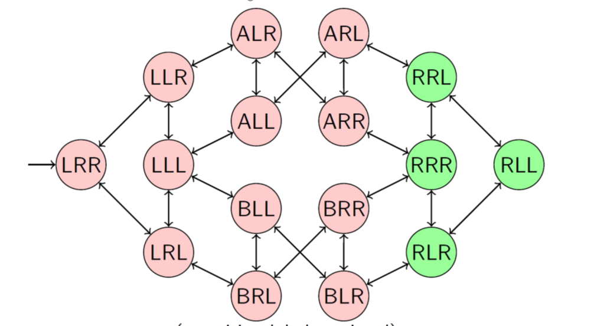
    
In this diagram, $<x_1, x_2, x_3>$ 
- $x_1$ = package location {A, B, L, R}
- $x_2$ = truck A location {L, R}
- $x_3$ = truck B location {L, R}

Applying an **abstraction formula $\alpha$** we can abstract this problem into a simpler one. 
For example, we may only consider the problem from the point of view of the package, so **we group the states** based on the location of the package:
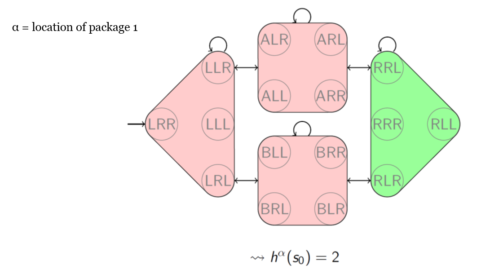

The obtained heuristic value (given $\alpha$) $h^\alpha()$ from the initial state $s_0$ is 
> $h^{\alpha}(s_0)$ = 2

Let's see another case now, which is pretty similar to the one just mentioned, but where the packages are 2 and the truck is just 1. How would we abstract this problem?
Well, a possible way would be to create 2 abstraction functions, one taking into account one package and the second one taking into account only the other one. The result would be like this:
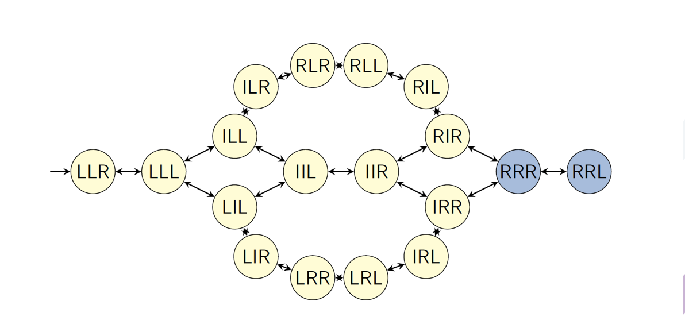

 
    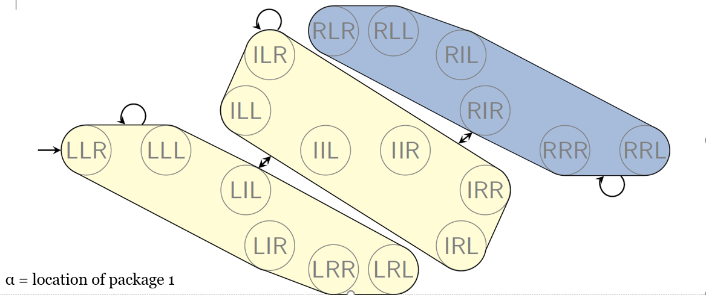
    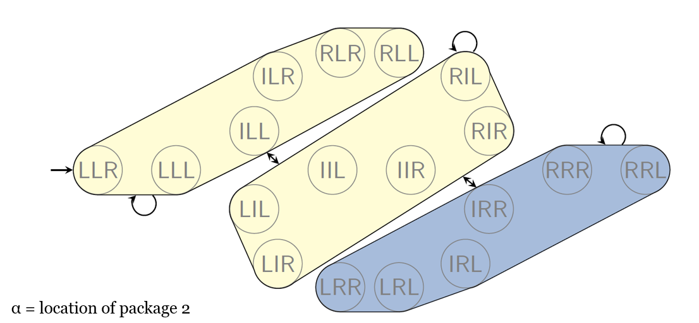

### Pros and Cons of PDB
**Pros:**
- Once the db has been created, the time needed to calculate the heuristic at any given time is constant as you just have to look at the db (**lookup tables are super fast**);
- The same db is **reusable** throughout the planning.

**Cons:**
- Creating the db take a lot of time, so it's **pretty slow**;
- **Adding** a new variable **or changing** a goal would require to **build a brand new db**.

> PDB are just one way of abstraction, other forms exist as well.

## Cost Partitioning (video 2 from week 5)

Given a problem, we can create multiple abstractions, each, perhaps, producing different heuristics. These heuristics can be compared, and the best one can be chosen. We denote this heuristic with 
> $h^{max}(s_i)$
> **Max** in this case is referred to the one with the maximum score, which in fact is the best. Why? As we are assuming all the heuristic are admissable, we want to take the one with the highest score as it better represent the actual possible strategy.

Another way of taking into account all the possible solutions is **adding the different heuristics** $h^{add}(s_i)$. However, even if both the $h^{max}(s_i)$ functions are admissible, their sum is **very likely not to be admissible, and hence not additive**.

The best way to deal with this addition issue is given by the **COST PARTITIONING**

Here we are hoping to **split the action costs** – or more appropriately, partition them - **among the heuristics** in such a way that the total cost implied by the heuristic does not exceed the original action cost, thus **ensuring it remains admissible**. 

So in essence, we’re trying to ensure our suite of available heuristics is additive, such that we can ensure the summation of these heuristics is still admissible. 

The way you do that is if we have found the best values in one heuristics, **we tweak the other heuristics**.

There are many Cost Partitioning approaches:

### Optimal Cost Partitioning
Given some possible actions such as those in the figure, you want to redistribute the cost of each action across both the graphs, so that if such a path is included in both $h^{max}(s_i)$, then it's like if $h^{add}(s_i)$ would count the action just at its original cost. 

Here is an example:
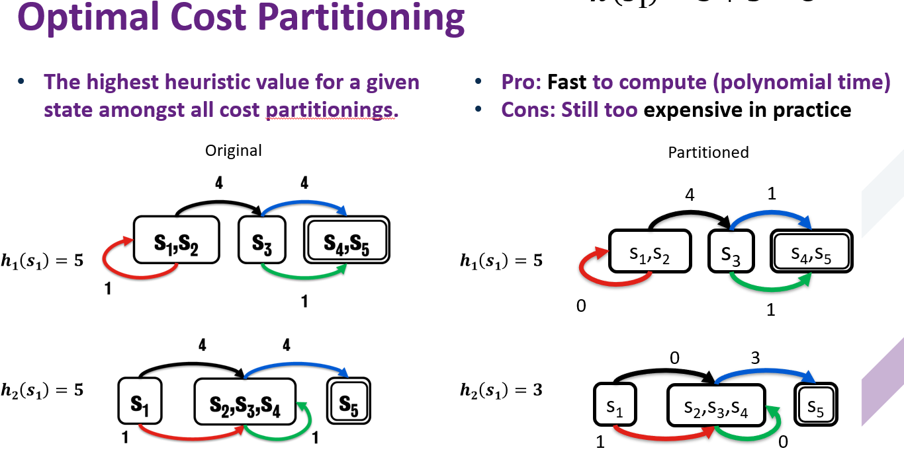
As you can see, the final heuristic $h^{max}(s_0)$ = 8, which is admissible.

<b>QUESTIONS:</b>
 
Is there a way to decide how to split the cost between the 2 graphs?
 
What if the same action (like the black line in the picture) is not present in both the graphs?

----

### Post Hoc Optimisation

Another way is to use **weights to weight each abstraction**. The **total SUM of the weight has to add up to 1**. So doing we change the total value of each action by multiplying them by the weight allocated to that abstraction.
Furthermore, we drop to 0 the cost of **non relevant actions**, those actions that do not help get us closer to the goal.
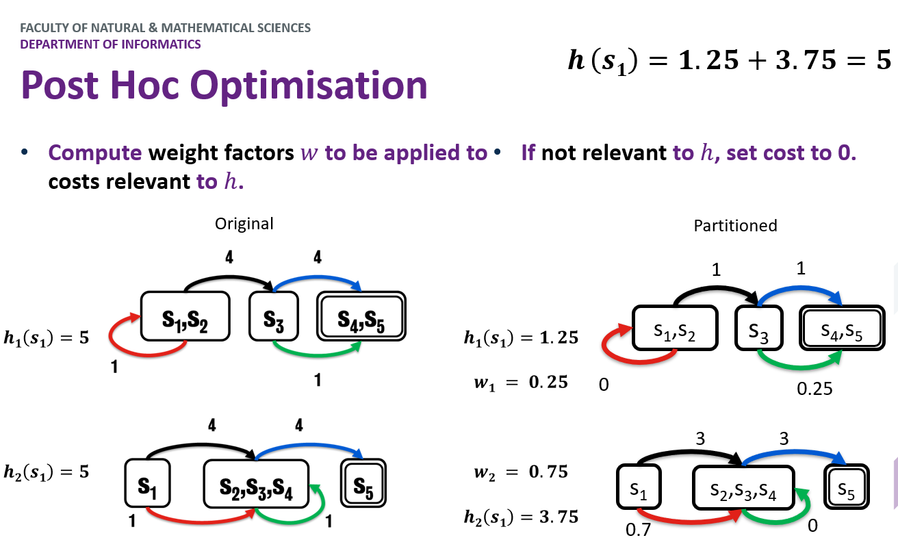

----

### Greedy Zero One Cost
- Take the first abstraction you bump into;
- Set to 0 the cost of non relevant actions;
- keep the others to their original value;
- For all the remaining abstractions, set to 0 the actions already considered (aka not set to 0) in at least one previous abstractions and repeat from the first point.
  
The issue with this approach is that we may keep the cost for an action which would not use to reach the goal in a particular abstraction (look at the blue in h1, we use the green instead, yet we keep the cost to 4)

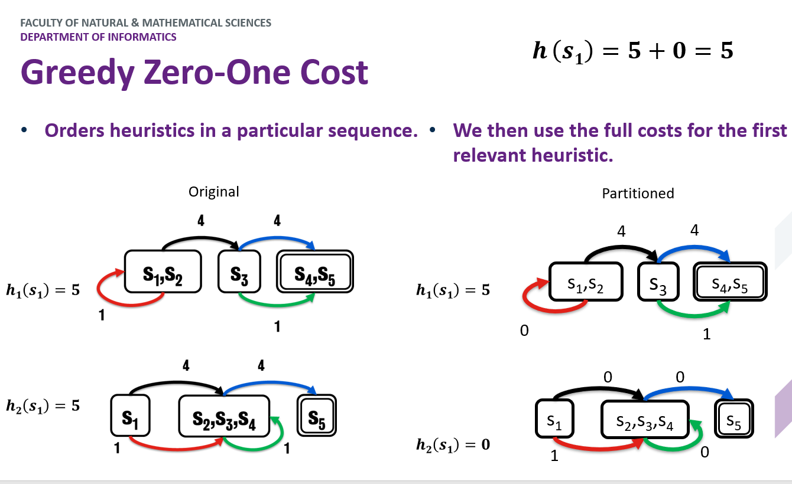

----

### Saturated Cost Partitioning
This is in a improvement over the Greedy Zero One Cost. The issue with the Blue action is resolved in a simple way, setting it to 0 would be we would choose that over green and we would reduce the heuristic by 1 (4 + 1) => (4 + 0). Not to change the final heuristic, we see the value of all the actions not used to find the best cost to the cost of the action(s) which achieve the same result.
So in the example, **green (1)** is preferred over **Blue (4)**, but they both achieve the same state, so **we drop blue cost to the same of green, so that Blue(1)**

The remaining blue cost (3) is used in the next abstractions.
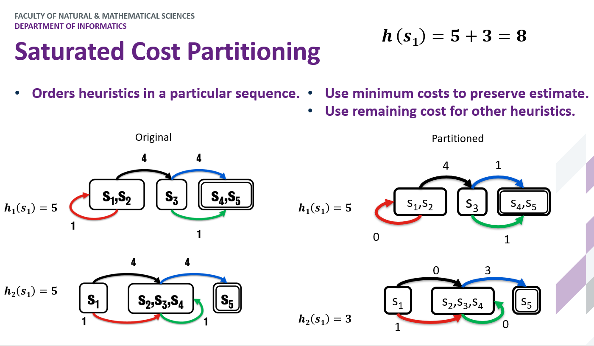

----

### Uniform Cost Partitioning
The cost of the relevant actions for more than one abstraction is evenly distributed across them. In the example, Black and Blue are both relevant to both the abstractions, so we split the cost of each (4) between the abstractions (2 + 2)

The non relevant actions costs drop to 0.

## GraphPlan (video 3 week 5)

A **GraphPlan** is pretty similar to the RPG, in fact, RPG is a simplification of the GraphPlan. The main difference is that RPG uses **delete relaxation**, that is, facts are never deleted.

In a GraphPlan, as the fact deletion is taken into account, from an action layers there are two types of lines leading to the next fact layer:
- The standard straight black lines, indicating addition;
- **Red dashed lines indicating deletion**;

A valid plan from GraphPlan is one in which:
- Actions at the same level don’t interfere with one another.
- Each action’s preconditions are true at that point in the plan.
- Goals are satisfied at the end of the graph.

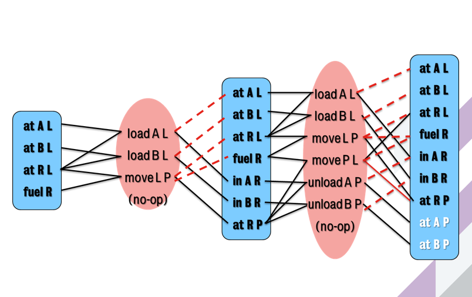

To enforce these rules, GraphPlan considers **Mutexes**, so some actions are not possible. There are 3 types of mutexes:
- **Interference**: when 2 actions interfere with each other and **the effect of one negates the precondition for the other**
  > e.g. Moving the rocket away and loading; if I am loading, the precondition is **`at R L`**, but by **`moving R from L to P`** I delete **`at R L`**
  > 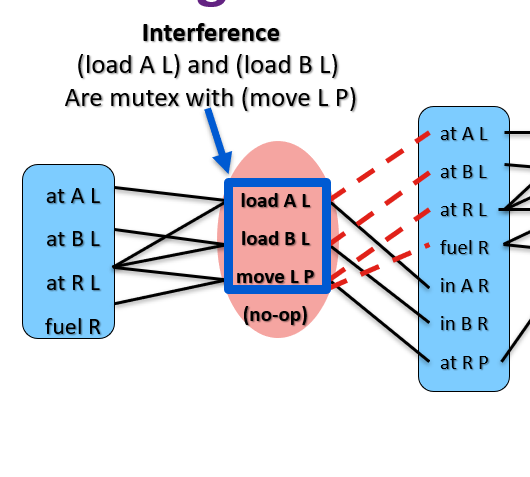

- **Competing Needs**: where two actions become mutex because **their preconditions are mutex with one another**.  
  > As it is impossible for the Rocket to be in 2 places at the same time (mutex), the deriving facts are mutexes as well.
  > 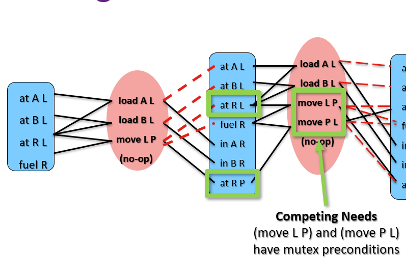

- **Inconsistent Support**: where two literals are mutex because **all ways in which we can create them in the fact layer are also mutex**.

The flow is the same as for RPG:
- you reach a layer where the goals are satisfied,
- then you **do a back propagation** to find a solution
- if it is found that's it, otherwise **add a new layer to the graph and repeat**.

At level **i**, pick a **non-mutex subset of actions** that achieve the goals at level **i+1**. 
The preconditions of these actions become the goals at level i.

Build the action subset by iterating over goals, choosing an action that has the goal as an effect. 
Use an action that was already selected if possible. Do forward checking on remaining goals.

> The actual plan generation process is pretty much what we saw with the RPG heuristic: iterate backwards finding actions that at first satisfy the goals at the final fact layer, then add those preconditions to the goal layer as we iterate backwards. Again we’re capable of picking any non-mutex subset of actions.  Hence in this example, we can safely load or unload both packages at the same time.  Given, when we execute it, we’re just going to pick one of them in an arbitrary fashion, it doesn’t matter which one we pick.  Provided they are both executed before the next set of actions, then everything will be valid.

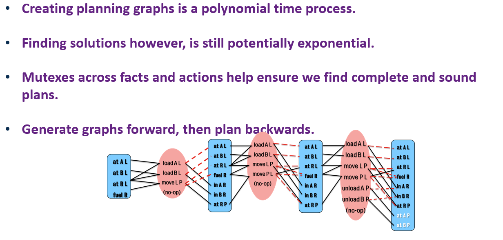

## SAT in Planning (video 4 from week 5)

CSPs (constraints satisfaction problems) are easily convertible to one another and the solution to one can be, in turn, converted into the solution of another. 
The idea here is to convert the problem of planning into a SAT problem.

In the context of planning, we’re trying to find a valid configuration of variables at different stages of the planning process such that it yields a true outcome, meaning that there is a combination of states, when put in the right order satisfy the constraints of the actions in the planning domain and enable us to transition from the initial state of the problem to the goal.

**How do we convert planning to SAT?**
 
Our problem can be expressed as 

> 𝝆 = (𝜮, 𝒔𝒊, 𝒔𝒈) 

Then we create clauses that describe how the variables can possibly change (actions). Denoting how a given variable will change between two time points **t** and **t+1**.
Once we have these clauses, the trick is to find a SAT formula phi 𝝓 and we then aim to satisfy it.
>If 𝝓 is satisfiable, then a plan exists for the planning problem 𝝆  
>Every possible solution for 𝝓 results in a different valid plan for 𝝆

The time steps go from 
- $0 \rArr T$ for the **predicates**, as at $T_0$ there exist some predicates already;
- $1 \rArr T$ for the **actions**, as the first actions has to be executed at $T_1$

<b>Planning Horizon (<i>T</i> ):</b> is the last time step at which we execute an action.

How do we know how much to set $T$ to?
> we don't, it's a **trial and error process** wherein you keep pushing up the value for **T**

Part on which I explain how to write in SAT preconditions and effects

### Framing
When writing the problem in the form of SAT, you have to write also what changes, but also **what does not change** as a result of the action, and this part is known as **FRAMING**.
Two types of framing exist:

- **Classical Frame Axioms**
    - State which facts are not effected for each action.
    - Must enumerate for all fact/action pairs where no the fact is not affected by the action.
    - Relies on one action being executed per time-step so axioms can be applied.

- **Explanatory Frame Axioms**
  - Instead of listing what facts are not changed, explain why a fact might have changed between two time steps.
    i.e. if a fact changes between 𝒊 and 𝒊+𝟏, then an action at step 𝒊 must have caused it. 
    > Given the effects, you have to find out the action basically

So **(if I got this right)**, in the first approach you write down what **has not changes** whereas in the second you you write down **what did change**x

#### Explanatory Frame Axioms
Consider the Robot problem
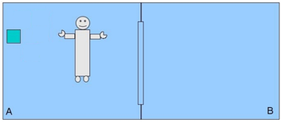
Following are a couple of example of **Explanatory Frame Axios** 

> **𝑎𝑡(𝑟1, 𝑙𝑜𝑐𝐵, 0) ∧ 𝑎𝑡(𝑟1, 𝑙𝑜𝑐𝐵, 1) ⟹ 𝑚𝑜𝑣𝑒(𝑟1, 𝑙𝑜𝑐𝐴, 𝑙𝑜𝑐𝐵, 0)**
**¬ℎ𝑜𝑙𝑑𝑖𝑛𝑔(𝑙𝑒𝑓𝑡, 𝑏1,0) ∧ ℎ𝑜𝑙𝑑𝑖𝑛𝑔(𝑙𝑒𝑓𝑡, 𝑏1, 1) ⟹ 𝑝𝑖𝑐𝑘𝑢𝑝(𝑏1, 𝑙𝑒𝑓𝑡, 𝑟1, 𝑙𝑜𝑐𝐴, 0)**

In this case if we look at the actions from the example, we identify that in order for the fact that r1 is not a location B on time step 0, but then is in the location at time step 1, then that must mean that the robot was part of a move action at time step 0.  Specifically the move action with r1 going from loc A to loc B.

We still need to list all of the possibilities that could emerge at a given time step. Hence we're going to have a lot of facts changing between time steps, especially as the branching factor of the state space increases.

However, this approach actually enables for parallelism in the planning process, given two actions could be executed in parallel if they have the same preconditions at time step t and their effects don’t conflict. You can spot parallelism is happening because there are other effects beside the ones of the action you are executing. 
[*"You can more easily identify this by catching whether or not an effect of one action appears within one of the explanatory frame axioms for an action that isn’t the action you’re running against."*]

#### Exclusion Axioms

As some actions may be conflicting, we have to enforce again the concept of **mutex**

- **Complete Exclusion Axiom**: ***only one action at a time***.
  These constraints will essentially enforce a ***total order plan***, whereby if we list every possible exclusion axiom, then only one action can be executed at the same time step. This also makes sense in the context of our gripper example, given none of the action of picking up boxes or moving the robot can be executed on the same time step.

    > ¬ 𝑚𝑜𝑣𝑒(𝑟1, 𝑙𝑜𝑐𝐴, 𝑙𝑜𝑐𝐵, 0)  ∨ ¬ 𝑚𝑜𝑣𝑒(𝑟1, 𝑙𝑜𝑐𝐵, 𝑙𝑜𝑐𝐴, 0)

- **Conflict Exclusion Axiom**: prevents invalid actions on the same timestep.
Two actions conflict if either **their preconditions contradict or their preconditions are not consistent with their effects**. This would allow us to solve plans with in a ***partial order*** fashion, which is a topic of a later chapter 
More on this topic partial order planning in another chapter.

# Week 6 
## Partial Ordering Planning (video 1)

So far we have seen all the plan as starting from the initial state and moving towards the goal state. This is known as **forward search** or progression search. 
There are however some planners that start from the goal state and move backwards; this planners operate a **regression search**.

The idea behind this planners is to consider what actions could have lead to that state.
> In the example of the amazon driver that delivers a dvd to myHome, the goal state is (at myHome dvd).
> If we were to identify this a 3-tuple state $<dvd-loc, truck-loc, driver-loc>$
> As I do not care of the truck and the driver location, I write my state as 
