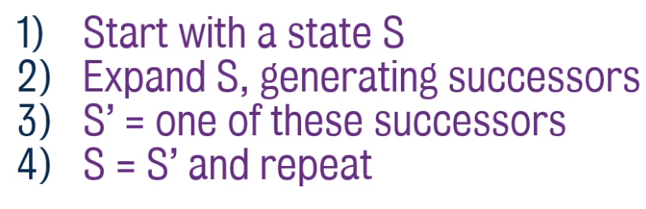
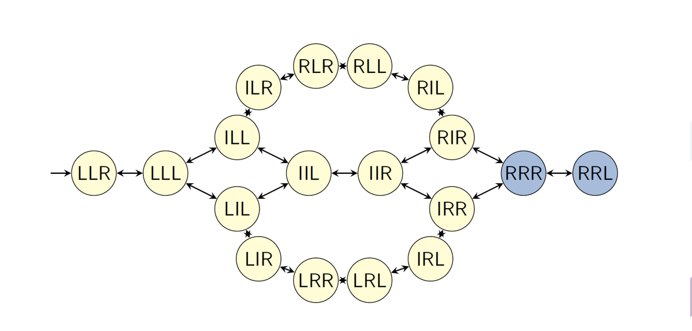
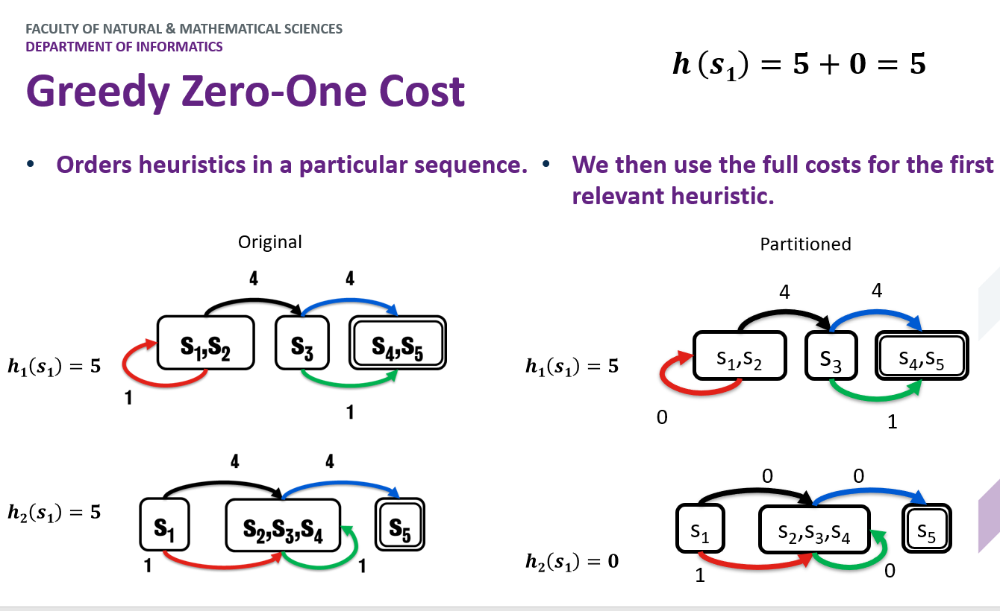
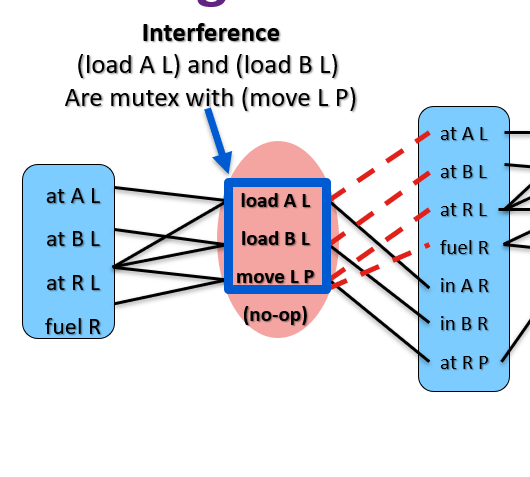

[TOC]

# WEEK 1 (Refresh of searching algorithms)

<b>Closed World Assumption :</b> Any fact not listed as explicitly being true in the initial state can safely be assumed as false.

In PLANNING, 3 are the **pillars** to solve a problem:
 - The initial state (what is True at the beginning);
 - The goal (what has to be True at the end to consider the problem solved);
 - The executable actions defined according to the DOMAIN

**Lifted Action:** when the :action contains :parameters

**PLANNER:** takes in an initial state and creates a plan to reach the goal state. It can be seen as an ordered list of actions
           telling what to do and when in order to reach the goal. To do this, it creates many plans and find the first or the
           most effective one.

---

## Searching Methods

When looking for the optimal plan, you can use different methods to find it:
 - **Depth First Search** (not very used as the path to the goal tends to be longer);
 - **Breadth First Search** (better than DFS, but not the best yet);
 - **Best First Search** which:
    - assigns a heuristic value h(S) to each new node;
    - puts all the not visited nodes into a sorted queue, sorted by the h(S) (in case two nodes have the same h(S),the first one generated has higher priority);
    - removes the first node in queue and visits it.
 - **A\*** which is like Best First Search, but takes into account the distance g(S) from the start, so it counts (and sum) both the distance to the goal and the distance from the initial state, that is, the number of actions performed so far (f(S) = h(S) + g(S)).

Of course, you choose between BestFS and A* based on what is most convenient for you: 
- A* -> shorter distance from the initial state (so optimal path) is guaranteed;
- BestFS -> less computations, but MIGHT result in a longer path g(S);

> ### Heuristic Cryteria 
>
A good heuristic value should be:

>
>- **ADMISSIBLE:** never overestimates the distance to a goal state;
>- **CONSISTENT** (Monotonic): at every state, the heuristic value must be less than or equal to the distance from that state to another state + the heuristic value of the other state     h(S) <= h(S') + d(S, S');
>- **ADDITIVE:** (not necessary, but good for heuristic) given 2 heuristic functions h1 & h2, their sum is **admissible** for each state s (i.e. h(s) = h1(s) + h2(s) ).

A* is very good, but also "expensive", a good trade off comes with **WA\* (Weighted A\* Search)**, which finds a solution 
more quickly than the A*, but not necessarily the optimal solution. It lays between A* and BestFS:
- the formula is: f(S) = g(S) + W*h(S)
- when W is 2, the h(S) counts twice as much as it did before, making it more relevant than g(S)
- when W tends to Inf., WA* behaves like A*
- the W is the factor than influence the worst possible solution, i.e., if W = 2, the worst solution
    we can (not necessarily the one we will) find, is at most twice as much the best solution

# WEEK 2

**Delete Relaxation:** Finding the a good heuristic can be tricky sometimes, **RPG** (or Relaxed Planning Graph) is very handy for that. It assumes that the actions only add and never delete predicates; in other words, **delete relaxations remove only the delete effects of actions**.

> i.e. an action that moves a box and outputs (on A B) (not (on A C)) would in fact only add (on A B), without deleting the other consequence. So doing, you create, step by step, the RPG, and going backward you create a possible solution. when you have al the table of facts, basically you look at the predicates, if it didn't exist in the previous state, you look at the action that generates it, and you consider it for the heuristic function

## EHC (Enforced Hill Climbing)
RPG only provides heuristic scores, it's not a search method itself. However, EHC uses it to find the optimal solution. The way EHC works is pretty simple:
1. look at h(s) of the generated states;
2. from s, find the state s' with the best h(s') which has to be better than h(s)(h of the parent node) and expand it;
3. keep doing it until no acceptable state can be found (this situation is called **tableau**);
4. use **Breadth First Search** on all the child states (even the ones with the worst heuristic) until a state that meets the criteria from rule **2** is found;

If EHC reaches a dead end, FF resorts and uses Best First Search to look for a plan.

**EHC** can find solutions pretty fast, but it is **incomplete**, that is, it is not guaranteed to find a solution.

**FF** on the other hand, is slower, but **complete**. It can be made more efficient by using the RPG and **pruning** some states; in particular, an action that leads to a goal in the first state is called **helpful**. In spite of making the algorithm faster, it also makes FF less complete.

In case EHC fails, and (as far as I got from the lecture) so did FF due to pruning, we can try one more time using the **helpful actions constraints**, and see if it can find a solution before rolling back to FF.

 the operator counting heuristic (<b>counting the number of actions used to reach the goal) isn't always admissible</b> (but that's not to say it's never admissible), <b>but the layer counting heuristic always is admissible</b>

>The **execution order** is then the following:
    1. **EHC with helpful actions**
    2. **EHC**
    3. **FF with helpful actions**
    4. **FF**

## Landmarks: Constraints-based heuristic
An alternative to using RPG is to set constraints that encapsulate facets of every possible solution of a problem.

Some of these constraints can be denoted as **landmarks** of the solution. 
- Landmarks **must be true** at some point in every plan generated. 
- They can include both facts and actions that will appear at some point.
- Landmarks can be **ordered** to dictate the order in which they should be achieved

 

## Types of landmarks

- #### Fact Landmark:
    
A variable takes a particular value in at least one state.

- #### Action Landmark:
    
An action must be applied in the solution.

- #### Disjunction Action Landmarks:
    
One of a set of possible actions must be applied.

>**PROBLEM:** Finding landmarks, however, can be demonstrated to be as hard a the problem itself, aka, **PSPACE complex**.

**Landmarks can be used as:**
- Landmarks as Planning Subgoals
- Landmarks as Heuristic Estimates
- Admissible Landmark Heuristics

 

## Finding Landmarks

There are many ways to do it:

### Deletion relaxation with RPG
- Iterate through all the actions and remove one that adds a fact;
- Build the RPG;
- If the goal no longer appears in the RPG, then that action is a landmark.
>**PROBLEM:** Applying this process for all the possible actions is pretty slow.

 

### Backchaining
- Consider every goal(B) *[in the goal state, I guess]* as a landmark:
- Look at the actions required to achieve B and the preconditions needed;
- If many actions needed to achieve B require A, than A can be considered as a landmark itself;
- Also, we know that A has to be achieved before B, this gives us a hint about the order

This approach can be improved by checking whether is needed to achieve B for the first time .

 

### RPG propagation
Consider an RPG and:
- each **action** takes into account **the union** of all the preconditions (even not from the very previous state) into account;
  > e.g suppose action **5** requires facts **C {A}** and **D {A}**, which are both achieved from a state **A**. In this case, action **5** considers the union $\{A, C\} \cup \{A, D\}$ = **{A, C, D}**.
- each **fact** takes into account **the intersection** of the actions.
  >  e.g. actions **4 {A, B}** and **6 {A, D}** are both necessary to achieve fact **G**, the intersection $\{A, B, G\} \cap \{A, D, G\}$ = **{A, G}**

In the example above, you can see that **G** is a goal state and that, to achieve it, **A** is the only fact necessary as it appears in all the actions required (intersection). As you can see, **each action generates a new node in the fact layer with its own facts**.

> **NOTE:** you do not stop after achieving all the goal state but when, after achieving them, the fact layers does not change anymore.

---
 

## Landmarks ordering

Having landmarks is definitely useful, but if we know in which order they should appear, this can be of much help.

### Sound Ordering

 We know that A achieves B, but we don't know when exactly.

- **Necessary Ordering** A →n B : A is always TRUE one step before B becomes TRUE;
- **Greedy Necessary Ordering** A →gn B : A is TRUE one step before B becomes TRUE for the first time, rather than every time;
- **Natural Ordering** A → B : A is TRUE some time before B becomes TRUE;

>***[My Guess]*** Both in Necessary and Greedy-Necessary Ordering A is a precondition for the action that achieves B. In Natural ordering A is used to achieve intermediate state that in turns are preconditions for actions that achieve B; hence, A is not required by the action the directly achieves B, but to reach its preconditions I need to achieve A at some point.

### Unsound Orderings

 There are special conditions on the ordering of landmarks.

- **Reasonable Ordering** A →r B : If B was achieved before A, then the plan should **delete B** and re-achieve it after (or at the same time as) A;

>There are cases in which achieving B before A is a waste of time as one has to delete B, re-achieve A, and then again achieve B. However, there are cases, like the *Hanoi Tower*, where achieving,deleting, and eventually re-achieve B is necessary before reaching A.

- **Obedient Reasonable Ordering** A →or B : If B was achieved before A, then the plan should **delete B** and re-achieve it after achieving A;

>e.g.: I need to deliver a parcel to a location. If B = *reaching the location*, and A = *collecting the parcel*, it makes no sense to achieve B before A.

   - - We say that there is a reasonable ordering between A and B, written A →r B, if for every plan π where B is added at time i and A is first added at time j with i < j [*A is added after B*], 
    it holds that B is not true at some time m with m ∈ {i + 1, . . . , j} and B is true at some time k with j ≤ k.true at any time j ≤ i. 
      - We say that there is an obedient-reasonable ordering between A and B with regard to a set of orderings O, written A → or B, if for every plan π obeying O where B is added at time i and A is first added at time j with i < j, 
    it holds that B is not true at some time m with m ∈ {i + 1, . . . , j} and B is true at some time k with j ≤ k.
      - We say that a plan π obeys a set of orderings O, if for all orderings A →x B ∈ O, regardless of their type, it holds that A is first added at time i in π and B is not 

# WEEK 3 (Landmarks)

Landmarks can be used in 3 different ways:
- as **planning subgoals**;
> This is not optimal due to **Susman anomaly** which claims that 2 landmarks necessary to achieve the goal, can in a sense be mutually exclusive, and reaching one prevents us from reaching the other and vice versa.
- for **heuristic estimates**;
- for **admissible landmarks heuristic**.

## LM Count

<b>LM</b> is a <b>Path Dependent Heuristic</b>, which is not a function of the current observed state, but rather the function of path used to reach it. It is <b>inadmissible</b> as the same state (like holding B) could be used to achieve multiple landmarks, even tho it's impossible.
    

LM heuristic value`h(s,p) where s is the state and p the path` is given by the union of incomplete landmarks with the ones required again.

The formula to count the heuristic score for landmarks is:

> $H(s,p) = ( L - $ Accepted $(s,p) )$ $\cup$ ReqAgain$(s,p)$ 

- **L** = set of all landmarks discovered for the problem;
- **Accepted (s,p)**: Accepted landmarks:
  Landmark is accepted if it’s true in $s$ and all its predecessors in the landmark graph are accepted.
- **ReqAgain(s,p):** Landmarks that we’ve seen but know we need to see again.   
  L is required again if:
  - Landmarks is false and it is a goal;
  - Landmarks is false in $s$ and is a greedy-necessary predecessor of landmark $m$ (must be true the step before $m$), which is not accepted.

For example:

> the initial landmark count is 8, but we o-in-B is already accepted, and the required again are 0, so:
> (8 - 1) $\cup$ {} = 7

## Double Heuristic

Having 2 heuristic functions might be very good:
- When you have a plateau with one, the other one might come in and rescue you;
- Alternating 2 heuristics (even $h()$ = random picking) helps improving the overall heuristic, and, hence, solving the plan.

**EHC** & **FF** are know as **Local Search algorithms**:

>**HEURISTICS ARE USED AT POINT 3**
>Basically we are applying a <b>gradient descent</b>

##  Problems With RPG

- Not perfect;
- The right move may not lower the heuristic;
- The best move might prove to be wrong.

##  Problems With EHC

- Can lead to a dead end and not find a solution;
- If FF fails, resort to systematic Best first search from the START!!;
- Searching on a plateau is expensive.

## IDENTIDEM

Alternative to EHC, it uses what are know as **RESTARTS**

- When reaching a plateau, pick a random generated state (doesn't matter if it's worse than the best node so far);
- Explore it down for a maximum of d steps(d is set at the beginning);
- If it doesn't find an optimal solution, RESTART from the original node.
> If no good state is found at depth **d** , then **increase d** (d += 1)

Identidem  select successor states using a "wheel" selection, wherein the chance of being picked is proportional to the heuristic score.
In case of plateau it uses the last "best" state found and searches again.

## LAMA
LAMA is planner that employs the LM Count heuristic. Although it may be very good, it is also inadmissible as one action can achieve more than one landmark.

# Week 4 - Numerical Values in Planning 

## Numerical Values Operations (Video 1)
Many planners allow for numerical values defined as functions
>e.g. **(:functions (total-cost))**

These values can be used for logical comparisons `<, <=, =, =>, >`, and mathematical operations `-, +, /, *`
> e.g. **(< (height truck) (height barrier))** or
> &nbsp;&nbsp; &nbsp; &nbsp; **(> (fuel) (\* 2 (distance ?from ?to)))**

It is also possible to update values of functions with operators like `decrease, increase, assign`
> e.g. **(assign (battery-charge) (max-charge))** or
> &nbsp;&nbsp; &nbsp; &nbsp; **(decrease (fuel) (\* 2 (distance ?from ?to)))**

In the goal state, it is possible to ask the planner to either **maximise** or **minimise** one or a set of functions.
>e.g. **(minimize (total-cost))**

## RPG
To calculate the RPG is bit trickier. Actions with the effect of decreasing, which can be seen as a delete effect (you delete a unit), according to the normal RPG solution, should be ignored, but this might be misleading to the solution of the problem or, even worse, make it impossible to solve. The solution is to use **bounds**.

Say we start with `(assign (money) 100)`, and operations may either decrease it or increase it. In the fact layer we write:
> money **[100, 100]**
> get-paid (gives you 10 money)
> buy-candy (takes 15 money away from you)

meaning that the minimum amount of money (**lower bound**) at the moment is 100, and the maximum (**upper bound**) is 100 as well.
Notice that there are 2 actions that can be executed, one increasing the money by 10, the other one reducing it by 15.
In the next action layer, as the RPG commands, we execute both of them, but what happens to money?
The upper bound increases by 10 and the lower bound decreases by 15.
The next fact layer should look like this:
> money **[85, 110]**
> get-paid (gives you 10 money)
> buy-candy (takes 15 money away from you)

The reason behind this is that if an action requires **money > 100**, or **money <= 50**, we look at both the upper and lower bounds, and if money required for the action falls into that range, we proceed with the execution of the action.

## Oversubscription (Video 2)

<b>Oversubscription:</b> when a planner has too many goals, and can only achieve some of them.

## Preferences
Preferences are conditions we want to be true:

- **Simple Preferences**: soft goal and preconditions
> (p0 (**at end** (at rover waypoint3)))

- **Trajectory Preferences**: conditions on the plan
> (p0 ( `X` (*condition*))) where `X` can be:
> - **always** (> (fuel) 50)
> - **sometime** (at driver warehouse)
> - **at-most-once** (at driver warehouse)
> - **sometime-after** (at B'ham) (at Glasgow)
> - **sometime-before** (at B'ham) (at Glasgow)

These are known as **soft constraints**, which means the program can **violate** them, however, a cost is associated with the violation of them. This cost is calculated via the **metric function** in the formula of minimize/maximize **(is-violeted p2)**.

### Notation is-violated
**is-violated** is a special function that triggers automatically at the end of the problem if a preference has not been satisfied. The structure should look like:
> (:metric minimize
$\qquad$(+ (**\* (is-violated p0) 4**)
$\qquad\quad$(**\* (is-violated p1) 3**)
$\qquad$)
)

Trajectory preferences are written in the problem file rather than the domain, and the formula is like this: 
> e.g. (**:constraints** (and
> &nbsp;&nbsp; &nbsp; &nbsp; &nbsp; &nbsp; &nbsp;**(preference p0 (sometime (at amanda work)))**
> &nbsp;&nbsp; &nbsp; &nbsp; &nbsp; &nbsp; &nbsp;**(preference p1 (sometime (at amanda piano)))**
> &nbsp;&nbsp; &nbsp; &nbsp; ))

### Notation at-end
Whereas trajectory preferences are expressed in the **:constraint** block, soft goals (or **at end** preferences) are expressed in **:goal** this way:
> (**:goal** (and
 $\qquad$(communicated_soil_data waypoint2)
 $\qquad$**(preference g0** (communicated_image_data objective1 colour))
)

### Sometimes-before vs. Sometimes-after
First of all, the way you read these preferences is different from other actions/preconditions:
- The precondition **(at amanda work)** is read as *"Amanda is at work"*, so the name of the action is moved to between the objects;
- The preference **(sometimes-before (at amanda work) (drink coffee))** is read as *"Amanda should drink a coffee before going to work"*. So the opposite of normal actions and objects

Another thing to point out is **violance** of these two preferences:
- **sometime-before (a) (b)** requires **b** to happen before **a** has ever happened. If I reach an **E-VIO** (or eternally violated) status, then this preference will never be satisfied. Vice versa, if I accomplish **b** anytime before achieving **a**, the preference is **E-SAT**(or eternally satisfied).
- **sometime-after (a) (b)** requires **b** to happen after **a**, at any time. This means that, if I ever reach **a** before reaching **b**, I do reach an unsatisfied state, but it's not eternal. Vice versa, I can accomplish **b** after **a**, but as I can reach **a** again, the condition is satisfied, but not eternally.

So, in essence, the two preferences are not the opposite of each other. Also, think at this examples:
> (sometimes-before (at amanda work) (drink coffee))
> This means that, **IF** Amanda goes to work, she must drink a coffee.

In this example, Amanda is free to grab a coffee whenever she wants, and she has just one coffee and then go to work as many times as she wants.

> (sometimes-after (drink coffee) (at amanda work))
> This means that, **IF** she has drunk a coffee, **then** she has to go to work

In this other example, Amanda can no longer drink coffees if she doesn't go to work afterwords, and here, if she takes a coffee, goes to work and **THEN** drinks another coffee, she will have to go to work **again**.

## LPRPG-P

<b>LTL</b> is Linear Temporal Logic

Create an automaton for each preference

**PVC** Preference violation cost of a state PVC(S) (Sum of violation cost of all the automata in E-Vio)

The way to operate is:
1. Set the best cost to ± $\infty$ (depending on the minimize/maximize metric)
2. Find a solution plan, aka, a plan that achieves all the hard goals;
3. If the PVC(new solution) is better than the cost of the best plan so far, update the best cost; else, prune the plan and start again. **REMEMBER:** PVC is based only on E-Vio, not on unsatisfied preferences.
4. Stop when it's clear that no more preferences can be achieved.

One thing to mention is that, conversely to what said before, the **sometime-after** preference can be violated iff the after-action/fact is no longer achievable.

### LPRPG-P Heuristic

In a plan with no hard goals (at-end), but only soft-goals, the heuristic is 0 for each state, as no actual goal exists.

When creating the RPG, beside keeping track of true facts, we also consider the set of preferences violated by achieving this fact at this layer.

> The preferences violation set of a subsequently appearing fact is the violation set of the action that achieved that fact and the Union of the violation set for the precondition of that action, or
> $new \ Vio \ Cost = current\ state\ Vio \ \cup Vio \ achieved \ with\ the\ action$

After achieving a fact, if we can find another path which preferences violation set has a lower cost, we use that set instead.

The final RPG will be the similar to the normal one (plus **it keeps track of the violations by storing the automaton for each preference**), but two notions are important:
- *cost*: the sum of the cost of all the violated preferences;
- *distance*: like the heuristic, is total number of actions required to achieve the goals; 

### Collect and Forgo actions of Keyder and Geffner
A way to force the preferences is to use a mode: set the mode to **normal** and add it to the preconditions of all the actions.
At the end of the plan, set the mode to **end**, so that no normal actions can be performed any longer. Now there are 2 more actions "unlocked" (or having mode = end as precondition). These actions are 
- **forgo(p)**;
- **collect(p)**;

where **p** denotes a preference.
So, let's say I have a preference p0 (at pkg0 loc3), then:
> collect p0:
> $\quad$:precondition (and (**end-mode**)
> $\quad\quad\quad\qquad\qquad\quad$(**at pkg0 loc3**)
> $\quad$)
> $\quad$:effect (p' pkg0)

> forgo ¬p0:
> $\quad$:precondition (and (**end-mode**)
> $\quad\quad\quad\qquad\qquad\quad$(**not** (**at pkg0 loc3**))
> $\quad$)
> $\quad$:effect (p' pkg0)
> $\quad\quad\quad$(**increase (total-cost) 1**)

# Week 5 - Optimal Planning (first part is continuous of Week 3)

## The Perils of Expressivity (video 6 from week 3)

**Introducing more variables, predicates and actions exponentially increases the number of possible states**, so the complexity of a problem grows exponentially.

Consider the **Blocks world** with 3 blocks (A, B, C), and all the possible predicates:
> A-On-B, B-On-Table, Clear-C, etc.

There are **12 predicates** that can be **either True or False**, for a total of **$12^2$ combinations**. 
Just by adding a new block **D**, the total permutations would sum up to  **$22^2$ combinations**, which is a huge number.
This meticulous description, which counts so many permutations, is known as the **PERIL OF EXPRESSIVITY**. Of course landmarks and heuristics help us canalise the planner to the right path and some configuration are not even reachable at the same time. However, this number can still be a problem, how should we deal with it?

### - Mutex (Invariants)
For example, for a object it (should be) impossible to be in 2 places at the same time, so say there are 2 places **home** and **Uni**, then
> $¬ (at-Home \enspace \land \enspace at-Uni )$ 

The above formula is an **INVARIANT**, that is something that has to hold True throughout the execution of the problem. 
Beware, finding Invariants might be as hard as solving the problem.

Referring to the blocks world, a mutex would be {A on B, C on B, clear B}, meaning that either B is clear or there's a block on top of it.

### - Finite Domain Representation (FDR)

In a **FINITE DOMAIN REPRESENTATION**, you declare a set of possible states (**domain**) a variable can assume. In the blocks world example:
 >**above-B $\in$ {a, c, nothing}
 above-C $\in$ {a, b, nothing}
 above-A $\in$ {b, c, nothing}**

And this would already drastically reduce the configuration space to $3^3$. To make it complete we should also include the below-X variables. The count would increase to $6^3$, which is still good, and besides, this number can be reduced more by adding constraints such as above-X = Y AND below-Y = X, or by checking that 2 above-X do not share the same block (nothing doesn't count, which means 2 blocks can be clear at the same time).

Given an FDR encoding you can always switch back to the normal propositions.

## SAS+
A famous planner called **SAS+** uses FDR. 
We can express our SAS+ planning problem as a 4-tuple of $Π = <𝑉, 𝑂, 𝒔_0, 𝒔∗>$ comprised of…

- The **set of all state variables** **$V$** (which can also be fluent or numeric values), each with their own associated domain of possible values.
  
    Any assignment of those variables to a value in their domain is known as an atom.
- The **set of all operators $O$**, effectively replacing the actions.
This includes the name of the operator, and the partial variable assignments covering the preconditions and effects.
    An operator is a triple **\<name, pre, eff\>**
    - **Name** of the operator
    - **Pre** and **eff** are partial variable assignments (preconditions and effects).
  
- $𝒔_0$ which is the **initial state** and $𝒔$* which is the **goal state**.  In the goal state definition and the preconditions and effects, we provide partial variable assignments.  
  
Given we are only interested in a given action in changing specific variables in the current collection of assignments $V$.  While also in the goal we’re only interested in whether certain conditions are true, much like before in PDDL where we’re not listing the entire state that we expect to happen.

### SAS+ Operations Conditions
In SAS there are 2 types of operation condition:
- **prevail conditions**: 
    The value of a variable stays the same;
    When loading a package p1 onto a truck t1 at location l1: **truck** $\rarr$ \<t1, at-l1\>

- **pre_post conditions:** 
    The value of a variable changes from one value to another:
    When loading a package p1 onto a truck t1 at location l1: **package** $\rarr$ \<p1, at-l1, in-t1\>

## Pattern Databases (PDB) (video 1 from week 5)

As we have seen, adding new variables massively increases the complexity which, however, can be reduced using constraints.

What if we set the cost of the original problem by decomposing it into a set of **sub-problems**?
- **Solution costs to sub-problems** will provide an **admissible heuristic** to solve the actual problem.  
- **Heuristic calculation** becomes **very fast** (database lookup).
- **Searching backwards** from the goal, record costs of states.
- An **expensive** albeit **one-time calculation**.

A <b>Target Pattern</b> is a partial specification of the goal state.

### Abstraction

**ABSTRACTION** is a fundamental concept wherein the problem is only **partially considered**. In hypothetic problem with:
- 2 Trucks (A, B)
- 2 Locations (L, R)
- 1 Package

    
In this diagram, $<x_1, x_2, x_3>$ 
- $x_1$ = package location {A, B, L, R}
- $x_2$ = truck A location {L, R}
- $x_3$ = truck B location {L, R}

Applying an **abstraction formula $\alpha$** we can abstract this problem into a simpler one. 
For example, we may only consider the problem from the point of view of the package, so **we group the states** based on the location of the package:

> ### Data Transition Graph (DTG)
>This is a particular graph which considers all the possible values that ONE variable can assume, as such, the nodes represents its values and the edges are the possible transitions. The following one is a **DTG** over the previous abstraction.

The obtained heuristic value (given $\alpha$) $h^\alpha()$ from the initial state $s_0$ is 
> $h^{\alpha}(s_0)$ = 2

Let's see another case now, which is pretty similar to the one just mentioned, but where the packages are 2 and the truck is just 1. How would we abstract this problem?
Well, a possible way would be to create 2 abstraction functions, one taking into account one package and the second one taking into account only the other one. The result would be like this:

 
    
    

### Pros and Cons of PDB
**Pros:**
- Once the db has been created, the time needed to calculate the heuristic at any given time is constant as you just have to look at the db (**lookup tables are super fast**);
- The same db is **reusable** throughout the planning.

**Cons:**
- Creating the db take a lot of time, so it's **pretty slow**;
- **Adding** a new variable **or changing** a goal would require to **build a brand new db**.

> PDB are just one way of abstraction, other forms exist as well.

## Cost Partitioning (video 2 from week 5)

Given a problem, we can create multiple abstractions, each, perhaps, producing different heuristics. These heuristics can be compared, and the best one can be chosen. We denote this heuristics with:
> $h^{max}(s_i)$
> **Max** in this case is referred to the one with the maximum score, which in fact is the best. Why? As we are assuming all the heuristics are admissable, we want to take the one with the highest score as it better represents the actual possible strategy.

Another way of taking into account all the possible solutions is **adding the different heuristics** $h^{add}(s_i)$. However, even if both the $h^{max}(s_i)$ functions are admissible, their sum is **very likely not to be admissible, and hence not additive**.

The best way to deal with this addition issue is given by the **COST PARTITIONING**.

Here we are hoping to **split the action costs** – or more appropriately, to partition them - **among the heuristics** in such a way that the total cost implied by the heuristic does not exceed the original action cost, thus **ensuring it remains admissible**. 

So in essence, we’re trying to ensure our suite of available heuristics is additive, such that we can ensure the summation of these heuristics is still admissible. 

The way you do that is if we have found the best values in one heuristics, **we tweak the other heuristics**.

There are many Cost Partitioning approaches:

### Optimal Cost Partitioning
Given some possible actions such as those in the figure, you want to redistribute the cost of each action across both the graphs, so that if such a path is included in both $h^{max}(s_i)$, then it's like if $h^{add}(s_i)$ would count the action just at its original cost. 

Here is an example:

As you can see, the final heuristic $h^{max}(s_0)$ = 8, which is admissible.

 
Is there a way to decide how to split the cost between the 2 graphs?
 
What if the same action (like the black line in the picture) is not present in both the graphs?

----

### Post Hoc Optimisation

Another way is to use **weights to weight each abstraction**. The **total SUM of the weight has to add up to 1**. So doing we change the total value of each action by multiplying them by the weight allocated to that abstraction.
Furthermore, we drop to 0 the cost of **non relevant actions**, those actions that do not help get us closer to the goal.

----

### Greedy Zero One Cost
- Take the first abstraction you bump into;
- Set to 0 the cost of non relevant actions;
- keep the others to their original value;
- For all the remaining abstractions, set to 0 the actions already considered (aka not set to 0) in at least one previous abstractions and repeat from the first point.
  
The issue with this approach is that we may keep the cost for an action which would not use to reach the goal in a particular abstraction (look at the blue in h1, we use the green instead, yet we keep the cost to 4)

----

### Saturated Cost Partitioning
This is in a improvement over the Greedy Zero One Cost. The issue with the Blue action is resolved in a simple way, setting it to 0 would be we would choose that over green and we would reduce the heuristic by 1 (4 + 1) => (4 + 0). Not to change the final heuristic, we see the value of all the actions not used to find the best cost to the cost of the action(s) which achieve the same result.
So in the example, **green (1)** is preferred over **Blue (4)**, but they both achieve the same state, so **we drop blue cost to the same of green, so that Blue(1)**

The remaining blue cost (3) is used in the next abstractions.

----

### Uniform Cost Partitioning
The cost of the relevant actions for more than one abstraction is evenly distributed across them. In the example, Black and Blue are both relevant to both the abstractions, so we split the cost of each (4) between the abstractions (2 + 2)

The non relevant actions costs drop to 0.

## GraphPlan (video 3 week 5)

A **GraphPlan** is pretty similar to the RPG, in fact, RPG is a simplification of the GraphPlan. The main difference is that RPG uses **delete relaxation**, that is, facts are never deleted.

In a GraphPlan, as the fact deletion is taken into account, from an action layers there are two types of lines leading to the next fact layer:
- The standard straight black lines, indicating addition;
- **Red dashed lines indicating deletion**;

A valid plan from GraphPlan is one in which:
- Actions at the same level don’t interfere with one another.
- Each action’s preconditions are true at that point in the plan.
- Goals are satisfied at the end of the graph.

To enforce these rules, GraphPlan considers **Mutexes**, so some actions are not possible. There are 3 types of mutexes:
- **Interference**: when 2 actions interfere with each other and **the effect of one negates the precondition for the other**
  > e.g. Moving the rocket away and loading; if I am loading, the precondition is **`at R L`**, but by **`moving R from L to P`** I delete **`at R L`**
  > 

- **Competing Needs**: where two actions become mutex because **their preconditions are mutex with one another**.  
  > As it is impossible for the Rocket to be in 2 places at the same time (mutex), the deriving facts are mutexes as well.
  > 

- **Inconsistent Support**: where two literals are mutex because **all ways in which we can create them in the fact layer are also mutex**.

The flow is the same as for RPG:
- you reach a layer where the goals are satisfied,
- then you **do a back propagation** to find a solution
- if it is found that's it, otherwise **add a new layer to the graph and repeat**.

At level **i**, pick a **non-mutex subset of actions** that achieve the goals at level **i+1**. 
The preconditions of these actions become the goals at level i.

Build the action subset by iterating over goals, choosing an action that has the goal as an effect. 
Use an action that was already selected if possible. Do forward checking on remaining goals.

> The actual plan generation process is pretty much what we saw with the RPG heuristic: 
> - iterate backwards finding actions that at first satisfy the goals at the final fact layer, 
> - then add those preconditions to the goal layer as we iterate backwards. 
> 
> Again we’re capable of picking any non-mutex subset of actions.  Hence in this example, we can safely load or unload both packages at the same time.  Given, when we execute it, we’re just going to pick one of them in an arbitrary fashion, it doesn’t matter which one we pick.  Provided they are both executed before the next set of actions, then everything will be valid.

## SAT in Planning (video 4 from week 5)

CSPs (constraints satisfaction problems) are easily convertible to one another and the solution to one can be, in turn, converted into the solution of another. 
The idea here is to convert the problem of planning into a SAT problem.

In the context of planning, we’re trying to find a valid configuration of variables at different stages of the planning process such that it yields a true outcome, meaning that there is a combination of states, that when put in the right order satisfy the constraints of the actions in the planning domain and enable us to transition from the initial state of the problem to the goal.

**How do we convert planning to SAT?**
 
Our problem can be expressed as 

> 𝝆 = (𝜮, 𝒔~𝒊~, 𝒔~𝒈~) 

Then we create clauses that describe how the variables can possibly change (actions). Denoting how a given variable will change between two time points **t** and **t+1**.
Once we have these clauses, the trick is to find a SAT formula phi 𝝓 and we then aim to satisfy it.
>If 𝝓 is satisfiable, then a plan exists for the planning problem 𝝆  
>Every possible solution for 𝝓 results in a different valid plan for 𝝆

The time steps go from 
- $0 \rArr T$ for the **predicates**, as at $T_0$ there exist some predicates already;
- $1 \rArr T$ for the **actions**, as the first actions has to be executed at $T_1$

<b>Planning Horizon (<i>T</i> ):</b> is the last time step at which we execute an action. (this starts at 1 and is increased by 1 if the solution cannot be found)

How do we know how much to set $T$ to?
> we don't, it's a **trial and error process** wherein you keep pushing up the value for **T**

### Writing SAT actions
𝑓𝑜𝑟 0 ≤ 𝑖 ≤(𝑇−1)
> for each time steps from $0$ to horizon $T$

𝒂^𝒊^⟹ {∧ 𝒇 ∈ 𝒑𝒓𝒆𝒄𝒐𝒏𝒅(𝒂) 𝒇^𝒊^} ∧ {∧ 𝒇 ∈ 𝒆𝒇𝒇𝒆𝒄𝒕𝑨𝒅𝒅(𝒂)𝒇^𝒊+𝟏^} ∧ {∧ 𝒇 ∈ 𝒆𝒇𝒇𝒆𝒄𝒕𝑫𝒆𝒍(𝒂) ¬𝒇^𝒊+𝟏^}
> Union (AND) of:
> - **preconditions** that have to be true at time steps **$i$**
> - **addEffects** that will become true at time **$i+1$**
> - **deleteEffect** that will become true at time **$i+1$**

Example of gripper domain:

𝑚𝑜𝑣𝑒(𝑟1, 𝑙𝑜𝑐𝐴, 𝑙𝑜𝑐𝐵, 0) ⟹ 𝑎𝑡(𝑟1, 𝑙𝑜𝑐𝐴,0) ∧ 𝑎𝑡(𝑟1,𝑙𝑜𝑐𝐵, 1) ∧ ¬𝑎𝑡(𝑟1, 𝑙𝑜𝑐𝐴, 1)

### Framing
When writing the problem in the form of SAT, you have to write not only what changes, but also **what does not change** as a result of the action, and this part is known as **FRAMING**.
Two types of framing exist:

- **Classical Frame Axioms**
    - State which facts are not effected for each action.
    **problem:**
    - Must enumerate for all fact/action pairs where the fact is not affected by the action.
    - Relies on one action being executed per time-step so axioms can be applied.

- **Explanatory Frame Axioms**
  - Instead of listing what facts are not changed, explain why a fact might have changed between two time steps.
    i.e. if a fact changes between 𝒊 and 𝒊+𝟏, then an action at step 𝒊 must have caused it. 
    > Given the difference of the state between time $i$ and $i + 1$, you have to find out the action that has been performed (and more than one action could lead to that result). This approach allows for **parallelism**.

So **(if I got this right)**, in the first approach you write down what **has not changed** whereas in the second you you write down **what did change**.

#### Explanatory Frame Axioms
Consider the Robot problem

Following are a couple of example of **Explanatory Frame Axios** 

> **𝑎𝑡(𝑟1, 𝑙𝑜𝑐𝐵, 0) ∧ 𝑎𝑡(𝑟1, 𝑙𝑜𝑐𝐵, 1) ⟹ 𝑚𝑜𝑣𝑒(𝑟1, 𝑙𝑜𝑐𝐴, 𝑙𝑜𝑐𝐵, 0)**
**¬ℎ𝑜𝑙𝑑𝑖𝑛𝑔(𝑙𝑒𝑓𝑡, 𝑏1,0) ∧ ℎ𝑜𝑙𝑑𝑖𝑛𝑔(𝑙𝑒𝑓𝑡, 𝑏1, 1) ⟹ 𝑝𝑖𝑐𝑘𝑢𝑝(𝑏1, 𝑙𝑒𝑓𝑡, 𝑟1, 𝑙𝑜𝑐𝐴, 0)**

In this case if we look at the actions from the example, we identify that in order for the fact that r1 is not a location B on time step 0, but then is in the location at time step 1, then that must mean that the robot was part of a move action at time step 0.  Specifically the move action with r1 going from loc A to loc B.

However, this approach actually enables for parallelism in the planning process, given two actions could be executed in parallel if they have the same preconditions at time step $t$ and their effects don’t conflict. You can spot parallelism is happening because there are other effects beside the ones of the action you are executing. 
[*"You can more easily identify this by catching whether or not an effect of one action appears within one of the explanatory frame axioms for an action that isn’t the action you’re running against."*]

#### Exclusion Axioms

As some actions may be conflicting, we have to enforce again the concept of **mutex**

- **Complete Exclusion Axiom**: ***only one action at a time***.
  These constraints will essentially enforce a ***total order plan***, whereby if we list every possible exclusion axiom, then only one action can be executed at the same time step. This also makes sense in the context of our gripper example, given none of the action of picking up boxes or moving the robot can be executed on the same time step.

    > ¬ 𝑚𝑜𝑣𝑒(𝑟1, 𝑙𝑜𝑐𝐴, 𝑙𝑜𝑐𝐵, 0)  ∨ ¬ 𝑚𝑜𝑣𝑒(𝑟1, 𝑙𝑜𝑐𝐵, 𝑙𝑜𝑐𝐴, 0)

- **Conflict Exclusion Axiom**: prevents invalid actions on the same timestep.
Two actions conflict if either **their preconditions contradict or their preconditions are not consistent with their effects**. This would allow us to solve plans with in a ***partial order*** fashion, which is a topic of a later chapter.

# Week 6 
## Partial Ordering Planning - POP (video 1)

So far we have seen all the plan as starting from the initial state and moving towards the goal state. This is known as **forward search** or progression search. 
There are however some planners that start from the goal state and move backwards; this planners operate a **regression search**.

The idea behind this planners is to consider what actions could have led to that state.
> In the example of the amazon driver that delivers a dvd to myHome, the goal state is (at myHome dvd).
> If we were to identify this a 3-tuple state $<dvd-loc, truck-loc, driver-loc>$
> As I do not care of the truck and the driver location, I write this predicates as <b>"?"
> </b> 
> As you can see, the load action allows for multiple values of T, this is due to the fact that you do not know where the loading action happened, but you are just implying that it happened before (unload MH), that is, a partial order.

Searching this way is not guaranteed to be faster and it is harder to find a good heuristic.

 

As there are many states that you can visit, the idea is to use **Partial Order Planning (POP)**, where we’re going to play within the plan space – a sort of lifted representation of the state model – and find actions we want to apply, but **not dictate the order immediately**. 

In fact, we’ll **generate a partial order plan**, after which the job is then to try and **find the optimal solution that ensures their orderings** are valid.

So we begin with:
- initial state,
- goal state, and our
- the set of actions.  

We can then aim to find an action that addresses an unresolved goal much like before, and if it is satisfying what we’re trying to do, we add it to the plan, we add its preconditions as subgoals.  But we also add what is known as a **causal link**.

A <b>causal link</b> is a special identifier that acknowledges which actions meet which preconditions of other actions.

An example of causal link in the DVD problem is that, if I eventually want the drive to be at my home to unload the DVD, the truck has to drive from London to home; this action is a first causal link, but also the fact that London and my house have to be linked (aka the driver can drive from London to my house) is a causal link. 

We can then also consider **bindings**: which is ensuring that **two actions use the same parameter**, thus ensuring some **continuity**.  
> e.g. loading a package and unloading a package at different points in the plan both use the same package or the same truck.

And lastly, there are **threats**: threats are when the search process discovers that an **existing ordering of actions will break bindings and causal links**.  You can then resolve this by either promoting an action, meaning you move it to after the connection it threatens, or demotion, which moves it behind it. (by moving it means that an action has to be executed BEFORE or AFTER another action).

## Hierarchical Task Network - HTN(video 2)
What if, instead of considering all the possible actions and states, you group them together?
This is the idea behind HTN wherein you try to accomplish big tasks altogether and to achieve that, you use methods.

**Reframe the problem as follows:**
Consider **tasks to complete instead of goals to satisfy**.
> Tasks are a little more abstract than a typical planning problem.

Use **methods to decompose tasks into subtasks**.
> - Enable for gradual decompositions of complex task into smaller and more manageable tasks.
> - A subtask could be a single action, or another method in and of itself.
> - We enforce constraints of the problem in the method and actions.

>HTN can be seen as a 4-tuple:

**HTN planning defines two types of tasks.**
 - **Primitive Tasks**: Translate to single planning action (this are the only tasks that actually change the state because they translate directly into actions from the planning domain).
 - **Compound Tasks**: Translate into a collection of one or more tasks.

> Methods can be used to group together multiple actions, but also to add constraints to the original action. Given this, a compound method can translate into a single action, but adding constraints.

**Planning Process:**
- Recursively refine each task into subtasks.
- Ensure tasks can then be grounded with literals.

### HTN is Up/Down rather than Backward/Forward

When you break down the tasks it is important to take into account the current world state as the actions eventually follow a <b>total ordering of tasks</b> (you can see this in the above picture where task tM happens before task tN

The reason why total ordering is an issue is represented in this problem:

That said, partial ordering requires a more complex algorithm to achieve it.

HTN is a general concept, what we have seen here is **Simple Task Network (STN) Planning**, which is a subset of HTN.

All the classical planning can be converted into HTN in P TIME, but **not** all HTN problems can be expressed in classical planning. 

## Planning under uncertainty (video 3)

<b>Markov property:</b> The probability distribution of transitioning from state <b>s</b> to any successor <b>s'</b> is only determined by <b>s</b>

You are said to be **planning under uncertainty** the transitions and the reward functions are know and the state are fully observable.

If any of these elements is not available, you are doing **reinforcement learning** instead.

**(video 4)**
Suppose now that you do not know what state you are in, but, using observations, you can assume which states you are possibly in.
This situation is still a MDP, but with **partial observability (POMDP)** and still uncontrolled decisions (**Hidden Markov Model**).

What you do in these cases is you create a **belief vector** which is a vector of length equal to the number of possible states, and each cell contains the probability for the agent to be in that state.

In the canonical example of (.8 .1 .1 chances of move and -.04 reward per move) the belief vector would start as 1/9 value on each cell, that is the agent has 1/9 possibility to be in that state, but 0 in the final cells (-1 and +1).

As we said, you do not know where you are in, but you can use a **sensor model** $O(o|s)$ for the probability of observations in the current state.
Let's say you make an UP move and you observe that you have 1 and only 1 wall next to you. Given this you can update the belief vector so that it redistributes the probability correctly over those cells that, given that move, could allow you to reach a 1-wall cell.

> the starred states indicates the possible state you may be in given that you are in a 1-wall cell.
> b(X) indicate the belief vector

# Week 7 - Temporal Planning
**(video 1)**
In **temporal planning** there are some differences from the standard PDDL notation:
- **:action** is named **:durative-action**;
- a new line called **:duration** indicates the duration of the actions;
- the **:precondition** statement is replaced by **:condition**
- conditions and effects are preceded by a temporal specifier such as: `over all`, `at start`, `at end`...

## Overlapping
When defining an action in the domain we may want to avoid **overlapping**, that is, prevent the same action to be achieved with different variables.
> e.g. *parcel1* is at *location1*, *truck1* loads it, then a second truck should not be able to load the very same parcel.

However, due to the temporal nature, when the conditions are specified in the wrong manner, this kind of issue may arise.
Consider the previous image, if the effect `(not (at ?obj ?loc)` were written as `at end` instead of `at start`, another truck could have come and pick the same parcel, which is obviously wrong.

Another thing to be aware of in temporal planning is that the effect part does not respect the order in which you write facts, rather, it first apply deletion and then additions.
So say you write:
> :condition (and
> &nbsp; &nbsp; &nbsp; &nbsp; (at end (at ?obj ?loc))
> &nbsp; &nbsp; &nbsp; &nbsp; (at end (not (at ?obj ?loc))) )

In spite the last thing you specify is to remove the obj from the location, the planner would actually do that as first thing, so the obj will end up still being at the location.

## Snap actions
**(video 2)**

So far we have have always assumed actions were **compressed**, so the start and the end of an action belong with the same block.

What we do in temporal planning is to decompose a durative action into **snaps**:
- **start snaps** $\vdash$;
- **invariant snaps** $\lrArr$ (stand for the `overall`); and
- **end snaps** $\dashv$.

Invariant snaps, as the name suggests, cannot change throughout the execution of the action.

In PDDL, a goal is satisfied when, <u>after the actions performed have accomplished their effect</u>, the goal still exists.

In STRIPS, where the actions are sequential, this is easy to check, but in temporal planning you might have an action A which accomplishes a goal and while this performs, another action B starts which eventually deletes the goal reached by A. 

In the below example, even if the goal has been achieved, this doesn't count because an action that already started (B) deletes this goal.

> In this picture, B started before reaching the end of A and eventually deletes the GOAL achieved by A.

In the previous picture, invariants were not included for simplicity, but how do we add them?

The idea is to create a sequential order:

So that A_start (As) sets the preconditions for A_invariant as **As**, then A_invariant deletes As (**¬As**) and sets the preconditions for A_end (**Ai**), eventually A_end deletes Ai (**¬Ai**).

Breaking down the problem this way creates an issue though, that is during the execution of an invariant, we could change some facts and have them returning as normal before the end of such invariant
> e.g. the truck must be at location L overall, instead I drive it away and drive it back before the end of the temporal action.

The solution is to say that, in every state where **As** is true, **inv_A** must also be true, and breaking this condition results in a **dead-end**.

How do we tackle the temporal problem then? Well, there are some options:

### 1. Decision Epoch Planning

An approach to temporal planning could be as following:
 

What this means is we reason in terms of state $S_t$ where $t$ indicates the time stamp.
After executing any actions snap_start, we insert the action snap_end in a priority queue $\textbf Q$ with key the time at which it will terminate: $t + duration(A)$;
after starting an action, a minimum amount of time must elapse, we call that time $\varepsilon$ and we update the current time $t \larr t +\varepsilon$

As an action reaches the end (and to do that it must be the first in queue), we set the current time to the action duration end ($t + duration(A)$) + $\varepsilon$.

    In order to do that, we must know the time required to complete an action beforehand. When we have a <b>inequality</b> in <b>:duration</b> we cannot operate this strategy.

Another issue with Decision Epoch Planners is that if we have 2 actions *(C [duration = 10, action = wall] and D [duration = 1, action = open barrier])* and we want to start D right before the end of C, we cannot have the time progress without taking actions. As a result, we are forced to call D at time $t_C + \varepsilon$ as $\varepsilon$ is the only elapsed time.

So, in general, Decision Epoch planner can deal only with actions performing with a time distance of $\varepsilon$ and not an arbitrary $n$.

You could potentially tell the planner to have x times $\varepsilon$ elapsed, but this would hugely increase the search space and the overall performance would be very poor.

You can change the value of $\varepsilon$ before the execution of the program, setting it to 1.01 instead of 0.01; this would reduce the search space drastically, but you can also overshoot and set it to 4 making it impossible to solve the problem.

### 2. Simple Temporal Problem (STP)

First off, the **constraints**:
- $ε$ ≤ t(i+1) – t(i)      (c.f. **sequence constraints**)
  > what this formula means is that an action happens at least $ε$ time after the previous one
- $dur_{min}$(A) ≤ t(A $\dashv$) – t(A $\vdash$) ≤ $dur_{max}$(A)
  > this means that the total duration has to be more than a minimum duration and less than a maximum duration.
  Respectively, they are called **minimum and maximum separation constraints**.
  It is possible to leave **either** of these bounds out. 
- Or, more generally, $lb ≤ t(j)$ – $t(i) ≤ ub$
  > l/u b = lower/upper bound

The positive thing about this approach is that it is **P TIME**

These constraints must hold true at every state.

#### How to solve a Simple Temporal Problem

**MAX SEPARATION CONSTRAINT**
> In this picture, Z is time 0, so the origin. Each arrow is the **Maximum Separation** and t(A) - t(Z) = 4 is to be read as "*A comes no more than 4 times units after Z*" so between Z and A there can be **at most** 4 time units.
>

Generally you do not happen to have the Max separation from time 0, rather you have it from another action.

If you want to find the earliest possible time at which an action can occur, you simply need to find the **shortest path** in the graph from point 0 to that action.

**MIN SEPARATION CONSTRAINT**

Conversely with the maximum separation, if you want to find the earliest possible time at which an action can occur, you need to find the **longest path** in the graph from point 0 to that action.

So, the minimum time at which B can happen is not 4, but 5 (2 + 3).

As looking for the longest path may be counterintuitive, you can multiply all the elements in the inequality by -1, so that 
`2 <= t(A) – t(Z)` becomes `t(Z) - t(A) <= -2`
and you end up looking for the shortest (negative) path

Note that the term Z comes now before the term A

Now that we have both the min and max separation constraints, we can draw this graph
> 

and looking at it, if we find that the shortest (negative) path is longer than the shortest positive path, we have an inconsistency.

### STN
STPs can be converted into graphs called **Simple Temporal Networks** (or STN).

Say we have 2 actions {A dur = 3, B dur = 5}

As you can see, the MINIMUM separation is often given by $\varepsilon$ as this is the minimum time interweaving between the beginning(or end) of an action and another.

Between the same action, instead, that time is given by the duration of the action itself.

In the example, earliest B start is at $ε$ as the longest path is -$ε$ and can end earliest at (-5) + (-$ε$)

A STN could present a **negative cycle**, meaning that the shortest past using lower bounds (the negative numbers) is greater than the shortest path using upper bounds.
> in this case: (2 * ε + 5) > 3.

A Negative cycle means that the minimum time is more than the maximum one in the formula $lb ≤ t(j)$ – $t(i) ≤ ub$

As there is the chance to bump into a negative cycle, which would make the problem unsolvable, we have to use a proper algorithm when searching for the shortest path:
 - Dijkstra is not good because doesn't tell you about cycles;
 - Bellman-Ford (and Washley?) are good because, even if they can't deal with cycles either, they do tell you about them.

## Crikey 3
**Crikey 3** is a forward search planner which takes into account snaps start and end to represent its states:

In the example, the planner operates the green path:
- starts with A_Start;
- then goes B_Start;
- then goes B_End; and this leads to
- ABBA, which contains a negative cycle and has to be pruned.

    In the exam, if you have the adjacency matrix be careful on the <b>ORDER</b> of the actions (ABBA or ABAB)

So it tries again from AB, ending A first and then B.

At every state the planner checks that all the constraints are not violated.

### Memoization
**Memoization** is a process that allows you to prune states with facts equal to one already visited (when applying costs, you can prune these states if the cost is the same or worse as one already visited).

In temporal planning, this is not possible as two state (ABBA & ABAB) may in fact have the same facts, but as the order here matters, you could end up pruning a valid state (**permutations** matter here).

## STP Heuristic
**(video 4)**
There are 3 main options:
1. using the **RPG**
  > It gives us an estimate of how many actions we shall take to achieve the goals, but does not tell us about the time; also, it may favor few longer actions to more smaller ones
2. Use a **temporal reachability analysis** (TRPG)
  > This is basically an RPG with timestamped layers (used by CRIKEY)
3. Approximate time as **action costs**
  > If you already have a ***numeric relaxed plan*** (the one used in plans with cost actions), you can use that to find the heuristic. 
  

    When you operate the same action twice in <b>parallel</b>, if you are operating with costs, then there is an <b>additive</b> property by which you just sum the cost of the fuel twice, but under a temporal perspective <b>the time doesn't double when you operate in parallel</b>. For this reason, this latter heuristic is <b>inadmissible</b>. 
  

Let's focus on the 2nd solution for now.

The first fact layer is at time 0.0, the rule for the action layers is that their timestamp is the same as the immediate preceding fact layer, so the first action layer is at time 0.0 too. 

Now, due to the fact that, after an action, some time must elapse and we call that time $\varepsilon$ (= 0.01), the next fact layer will have a time stamp of 1.01.

As this heuristic reasons with snaps, you can have an snap_start at any time $t_{start}$ (as long as the preconditions hold) but the time snap_end cannot happen before $t_{start} + dur$. Of course, if that snap_end has some preconditions, we must delay it until those preconditions are satisfied.

Finally, we have to ensure that, when we start an action, not only snap_start preconditions exist, but also snap_invariant preconditions exist. However, we do not have to worry about the possibility of snap_variants to be deleted as in the RPG deletion effect are not taken into account.

### Solution Extraction
This works the same way as the normal RPG in the sense that you start from the goal layer, select the actions that achieve it, then look at the preconditions, select the actions that achieve them and so on.

Keep in mind 2 thing though:
- Given an action A, if we achieve A_start we must achieve A_end and vice versa.
- We need to satisfy A_invariant preconditions (again do not worry about maintaining them).

The advantage of using TRPG (which is the method we have just illustrated) is that the estimate we get is based on the time (due to the time stamps) rather than the actions; so the heuristic guides us to plans that are shorter in time rather than short in actions.

**Is the relaxed plan length admissible?**
> Like for the normal RPG, there is no guarantee that the number of actions is an underestimate. 
 
**Can we get an admissible estimate of the time we can achieve a fact in the TRPG?**
> Yes, the layer at which a fact appears is an admissible estimate of how soon we achieve that fact.

**Is the relaxed plan makespan (the interval from the start to the end) admissible?**
> Yes, it is. We can use this heuristic to prune states.

 
  The actual solution to the plan terminates with the achievement of the <b>end snap</b> of the last action and you do not have to add ε to it.
  Say your final action is at t = 3.003, the next fact layer is t = 3.004, and if you are asked about the final solution, the goal is <b>USABLE</b> at 3.004, but <b>ACHIEVED</b> at 3.003.
  Also, the notion that the fact can only be used epsilon later shouldn't be included in the makespan.

# Week 8 - Temporal Planning (II)
**(video 1)**
## POPF
POPF (Partial Order Planning Forwards) is an CRIKEY3 based temporal planner, but differently from CRIKEY3, POPF only adds constraints when necessary.
It uses snaps (start and end action) to fragment temporal actions.
A state S is a tuple $<F,V,P,T>$ of:
- **F** Propositional Facts
- $V$ Values of numeric task variables
- The Plan to reach S
- The Temporal Constraints on the steps in P

To see how it works let's imagine this scenario:
2 actions A and B with no interactions to one another, that is, neither sets the prerequisites for the other. 
B takes longer than A but B┤ must precede A┤(this is a **total order constraint**). 

Generally, total order constraints are good as may require some preconditions for B_start achieved by A_start. As in our example A_end relies on a precondition achieved by B_end, A_start cannot be achieved before B_end. 
B is however longer than A, so the plan is temporally unacceptable. 
Hence, we have to remove the constraint A_start before A_end. 

To decide the necessary constraints we record additional information at each state concerning which steps **achieve** / **delete** / **depend on each fact**.

If we are going to introduce an action the deletes a previously achieve fact, in traditional partial order planning we either **demote** or **promote** an action; here, as we are operating a forward search planning, we always do a promotion.

Let's see how this works:

In our example we added the constraint that B_start must come after A_start, bu in reality:
- neither B_start requires some preconditions achieved by A_start;
- nor B_start deletes some preconditions necessary to achieve A_start.

Hence, we remove that dependency:

The dependency to respect now is the one B_end before A_end, and this does not break any constraints.
Next, keeping A_end after B_end, we see that A is shorter than B, so we end up having B_start before A_start:

And you can see that B starts at $t$ = 0.00, whereas A starts at $t$ = 3.01, that is:
 $dur$(B) + $\varepsilon$ - $dur$(A)

### POPF details
**(video 2)**

> For this section it can be useful to consider that **i** is the **state we are currently in**, so t(i) denotes its timestamp, and **j** indicates a **future state**; finally, **p** is a **fact**.

To capture ordering information POPF considers:
- The actions adding or deleting facts: **F+** and **F-**, where **F+(p)** *(F-(p))* is the index of the of the step that most recently **added** *(deleted)* p
- The currently active facts: **FP**, where **FP(p)** is a set of pairs **<j,d>**:
  - **<j,ε>** denotes that step j has an **instantaneous condition** on p (at **start** or at **end**)
  - **<j,0>** denotes that step j marks the **end** of an action with an **over all condition** on p. 
> The first one has ε because it happens after ε time from the action that achieves the precondition p, whereas <j, 0> denotes the end of an invariant, and as actions can achieve and deletes their own invariants, they do not require any further time to elapse.

 j itself is not the time stamp, rather, the index of the action.

> To better understand this concept imagine the barrier domain wherein there are 2 barriers and they have to be open, respectively, when the walk starts, and when it ends:
> 

For each `at start` condition p we enter an ordering constraint:
> t(F+(p)) + ε ≤ t(i)

The constraint says: “*this action comes after the most recent action that added P to the state, which is F+(p)*”
If this fact (p) is true at the current state, then the last thing that happened to this fact was an add effect and not a delete one, and this fact must be true because we are considering an action with the precondition p applicable. As we know the fact must be true, we just have to make sure we come after what made it true.

For each `overall` condition p we enter this constraint:
> **if** F+(p) $\ne$ i **then** t(F+(p)) + ε ≤ t(i)

The if it's important because, if this action itself adds p then we don't need to worry about ordering ourself after the previous thing to add p bc we are that previous thing, hence, we don't add the constraint.

### POPF in action

> On the right hand side you can the domain map;
> On the top left you can see the actions performed in order
> On the bottom left you can see the temporal plan

The first action operated is the **start working** and the second is **Load**. What is different here is that W_start and L_start are not sequential in the graph (aka, L_start doesn't happen ε after W_start) and the reason is that L_start does not needs preconditions achieved by W_start, nor it deletes any preconditions required from W_start (and the same is true for W_start about L_start).

Advancing with the planning you can see that both B_start and D_start depend on the preconditions achieved by W_start, hence we add a constraint in the form of an arrow.

From the graph it is easy to see how [L_start, L_end] and [W_start, B_start, B_end, D_start] can happen in parallel. 

This is a problem as D_start (Driving) should happen after Loading the parcel into the truck. So, we must add a constraint of the form D_start after L_end. 

Beware not to add the the constraint from D_start to L_start, because this would break the Load invariant of having the truck at the same location throughout.

### What happens when you delete effects

The first part says that if we are calling an `at start` action that deletes p, all the actions that require p as a precondition must happen before or at the same time as the action we are operating now that deletes p.

The second bit says that, if we action we are in, that is t(i), in which we are deleting p, come after the last action to add p **F+(p)**, then p is false; conversely, if our action comes before the last action that added p, then p is True.

Now, as we have deleted p, we set **F-(p) = i**, meaning that the last action to operate on P happened at time i (current time) and p was deleted. Also, we have to **clear** **FP(p)** as that is a "history" of the actions that required p to be True, but as the current state i comes after all of them (this was checked in the previous steps) we don;t have to worry about those actions anymore.

### What happens when you add effects

Similar to the delete effect, but we add the if condition here.

The main benefit of POPF is not the search time, which is the same as CRIKEY3, but **the makespan of the plan does improve**.
Also, in domain with deadlines (that is, where we have to achieve an action by a certain time), POPF is more capable of finding a solution and does it more quickly. This is thanks to the removal of the ordering constraints.

## Safety Compression
**(video 3)**

When we decompose durative actions in snap_start and snap_end we have an at least **twice** as big search space. 

There are actions, like the *open-barrier* wherein we do not care about the final effect, rather the invariant, and other where the matters is the effect, like *load-truck*.

The issue with load-truck is that, after we start the action, we have to consider the end of it in every state we search until we apply it. This is a waste of time searching. 

So the intuition is that if the action does nothing bad, we can just **end it straight away**, just like *load* or *drive*. This thing is also called **compression**.

For actions like the barrier one, instead, we cannot do the same reasoning.

When can we apply compression? Given an action C we consider 2 rules:

- **The end-effect rule**
  - There must be no end-delete effects.
  - Delete effects make preconditions false, which is bad:
  if we immediately add C⊣ after Cⱶ in this case, then we might not be able to use a fact that C added, e.g. the match or the barrier.

- **The end-precondition rule**
  - If an action has end-preconditions that aren't also over all conditions, we can't just end it – maybe we have to do something first.
  - Cⱶ requires p, adds q.  D requires q, adds r. C⊣ requires r.
 pre (C⊣) might not be satisfied.
 

**Compression safe end preconditions**
In general we can compress if:
- once the start of an action (Cⱶ) has been applied, **invariants of C will be maintained until C⊣ is applied** (no action may be applied that violates them).
- Pre (C⊣) ⊆ Pre(C↔) (**the invariant and the end actions share the same preconditions**), C⊣ is always applicable so we don’t need to worry about something deleting pre (C⊣).

so, an action is compression safe if:
- it has no end delete effects;
- **and** no end preconditions that are not over all conditions.

The main issue with this approach is that, in CRIKEY3, it prevents parallelism:

However, POPF uses partial ordering and the efficiency is not compromised and automatic compression improves performances.

## Deadlines
**(video 4)**

Deadlines can be of 2 type:
- The ones we normally identify as such, that is, an action has to be achieved by a certain time;
- The windows, that is, an action has to be achieved after a certain time, but before another one (dinner is served from 5 to 7)

The way you model deadlines is simply by using a "timer" of the form 

> (**at** \<time> **(fact)**)
> This predicate is actually called TIL (timed-initial literal)

This can be a either an add or delete effect.
As actions have a duration, it common sense to add the deadline as an `at end` constraint. (`at start` could be used instead, but you should tweak the time of the deadline)

For time windows, the approach is pretty much the same, you use the **at** function to open and then close a time window. 

Keep in mind that you can use `at end`, `at start` but also `overall` constraints (e.g. you have to go for shopping, the grocery is open from 8 AM to 8 PM, and overall the time you are walking around the aisles the grocery has to be open.)

## Reasoning with TILs in Forward Search
- Order the TILs chronologically;
- At each state we have a choice:
  - Apply an action that is applicable in that state;
  - Apply the next Available TIL.
  
This allows us to leave the choice to search about whether the TIL will appear before or after a given action.

POPF has some advantages in this situation: only necessary orderings are enforced.

Imagine a problem with a bus driver working (W) and during the shift he has to drive the bus thru Route1 (R1) and Route2 (R2). There is a deadline Time Window (TW = (at 3.75 (due Route3)) (at 4 (not (due Route3))) ):

> This is The CRIKEY3 solution, in POPF the edge TW1 $\rarr$ R3_start would not be enforced.

The plan, in order to ba valid, has to be valid on its own and has to keep being valid after applying the TILs.

Beware, you can have negative cycles that include deadline/temporal window edges.

Both POPF and CRIKEY can find the solution (if it exists) when you have these negative cycles, but the difference is that CRIKEY3 has to search again whereas POPF can easily solve the problem thanks to partial ordering.

# Week 9 - CoLin (Continuous Linear Change)

> **USEFUL for this lecture**: numeric values can be of 2 types:
> - **discrete**: is it when you use a number (like 5) or the values previously assigned to a variable (> (?duration) ?time_to_eat)
> - **continuous**: values that depend on the duration of an action but apply the derivative of a formula. They are defined by **#t** which means the derivative with respect to the time. 

So far we have seen temporal domains and action costs, sometimes blended together, for instance, driving a bus takes 2 time units and has a cost of 10 for the fuel.

Now, imagine a hybrid bus (when the battery is running short it can use an engine to recharge it);
This bus has to go from A to B. It takes 2 time units and the battery decreases by 40 at every time unit. 
When the engine is used (duration >= 0.25) the battery is recharged by 60 per time unit.

In the planning we have seen so far, if the bus starts with 50 of battery it cannot reach B as the changes are instantaneous.

 In reality, a similar situation may happen and the bus can actually reach B by using the engine.

**COLIN** is a planner which allows for this by considering the time units when dealing with temporal problems.

> **Red** things are preconditions and **blue** ones are the effects. The ones in the middle are the invariants.

How does colin executes?

This first example takes into account battery:
> 

Bx means Battery level at snap x.
The highlighted lines are the constraints.

> Note 2 things:
1. there are 2 Bs: B and B$'$ where B denotes the normal battery and B$'$ denotes the derived of the battery during the execution of an action. In other words, B is the value of right before the start of an action and B$'$ is the value right after the start.
2. the constraint B >= 10 is as a precondition of the invariant, not of the start action, this is because the invariant could be achieved by the start action itself and, when that's the case, you would be saying that "I don't care if the start action achieves it, i do not allow it", which is wrong.

Point 1 of the above list can be genaralised as follows:
> For each (snap) action (start, instantaneous or end), **Ai**, in the (partial) plan create the following LP (linear program, meaning that δv increases or diminishes by a constant factor c) variables for each numeric variable in the problem:
> - **vi**: the value of that variable **immediately before** Ai is executed;
> - **v’i**: the value v **immediately after** Ai is executed.
> - **δvi**: the **rate of change** active on v after Ai is executed.
>
>Create a single LP variable ti to represent the time at which Ai will be executed

  You should look at <b>δv</b> as a function which takes a timewindow as input (tj - ti) and then derives it.
  So, if <b>δv</b> is simply <b>4t</b>, the derivative is 4 so you just multiply the time by 4, but if <b>δv</b> were <b>2w - u</b>, and so <b>non-linear</b> the problem would be unsolvable. So we assume that <b>ALL the δv MUST be linear</b>.  

A focal point of COLIN is LP, which is used for:
- Determining the constraints;
- Create an objective function and so minimise (or maximise) some values;
- Determining action applicability.

Like CRIKEY3 (and unlike POPF and OPTIC), COLIN by default puts an epsilon separation between every adjacent pair of snap actions regardless of whether the previous one achieves a precondition or invariant of the next. (Except, of course if these two actions are the start and end of the same action in which case this is superfluous as it is dominated by the lower bounding duration constraint)

## Constraints (video 2)

## Linearity Assumption

We mentioned that we check the constraints right after the start and before the end of action, but how do we know that a constraint holds throughout an invariant? Being the formula linear (monotonic), if the constraint is satisfied both at the start and at the end, it is also satisfied throughout.
Vice versa, if it not satisfied at either extreme, it is also not satisfied at some point during the invariant; Note: if the function is not monotonic, we cannot guarantee that this assumption holds as it is not feasible to check the value at every time, so we do not allow non-monotonic functions.

## Objective Function

  <b>What is the Objective Function?</b>

  The objective of a linear programming problem will be to maximize or to minimize some numerical value.

The point of a Linear Program is to minimise (or maximise) a value via an objective function. In our case we want to minimise the time and we do it by creating a variable <b>tnow</b> and adding the constraint that tnow has to come after every single ti:
> ti - tnow >= $\varepsilon$ for every ti

If time is not the only thing we care about, we can create the variable <b>vnow</b> which represents the value of v at tnow 
and seek to minimise that instead.

## Action applicability

  What is an active change?

## Using the LP to find Bounds

---
**Isn't solving many LPs expensive?**
Short answer no: they’re easy ones.
Heuristic computation is notoriously expensive:
> An analysis showed that FF spends ~80% of its time evaluating the heuristic.
>
So what about COLIN:
> Empirically using an STP (like CRIKEY3) scheduler scheduling accounts for on average less than 5% of state evaluation time. 
For CLP and CPLEX (LP solvers) the figures are 13% and 18% respectively. 

So solving LPs is better than calculating the heuristic.

## OPTIC (video 3)

OPTIC is an extension of POPF, so it allows continuous numeric changes as well as preferences. 

In this example we have a train and a bus which both reach a train station and then leave to another location.

TA/D = Train Arrives/Departs; idem for the bus;

If you only consider solid lines, this is a temporal problems.
However, we introduce 2 preferences **P1** and **P2**

## Mixed Integer Program (MIP) and Big M

###### (video 4 is useless)

## PDDL+ (video 5)
So far we have seen domains with only either durative or instantaneous actions. 

In **PDDL+** this concept is no longer true, in fact we have **mixed actions** (durative and non)

**REMEMBER:** (:action x) means that an action is immediate whereas (:durative-action y) means the effects may not be immediate.

Previously, we were responsible for all the actions, now actions (called **events** or **processes** if durative) **happen independently** and triggers as soon as the conditions are met. 

> e.g. imagine the action of dropping a ball, it bounces on the floor and then catching it back. 
>   
>   

Finally we allow for **non-linear** continuous actions

## Possible Issues with PDDL+

### 1. Zeno Behaviour
Suppose there were no catch action, the ball from the previous example would bounce forever always at the same rate, which is not a correct behaviour as the ball should lose energy.

We can remodel the problem adding this energy loss called coefficient of restitution:

If we do not tell the planner to stop the bouncing when the energy is below a certain amount, we would expect to reach a point at which we have infinite bounces at the same instant.

Actually, this is not possible as, when the same action will be triggered twice on the same object at the same instant, the planner will **throw an error**, but  it's still nice to have something preventing the ball from keeping bouncing after a certain threshold.

---

### 2. Cascading Events

Another risk is to have events triggering other event in a loop, or as it called here, **in cascade**. If an event goes on forever it takes forever to check it.

The solution should be that each event deletes its own preconditions.

----

### 3. Semantics Issue

Consider the following scenario:

>(:event E
  &nbsp;:precondition (> (x) 10)
  &nbsp;:effect (and (not (active)) (explode)))

>(:process P
 &nbsp;:precondition (active)
 &nbsp;:effect (increase (x) (* #t 1)))

>:init (= (x) 0) (active)

At any time **after** x > 10 the event E can occur. It can be 10 + $\varepsilon$, for as long as $\varepsilon$ > 0, but this means it can also be possible with $\varepsilon$/2, or $\varepsilon$/1000 etc.

To prevent this kind of issue we impose only inequalities ($\ge$, $\le$). 

###### (video 6) 
Shows how to use PDDL+ to model the rover domain

# Recap
## Temporal Planners comparison
### Decision Epoch Planner:
Actions start at time $t$ and their snap_end is put into a priority queue $Q$ with key = $t + duration(action)$
$\varepsilon$ time elapses between an action an the other.

**Issues:**
The time elapsed between 2 actions must be $\varepsilon$, hence, if you want to perform an action B right before the end of an action A which lasts for 3 seconds, you can't.
Also, the duration must be defined, inequalities cannot be used 
(as in 3 < cooking duration < 5).

### Simple Temporal Problem (STP):
Actions time is defined within the MIN and MAX duration, allowing for actions to be variable in length, and not necessarily happening $\varepsilon$ time after one another.

Upper arrows are **MAX** durations.
Lower arrows are **MIN** durations.

The **shortest path** in both (keep in mind that lower arrows are negative, so -5 is the minimum from {-5, -2}) tells what is the minimum time at which an action can occur.

### STN
STPs can be converted into graphs called Simple Temporal Networks (or STN).

Time between the start and the end of the same action is given by the action itself, whereas the time between two snap actions of different actions is $\varepsilon$.

Find a cycle, if it is negative, the plan is temporally inconsistent.

### Crikey 3
This is a planner that uses the STN.
At every state the planner checks that all the constraints are not violated.

To calculate the heuristic, the planner uses the TRPG, which is the RPG with layers labelled by the timesteps. The notion that the fact can only be used epsilon later shouldn't be included in the makespan.

&nbsp;
&nbsp;
&nbsp;
&nbsp;
&nbsp;
&nbsp;
&nbsp;
&nbsp;
&nbsp;
&nbsp;
&nbsp;