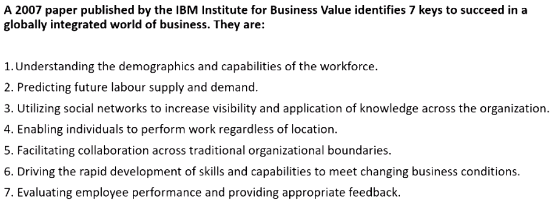

[TOC]

# Week 1 - HRM First lecture

---

## PART 1

The main idea of HRM is that organizations can boost productivity and performance by designing and managing work so that they take into account **employees' psychological and social need and aspirations**

>people don't react to work based only on the physical conditions and the characteristics of the technological system. Organizations are social systems, people like to feel that they matter

What is distinctive about HRM (as compared to traditional personnel management)?
- with can obtain higher performances through the application of HR practices;
- practices need to be seen as bundles: they need to fit together and to fit with the strategy of the organization;
- line managers need to cooperate with the HR rules, by committing to and applying them.

### The development of contemporary HRM also benefits from:
 - the decline of union memberships and union influence (probably it means the HR theory is **widespread across the world** and everyone can bring new features and techniques in);
 - the Japanese model (Toyota and Honda mainly) highlighted the importance of managing people by focus a lot on importance of **social aspects** in organizations and things like **teamwork**

---

## PART 2

####Strategic HRM (SHRM) = Strategic Management + HRM
The idea derived from 2 main points:
- Different [business] strategies require different HR practices;
- Higher performance is the result of alignment between HR strategies and HR strategies and their (business) practices (in the lecture he said HR practices instead).

## There are 3 types of SHRM

### Universalist Perspective (Best practices)
*"There exists a set of best HR practices that, if applied, lead to higher organizational performance"*.

Some of these practices include promotions from within, high wages, incentives, information sharing, employment security, job rotation etc.

The theory says that the more of these practices are applied, the more engaged and satisfied the employee is, and the higher is the employee outcome and the organizational performance. 
It also states thats these practices are equally applicable to each organization regardless of the nature of unique aspects organizations might have; like if this approach could be "**universal**".

**The argument** is that many companies in different sectors managed to be successful using different **sets of management practices**. Furthermore, applying all of these practices is expensive. 
**The evidence**, however, came from many (empirical) studies and stated that the more of these techniques are applied, the betters is the outcome.

### Contingency Perspective (Best Fit)
*"Specific business strategies and goals require specific HR techniques"*.

**The argument** is that you might fall into the trap of **contingency determinism**, which means that the environment is defined as absolute and the solution to that is, in turn, absolute. (i.e. the context absolutely determines the strategy)
> **why is this wrong?**

**The evidence** There is some, not too wide, support for this thesis. Huselid (1995) found out that those organizations that link HRM practices to strategy report higher financial performance outcomes.

### Configurational Perspective (Bundle)
*"There are configurations or patterns of practices - called **bundles** - and the key is to find the most effective one"*.

Bundles are **interrelated** and they mutually reinforce the effect of the others. It is implicit in this that "more is better". 

**The argument** is that finding the right bundle is difficult, and it's hard to prove that a bundle is better than another.

**The evidence** Some tests have failed to prove that specific combinations of practices are better than the total number of HR practices applicable. However, other tests have found support for this approach in the banking sector.

> a key thing to point out is about the changes a Company makes: 
> - when these changes are aimed at improving the working space and the employee benefits, the latter is more committed to work and, of course, happier;
> - vice versa, when the changes are made to cut costs down, or employees are worried about being fired, the commitment levels drop down

 
 
 
 
 
 
 
 

# Week 2

### The IBM Case (a few years ago)
Looking at the competitive landscape, IBM realised 3 main things:
- Thanks to globalisation, communication and international trading barriers we're breaking down, which favored trades and investment flows across the countries;
- Protectionism in most countries was reducing;
- There were huge technological advances in communications which, to some extent, greatly favored the way work could be structured and teh way people could be managed.

This brought significant opportunities and changes:
- The production of goods and services flowed globally to places where it was more efficient and most benefit could be created, at the lowest cost (China exploitation);
- Looking at themselves, they figured they had to evolve **from** a traditional '*multinational*' approach, in which production is organised state by state, market by market, region by region (traditional boundaries of the nation-state) **to** Globally integrated Organisations to keep their competitiveness. (fully globalised and integrated organisation)

Hence, they had to remove redundancy and integrate operations both horizontally and globally.

So the focus was on:
+ understanding the people working in the organisation, what their environment is like, who are the talent to invest one etc.
+ how to attract the right people and develop them internally, and how to deploy the workforce across cultural and geographical boundaries.

## Globalisation for sociologists
Globalisation can be seen in many ways, for example:
- The **intensification of social relations which links together distant localities**, making an event happening somewhere in the world, relevant to shape the life of a place located on the other side of the world;
- The creation of a big, **heterogeneous culture spread across the world**, but also the **annihilation of small cultures**.

From the sociologists POV these are the key ideas:
- globalising values and views of the world, meaning tha there is a culture that we all share;
- interdependence between societies, that can lead to culture enrichment as well as cultural annihilation;
- globalisation is seen as an irreversible trend.

## Globalisation for economists
"Globalisation is the **increasing interdependence between countries** which inevitably leads to **increasing volume and varieties of cross-border transactions** (also the increase of technology is part of this phenomenon)"

"**Integration of markets, nation-states and technologies** to a degree that we have never seen before, allowing to **reach for places farther, faster, deeper and cheaper.** It also includes the **spread of free-market capitalism to virtually every country of the world**"

From the economists POV these are the key ideas:
- there is a growing internationalisation dynamic of our economy;
- it is dominated by uncontrollable market forces;
- the main actors agents of change are truly **transnational corporations** located wherever on the global market advantage dictates.

Drop in transports costs and increase in technology allowed richer countries to exploit developing countries for production, however, *premium skills* like R&D are still done in rich countries.

**Globalisation in not inexorably expanding** (think of Covid or WW)

# Week 3

## Skills that will be demand in future
- **Digital skills**: knowing how to use a computer, how to surf the web, able to work remotely and to use software like MS Office;
- **Agile thinking skills**: ability work and adapt to different scenarios, to complexity and ambiguity, to innovation;
- **Interpersonal and communicational skills**: collaborative people, able to efficiently communicate to customers and other team members, with good oral and written communication skills, people how can brain storm. 
- **Global operating kills**: (particularly important for multinationals and big corporations) people speaking different languages, people sensitive to different cultures and traditions, people who understand international markets and can work (and manage) diverse people.

## Talents
Back in the past (2010), **talents were primarily in developed countries** like US, UK, Germany and so on, and there was a **lack of them in developing countries** like China, India, Brazil etc. As the projection proved, **the situation has become the opposite in our days**, having developing countries with a surplus of talents, and with developed countries having shortages.

> talent here is meant as analytical, digital, agile etc. skills.   

The reason behind this shift in talents is that those developing countries, as they were facing deficits, **invested on new workforce growth, training more college graduates and post grads** per capita.

A quick solution would be **to import talents** from other countries, but these people **hardly understand** the language, the culture, and even less, **the market**. Furthermore you not only have to retain and engage people from your local market, by expanding to other markets and teaching them the fundamentals of your nation.

## Old vs. New Deal

## Psychological contract

It is a set of unwritten reciprocal **expectations** between the individual employee and the organisation. But of course it can be subjective, that is, the perceptions of both parts of the employment relationship of the **reciprocal promises and obligations** implied by that relationship.

> During an interview the company promises you great stuff, and you promise to help them fulfill their mission.

## Protean and Boundaryless careers
 
In spite of being different, these careers types are not opposite; the opposite might be (I am not sure) organisational career.
A protean career attitude implies that a person strives towards a developmental progression and self-fulfillment; a boundaryless career attitude is characterized by a high physical and/or psychological mobility.

The latter concept is very linked to the fact that long term careers do not exist anymore.

> **Job tenure:** the average years a person spend with the same company.

Although researches have demonstrated a slight increase in job tenure over the years, there's the chance that careers are getting more boundaryless and highly protean.

### Satisfactions and proficiency with protean and boundaryless attitudes
**Some studies coducted at Kings** show that people taking boundaryless careers have lower job, life and career satisfactions than other workers. 
From a organisation POV, they have less commitment to work and are more willing to leave the company.

Opposed to that, people taking protean careers tend to be happier than other workers. Also, they have better job performances, and better CB (Citizenship behaviour).

As protean attitude leads people to proactivity and better performance, organisations seeks to retain these employee.

Boundaryless people are instead retained when they have high human capital and high turnover.
Low boundaryless careers tend to appreciate High HRM commitment, whereas high boundaryless careers seem to prefer not to have HRM investing too much on them. This counts for OCB, OCBI and Job Performance. 

**To conclude**:
- Protean Careers are a WIN-WIN, the employee is happy and the job performance is good;
- Boundaryless Careers are a LOSE-LOSE, their general dissatisfaction leads them to less commitment and lower performance at work. Furthermore, HR has little impact on them.

# Week 4 - Recruiting the right talents

Is recruiting a fair process?

> No, the examiner may be **biased** or they might trust their **gut** over non quantifiable matters like **level of confidence** or **how much a candidate talks confidently** or **the energy**.

## The selection process
The selection is a set of specifications, that you should think thoroughly, about how the candidate should be, that is, you should seek a candidate that fits the criteria you define.

A candidate features belong with 2 type:
- **Background Factors**: education, experience, etc.
- **Personal Factors**: intellectual ability, personality, motivation etc.

### Background Factors

Background factors can in turn be divided into sub categories:

**Education**
Is the educational background mandatory, or is it more of a tradional standard? Also, if you require someone to have a PhD, think of how big is the pool you can draw from when looking for candidate: surely the candidates will be very prepared, but they are also a very small amount.

**Experience**
Experience is required very often too, but, again, it is important to be precise on the type of experience required:

- **Industry Exp**: you may need an expert in a field, but that person should be able to talk to costumer rather than working on internal stuff
- **Function Exp**: experience in the sector or in specific tasks, but this kind of requirements may be misleading. Suppose you are a multinational company counting thousands of employees, and are looking for someone with 2 years of experience in HR: a candidate comes up with 3 (even more than what you asked for) years of experience, but in a small company counting 500 people at most.
- **Company Exp**: some companies heavily invest in the employee training and formation, so a candidate coming from there may be more interesting than someone caming from a "lazy" company that produces paper pushers.

### Personal Factors

**Intellectual ability**
- **Analytical ability** – Ability to take a complex problem, define it, break it down in pieces to understand it better and then put the pieces back together and come up with a solution

- **Creative ability** – This may encompass the ability to generate strategic options, come up with new product/service ideas, etc.

- **Decision-making Style** –  Some people are extremely analytical, fact-based and structured. Others rely more on gut and intuition. Which style best fits the job/company?

**Motivation** (How much effort is the individual willing to make in his/her job?)
> Beware, if you promise something to the employee and do not fulfill the commitment, there will probably be a turnover and they will leave.

- **Goals** – Does the work fit with people’s own goals and ambitions?

- **Interests**  - Does the work fit with people’s interests (a salesperson who does not like to talk to people is not likely to be successful) (see career orientations).

## Selection process

### Decide the prerequisites
This will already skim a lot of candidates

### Aggiungi pic

Candidates may have to meet some prerequisites that could be:
- **Job wise**: the preparation for a specific job or role;
- **Person wise**: background, experience, character, relationship capabilities

There are several ways to test these characteristics, for example an interview reveals the person, how they speak etc. whereas a test shows their technical skills. The best idea would be to use multiple testing techniques (interviews, test, assestment centres, references, etc.) to better understand all the aspects you are interested in.

**Characteristics of a good test**

**standardised** means that a person's score has to be contextualised. A score of x has a different meaning if executed by a graduate rather than a worker (perhaps in the sense that a grad student, who has no practical experience, may be disadvanted, yet prove to have a great potentiality)

**the other thing**

###### video 2
## Assessment Centres

Assesment Centres are very important in the process of selecting new candidates. People taking part to this (on avg 1 assessor per 2 candidates) can give different opinions on the same candidate and, if the criteria are well defined, the **bias** can be removed.

## References
Very required, can be important to know the responsabilities and the professionality of a candidate, but they don't help much when it comes to character as the person on the other side will probably not talk trash about them. So be careful about it.

## Selection Interviews
Useful to find out about the candidate skills, competences, knowledge, qualifications, training etc.
But also to find out how much they are motivated and if they (values and horientations) would fit in the organisation (also, for example, can they travel or come to work on short notice, can they work on social hours)

### How to prepare for a interview
- Clearly define the requirements and the criteria necessary for a candidate to achieve them (study degree, experience, knowledge and skills);
- Decide what else to judge the candidate on beside the competences and the behaviour (for example being able to work on social hours, having a car etc.)
- Will you have a structured or unstructured interview:
  -  #### Structured interview
        Super **standardised**, questions are defined and asked in a specific order; these questions are very tied to specific role criteria.
        The answers are rated based on a **pre-formatted scale**.
        The advantages of structured interviews are that they are **less prone to bias**, so they are more reliable predictors of future job performance and person job fit 