[TOC]

# Week 1 - HRM First lecture

---

## PART 1

The main idea of HRM is that organizations can boost productivity and performance by designing and managing work so that they take into account **employees' psychological and social needs and aspirations**

>people don't react to work based only on the physical conditions and the characteristics of the technological system. Organizations are social systems, people like to feel that they matter

What is distinctive about HRM (as compared to traditional personnel management)?
- companies can obtain higher performances through the application of HR practices;
- practices need to be seen as bundles: they need to fit together and to fit with the strategy of the organization;
- line managers need to cooperate with the HR rules, by committing to and applying them.

### The development of contemporary HRM also benefits from:
 - the decline of union memberships and union influence (probably it means the HR theory is **widespread across the world** and everyone can bring new features and techniques in);
 - the Japanese model (Toyota and Honda mainly) highlighted the importance of managing people by focusing a lot on the importance of **social aspects** in organizations and things like **teamwork**

---

## PART 2

#### Strategic HRM (SHRM) = Strategic Management + HRM
The idea derived from 2 main points:
- Different [business] strategies require different HR practices;
- Higher performance is the result of alignment between HR strategies and HR strategies and their (business) practices (in the lecture he said HR practices instead).

## There are 3 types of SHRM

### Universalist Perspective (Best practices)
*"There exists a set of best HR practices that, if applied, lead to higher organizational performance"*.

Some of these practices include promotions from within, high wages, incentives, information sharing, employment security, job rotation etc.

The theory says that the more of these practices are applied, the more engaged and satisfied the employee is, and the higher is the employee outcome and the organizational performance. 
It also states thats these practices are equally applicable to each organization regardless of the nature of unique aspects organizations might have; like if this approach could be "**universal**".

**The argument** is that many companies in different sectors managed to be successful using different **sets of management practices**. Furthermore, applying all of these practices is expensive. 
**The evidence**, however, came from many (empirical) studies and stated that the more of these techniques are applied, the betters is the outcome.

### Contingency Perspective (Best Fit)
*"Specific business strategies and goals require specific HR techniques"*.

**The argument** is that you might fall into the trap of **contingency determinism**, which means that the environment is defined as absolute and the solution to that is, in turn, absolute. (i.e. the context absolutely determines the strategy)
> **why is this wrong?**

**The evidence** There is some, not too wide, support for this thesis. Huselid (1995) found out that those organizations that link HRM practices to strategy report higher financial performance outcomes.

### Configurational Perspective (Bundle)
*"There are configurations or patterns of practices - called **bundles** - and the key is to find the most effective one"*.

Bundles are **interrelated** and they mutually reinforce the effect of the others. It is implicit in this that "more is better". 

**The argument** is that finding the right bundle is difficult, and it's hard to prove that a bundle is better than another.

**The evidence** Some tests have failed to prove that specific combinations of practices are better than the total number of HR practices applicable. However, other tests have found support for this approach in the banking sector.

> a key thing to point out is about the changes a Company makes: 
> - when these changes are aimed at improving the working space and the employee benefits, the latter is more committed to work and, of course, happier;
> - vice versa, when the changes are made to cut costs down, or employees are worried about being fired, the commitment levels drop down

# Week 2

### The IBM Case (a few years ago)
Looking at the competitive landscape, IBM realised 3 main things:
- Thanks to globalisation, communication and international trading barriers we're breaking down, which favored trades and investment flows across the countries;
- Protectionism in most countries was reducing;
- There were huge technological advances in communications which, to some extent, greatly favored the way work could be structured and the way people could be managed.

This brought significant opportunities and changes:
- The production of goods and services flowed globally to places where it was more efficient and most benefit could be created, at the lowest cost (China exploitation);
- Looking at themselves, they figured they had to evolve **from** a traditional '*multinational*' approach, in which production is organised state by state, market by market, region by region (traditional boundaries of the nation-state) **to** Globally integrated Organisations to keep their competitiveness. (fully globalised and integrated organisation)

Hence, they had to remove redundancy and integrate operations both horizontally and globally.

So the focus was on:
+ understanding the people working in the organisation, what their environment is like, who are the talent to invest one etc.
+ how to attract the right people and develop them internally, and how to deploy the workforce across cultural and geographical boundaries.

## Globalisation for sociologists
Globalisation can be seen in many ways, for example:
- The **intensification of social relations which links together distant localities**, making an event happening somewhere in the world, relevant to shape the life of a place located on the other side of the world;
- The creation of a big, **heterogeneous culture spread across the world**, but also the **annihilation of small cultures**.

From the sociologists POV these are the key ideas:
- globalising values and views of the world, meaning tha there is a culture that we all share;
- interdependence between societies, that can lead to culture enrichment as well as cultural annihilation;
- globalisation is seen as an irreversible trend.

## Globalisation for economists
"Globalisation is the **increasing interdependence between countries** which inevitably leads to **increasing volume and varieties of cross-border transactions** (also the increase of technology is part of this phenomenon)"

"**Integration of markets, nation-states and technologies** to a degree that we have never seen before, allowing to **reach for places farther, faster, deeper and cheaper.** It also includes the **spread of free-market capitalism to virtually every country of the world**"

From the economists POV these are the key ideas:
- there is a growing internationalisation dynamic of our economy;
- it is dominated by uncontrollable market forces;
- the main actors agents of change are truly **transnational corporations** located wherever on the global market advantage dictates.

Drop in transports costs and increase in technology allowed richer countries to exploit developing countries for production, however, *premium skills* like R&D are still done in rich countries.

**Globalisation in not inexorably expanding** (think of Covid or WW)

# Week 3

## Skills that will be demanded in future
- **Digital skills**: knowing how to use a computer, how to surf the web, being able to work remotely and to use software like MS Office;
- **Agile thinking skills**: ability to work and adapt to different scenarios, to complexity and ambiguity, to innovation;
- **Interpersonal and communicational skills**: collaborative people, able to efficiently communicate to customers and other team members, with good oral and written communication skills, people who can brain storm. 
- **Global operating skills**: (particularly important for multinationals and big corporations) people speaking different languages, people sensitive to different cultures and traditions, people who understand international markets and can work (and manage) diverse people.

## Talents
Back in the past (2010), **talents were primarily in developed countries** like US, UK, Germany and so on, and there was a **lack of them in developing countries** like China, India, Brazil etc. As the projection proved, **the situation has become the opposite in our days**, having developing countries with a surplus of talents, and with developed countries having shortages.

> talent here is meant as analytical, digital, agile etc. skills.   

The reason behind this shift in talents is that those developing countries, as they were facing deficits, **invested on new workforce growth, training more college graduates and post grads** per capita.

A quick solution would be **to import talents** from other countries, but these people **hardly understand** the language, the culture, and even less, **the market**. Furthermore you have to retain and engage people from your local market, by expanding to other markets and teaching them the fundamentals of your nation.

## Old vs. New Deal

## Psychological contract

It is a set of unwritten reciprocal **expectations** between the individual employee and the organisation. But of course it can be subjective, that is, the perceptions of both parts of the employment relationship of the **reciprocal promises and obligations** implied by that relationship.

> During an interview the company promises you great stuff, and you promise to help them fulfill their mission.

## Protean and Boundaryless careers
 
In spite of being different, these careers types are not opposite; the opposite might be (I am not sure) organisational career.
A protean career attitude implies that a person strives towards a developmental progression and self-fulfillment; a boundaryless career attitude is characterized by a high physical and/or psychological mobility.

The latter concept is very linked to the fact that long term careers do not exist anymore.

> **Job tenure:** the average years a person spend with the same company.

Although researches have demonstrated a slight increase in job tenure over the years, there's the chance that careers are getting more boundaryless and highly protean.

### Satisfactions and proficiency with protean and boundaryless attitudes
**Some studies coducted at Kings** show that people taking boundaryless careers have lower job, life and career satisfactions than other workers. 
From a organisation POV, they have less commitment to work and are more willing to leave the company.

Opposed to that, people taking protean careers tend to be happier than other workers. Also, they have better job performances, and better CB (Citizenship behaviour).

As protean attitude leads people to proactivity and better performance, organisations seeks to retain these employees.

Boundaryless people are instead retained when they have high human capital and high turnover.
Low boundaryless careers tend to appreciate High HRM commitment, whereas high boundaryless careers seem to prefer not to have HRM investing too much on them. This counts for OCB, OCBI and Job Performance. 

**To conclude**:
- Protean Careers are a WIN-WIN, the employee is happy and the job performance is good;
- Boundaryless Careers are a LOSE-LOSE, their general dissatisfaction leads them to less commitment and lower performance at work. Furthermore, HR has little impact on them.

# Week 4 - Attracting and Retaining Talents
###### video 1
60 % of companies reported problems to attract talents and 55 % to retain them.

## Techniques to attract talents

- Understand **what people** - the ones the company wants to attract - **want from work and career**
- Communicate who they are to current and prospective employees
- Translate their EVP (Employee Value Proposition) into a strong employer brand
- Invest in recruitment
- Very selective in hiring

## Schein's research
According to this guy who studied alumni for 10/12 years, people do not know what they want from a job at the beginning
of their career. They generally develop an identity within the first 5 to 7 years and that tends to remain stable throughout their lives.
Schein Identified 8 types of people:

The technical one aims to become a GURU and to be seen as a master in what they do.

###### video 2
## Before the recruitment process
Companies should wonder 
- what distinguishes them from the competition, 
- what they can offer to prospective employees and
- what people they want to attract

## Signaling the job market WHO YOU ARE as an employer
Before applying for a job, people may know what leaks out of the company (*outside*) such as their product, their reputation, the salary and the job offer you 
can get, but they know **little about the working environment** (*inside*) and this unbalanced knowledge is know as **INFORMATION ASYMMETRY**.

Signalling the market about the job is you offer is very important to 
- the company: because you want to recruit the right people, because the recruiting process is very expensive and time consuming, 
- but also for candidates who, just like you, do not want to waste time after a job which does not suit them. (both of the parties want to lessen the problem **adverse selcection**)

So the company want to signal the market with the quality of the work they offer.

## Employee Value Proposition (EVP)
What the company stands for and what it represents, what an employer has to offer in terms of salary, benefits, social responsibility etc. 

To be effective, an EVP has to be:
- **formalised**: the company has to be conscious of what they have to offer and communicate it very clearly;
- **effectively communicate to both prospective employees and current employees** via ads, website, during the interviews etc.;
- **aligned** with the mission of the company;
- **different** from other to distinguish them from competitors;
  
EVP has to reflect in the employees':

Rewards = salaries and how people are managed 

### Hospital 1
Life balance, challenge, strong city community, high salary, life amid the nature, "adventure".

Looking to be rich and leave amid the nature.

### Hospital 2
Serenity, calm, Christian values, strong inner community, strong proposition of curing people to make some good, "spiritual environment", child support

Looking to fulfill the hospital mission to help other people and commit to the Christianity community, great for people with kids, stability, possibility of making career and to use state-of-art machines

###### video 3
## Recruitment
A company shoudl attract as many candidates as possible in order to have a big pool to choose from.

### Key recruitment decisions
- Should we fill a vacancy internally or search for candidates in the external market?
- Where to look for applicants?
- The content of the job and the type of person required
- What to tell applicants? What do we tell them about the company, especially about the **downsides**?

### Filling a vacancy
This is not a mutual exclusive process, you can look into both external and internal candidates

### Where to search
- Direct applicants

- Referrals

- Local/national (?) newspaper (Gardian? FT? Daily Telegraph? Professional journals? e.g. Nursing Times or the Journal of Pharmacy)

- E-recruitment (jobs.ac.uk; facebook; linkedin; company websites; etc.) 
  > **BEWARE** that you do not really know what kind of people you may attract via social networks

- Employment agencies 
    - Public (Job Centre)
    - Temporary employment agencies
    - Recruitment Consultants
    - Headhunters/Executive Search Consultants

- University “milk-round” (Key for attracting high potential employees)

### Defining the person requirements

### What you should tell to applicants
Every job comes with some downsides, and the recruiter has to give a good dose of realism to the candidate.
This will prevent a turnover as the candidates are aware of them (and the employer will not have to repeat the recruiting process again in case) and the employee will be more committed. 
Put it in a nice way of course, for instance, during the interviewing for healthcare assistant, ask the candidate how they would feel about cleaning the vomit, which smells terrible, as it will happen very often. This will give them a chance to reflect on whether or not they really want that job and are ok with that.

# Week 5 - Recruiting the right talents

Is recruiting a fair process?

> No, the examiner may be **biased** or they might trust their **gut** over non quantifiable matters like **level of confidence** or **how much a candidate talks confidently** or **the energy**.

## The selection process
The selection is a set of specifications, that you should think thoroughly, about how the candidate should be, that is, you should seek a candidate that fits the criteria you define.

A candidate features belong with 2 types:
- **Background Factors**: education, experience, etc.
- **Personal Factors**: intellectual ability, personality, motivation etc.

### Background Factors

Background factors can in turn be divided into sub categories:

**Education**
Is the educational background mandatory, or is it more of a tradional standard? Also, if you require someone to have a PhD, think of how big is the pool you can draw from when looking for candidate: surely the candidates will be very prepared, but they are also a very small amount.

**Experience**
Experience is required very often too, but, again, it is important to be precise on the type of experience required:

- **Industry Exp**: you may need an expert in a field, but that person should be able to talk to costumer rather than working on internal stuff
- **Function Exp**: experience in the sector or in specific tasks, but this kinds of requirements may be misleading. Suppose you are a multinational company counting thousands of employees, and are looking for someone with 2 years of experience in HR: a candidate comes up with 3 (even more than what you asked for) years of experience, but in a small company counting 500 people at most.
- **Company Exp**: some companies heavily invest in the employee training and formation, so a candidate coming from there may be more interesting than someone caming from a "lazy" company that produces paper pushers.

### Personal Factors

**Intellectual ability**
- **Analytical ability** – Ability to take a complex problem, define it, break it down in pieces to understand it better and then put the pieces back together and come up with a solution

- **Creative ability** – This may encompass the ability to generate strategic options, come up with new product/service ideas, etc.

- **Decision-making Style** –  Some people are extremely analytical, fact-based and structured. Others rely more on gut and intuition. Which style best fits the job/company?

**Motivation** (How much effort is the individual willing to make in his/her job?)
> Beware, if you promise something to the employee and do not fulfill the commitment, there will probably be a turnover and they will leave.

- **Goals** – Does the work fit with people’s own goals and ambitions?

- **Interests**  - Does the work fit with people’s interests (a salesperson who does not like to talk to people is not likely to be successful) (see career orientations).

## Selection process

### Decide the prerequisites
This will already skim a lot of candidates

> #### PICTURE TO BE ADDED

Candidates may have to meet some prerequisites that could be:
- **Job wise**: the preparation for a specific job or role;
- **Person wise**: background, experience, character, relationship capabilities

There are several ways to test these characteristics, for example an interview reveals the person, how they speak etc. whereas a test shows their technical skills. The best idea would be to use multiple testing techniques (interviews, test, assestment centres, references, etc.) to better understand all the aspects you are interested in.

**Characteristics of a good test**

**standardised** means that a person's score has to be contextualised. A score of x has a different meaning if executed by a graduate rather than a worker (perhaps in the sense that a grad student, who has no practical experience, may be disadvantaged, yet prove to have a great potentiality)

###### video 2
## Assessment Centres

Assesment Centres are very important in the process of selecting new candidates. People taking part to this (on avg 1 assessor per 2 candidates) can give different opinions on the same candidate and, if the criteria are well defined, the **bias** can be removed.

## References
Very required, can be important to know the responsabilities and the professionality of a candidate, but they don't help much when it comes to character as the person on the other side will probably not talk trash about them. So be careful about it.

## Selection Interviews
Useful to find out about the candidate skills, competences, knowledge, qualifications, training etc.
But also to find out how much they are motivated and if they (values and horientations) would fit in the organisation (also, for example, can they travel or come to work on short notice, can they work on social hours)

### How to prepare for a interview
- Clearly define the requirements and the criteria necessary for a candidate to achieve them (study degree, experience, knowledge and skills);
- Decide what else to judge the candidate on beside the competences and the behaviour (for example being able to work on social hours, having a car etc.)
- Will you have a structured or unstructured interview.

## Structured interview (IMPORTANT!)
Super **standardised**, questions are defined and asked in a specific order; these questions are very tied to specific role criteria.
The answers are rated based on a **pre-formatted scale**.
The advantages of structured interviews are that they are **less prone to bias**, so they are more reliable predictors of future job performance and person job fit.

### Researches on structured interviews
- Interviewers tend to agree more on candidates.
- They have proven to be more reliable.
- Candidates chosen via this process are associated with better job performances, tenure and promotions.
  

## Biographical Interviews

A **Biographical interview** is one where the interviewer looks at the past experiences of the candidate, from the most recent to the oldest one.

## Behavioral interviews

In **Behavioural interviews**, instead, the candidate is asked how they behave in specific occasion like "how do you deal with a type of client" or "how do you respond when you are under pressure" and so on.

**Pro**
- Past performances are the best predictor of future behaviour.

**Con**
- Some candidates may not have experience and this makes it harder to compare them. Also, some of them might have had different experiences than others.

## Situational Interviews
Look at the behaviour in very specific scenarios such as a difficult client you have to deal with.

The difference with the behavioural is that here you suppose a scenario whereas in the previous one it refers to something that has happened already.

**Pro**
- Easy to compare candidates as the example is the same for all, and even candidates with no experience can answer.

**Con**
- People may say "I would do this" but then, in practice, they would not act that way.

## Bias in selection
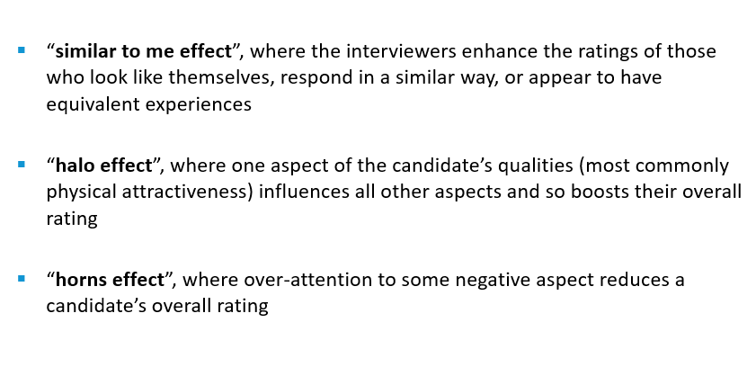

Obese people (especially women) are way less likely to be hired.

> the first impression an interviewer perceives of the candidate happens between the first **4 minutes**, and then the rest of the time, the interviewers tries to confirm their impression.

Being aware of the fact that we are often biased is the best way to mitigate it.

We are not biased on purpose, it is an unconscious process.

# Week 6 - Training

## Training process

> What Honey means by that is that **learning** and managing knowledge is the way to achieve innovation and to keep oneself different from the competitors; also that **being different is now more important than being better** with respects to your competitors.

A **learning company** is one that seeks for new ideas, comes up with new ideas, moves them throughout the organisation, and *then* it actually **acts**, it takes the new knowledge as a basis for responding to a changing environment.

This **learning process** is accompanied by a **learning environment** that makes this process possible, and the **leadership** that fosters (favorire) and inspires the learning processes and helps create this learning environment model.

Products, services and even processes can be copied, to so stay ahead of the competition, **learning is the only sustainable competitive advantage you can have**.
If your rate of learning is smaller than the rate of changing (of the world, the market, the sector etc.) you are gonna fall behind.

Some companies believe they do good, but fall into common pitfalls:
- They theoretically do it, but in practice do not implement and activate the learning process;
- The learning is done, but only highest members in the hierarchy, such as CEOs and top managers, are instructed whereas line managers and normal workers, aka those doing the real work, are not;
- Lack of standards to assess how well the organisation is doing

When selecting the candidate, the company can:
- Assume an experienced worker:
  - who can bring a lot of experience and flexibility, but
  - will require a higher salary and
  - (being more employable) are at higher risk of a turnover
- Assume an unexperienced person:
  - who brings less benefit, 
  - who can be trained (but then they turn into an experience worker) risking to invest on their learning and then they change company

> Researches show that employees who feel more employable also report higher intentions to quit their organisations.
> However, Nielson found that investment in learning makes the employer

Empirical studies proof that investing in employee training and development is more strongly associated with **internal** rather than **external** employability, that means, they are not very likely to quit the job, but they are to seek a new position in the company.

> Investing on the right employee is always a good decision. Investing on someone seeking a protean career, for example, helps the company retain such employee.

Investment in **Career Development Practices** increases people's perceptions of their own employability (PEE) in the external market, and the effect is stronger on people who already feel employable to start with.

**Higher perceptions of employability** are associated with **lower intention to quit** and **higher organisational commitment** among individuals who are more **proactive** in managing their careers (protean career).

So, when people are expecting investments in their career (protean) and they do receive such training, they are more willing to stay with that company.

## Training analysis

Before doing any type of training, the company has to clear out the objectives of that process in 3 ways:

> 
> 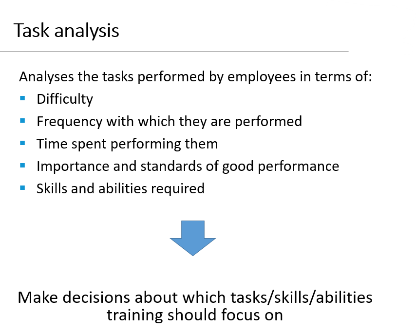
> Critical tasks and tasks that add a lot of value to the company are the primary objective.

> 

## Training methods

There are 2 main types of training:

### Presentation methods

The trainee is passive recipients of information:

- **<u>Classroom instruction</u>** 
    - Typically we have a **lecturer** transmitting information to one group of trainees;
    - **Inexpensive** way to transmit information to many trainees.

- **<u>Distance learning</u>** 
    - Trainees attend programs where they can communicate with the trainer and other trainees at other locations (eg. **Videoconferencing**)
    - Useful for geographically dispersed companies.

- **<u>Audiovisual technique</u>** 
  - Useful for transmitting information and developing skills such as communication, interviewing, and customer-service skills (eg. **Training Videos**).

### Hands-on methods

The trainee is actively involved in learning:

- **<u>On-the-job training</u>**
Employees learn through observing peers or managers performing the job and trying to imitate their behavior (adequate for newly hired employees; low skilled workers)

- **<u>Simulations</u>** 
Represents real life situations and allows trainees to see the impact of their decisions in an artificial, risk-free environment (eg. Airplane pilots)

- **<u>Business games and case studies</u>** 
Trainees discuss cases relevant to better understand the complexity of their jobs and engage in games that stimulate acquiring relevant skills and knowledge.

- **<u>E-learning</u>** 
Training content usually delivered via web allowing trainees to have control over the learning process (when, where, at what speed)

### Selecting the method

- **<u>Who is it for?</u>**
Methods such as on-the-job training may be more useful to train unskilled workers than managers

- **<u>What is it for?</u>**
Classroom training may be more adequate to transmit information on labor law than case studies or simulations.

- **<u>What is the cost?</u>**
Audiovisual techniques may be less expensive to transmit company policy on customer care to thousands of workers dispersed across a country than classroom training. However, if we are training a few dozen workers producing a video may be too expensive.

### Method evaluation

## Employee Development Experiences

- **Temporary assignments with another organization -** What Toyota does which makes an employee working with a partner group for the sake of both employer's development and building the relationship with the partner (understanding and helping them) 

## Interpersonal Relationships

 
 
 

## RITZ-CARLTON Case study
The history of the Ritz-Carlton is the one of a luxury hotel which guests have always experience an amazing staying. Employees are perhaps the most important resource of the company and their training is fundamental. 

Employees are treated as *ladies and gentlemen* so that the company can retain them and, most importantly, because if the hotel treats them this way, they will treat guest the same way in turn.

The voluntary attrition (abbandono) rate is only 18%, which is well below the industry standard.

Ritz-Carlton realised that the quality of its end products was only as good as the people providing it. They do not "*hire*" people, they "*select*" them. As every employee has to take care of just one task, but they have to do it very well, the company prepared the ideal profile, job description, and quality recruitment based on the top performers from its hotel chain and the other comparable organisations. 

Candidates go through many interviews with different managers and they have to prove worthy of the job and full of empathy, kindness, passion for the job, and the ability to smile naturally.

> Technical skills can be taught, a change in the attitude is instead harder to achieve.

The idea is that people can show no skills, but the training cab teach them. What the training cannot teach them is to be passionate about their job and to smile in every situation.

### After being recruited

**2 day orientation**
After being recruited, the new employees undergo a 2 day orientation program. During this period they are treated like guests, they stay in the hotel rooms, eat at its restaurants, and a top managers welcome them with hand-written welcome cards. This is to ensure that they enjoy their job since day 1.

**21 day training**
After the initial orientation, each new recruit is assigned to and experience employee for 3 weeks of training. The 3 week the recruit performs the job and the actual employees gives feedback on his performance.
Recruits are instructed on the kind of language to use, omn dressing and appearance, and the behaviour with customers.
After this period, the top managers listens to the employee and the feedback; this allows him to check that the behaviour of employees is in line with the Ritz-Carlton philosophy and that the training is good enough.

At the end of the period, the employee takes a test to gauge(valutare) their technical skills and to demonstrate they have learnt the company philosophy. If not, the employee is offer the possibility to either leave or to join a department more suited to them.

**365 Certificate**
The training does not stop after those 21 days and employees are trained until day 365. Here they are tested again and certified.

**On going training**
The training does not stop after the first year and employees keep learning by doing and via courses

Each employee was given $2,000 a day to spend in assisting and helping guests. This gave them a lot of freedom as they did not have to ask for approval from managers, but also great responsibility (you consider them like valuable resources who can handle valuable resources).

Employees were also encouraged to suggest ideas to cut costs down or improving quality. Worthwhile ideas were awarded with cash bonuses. "employees have to feel part of the Ritz-Carlton".

**Why employee prefer RC**
Salaries are not higher than competitors, but employees are treated kindly and respectfully. Also the possibility of escalating the hierarchy lengthens job tenure.

# Week 7

## Performance Management
**(video 1)**

If you want to manage the performance of your company there are 3 steps to follow:

- **Define performance**: not every employee can be judged based on the same criteria, as such you have to define what performance means (based on the job, on the role, etc.)
- **Performance Appraisal (Evaluation)**: after defined performance, you need to define how and based on what you are going to assess the performance
- **Feedback**: once you have assessed the performance of your employees, providing them with feedback is a good way to point out their weaknesses and have them improving.

## Aims of performance management
**(video 2)**

**Strategic** <u>(align the employee to the company's mission)</u>
The performance management system should **communicate** and reflect the company **strategy** in terms of expected employee results and **behaviours**, and **skills** to develop.

**Administrative** <u>(allow the company to make decisions)</u>
The performance management system is useful (and should lead) to **make decisions** regarding employee promotion/demotion, retention/termination, salary growth, etc.

**Developmental** <u>(main point of perf. manag. - should help employee develop and improve)</u>
Feedback sessions are particularly important for employee development (analyse why employees are not performing; decide on training, job transfer, etc.). It easy to critic people, but instead of giving destructive criticisms, you should aim at developing them. 

## Performance Appraisal
A good performance appraisal system should be
- **Focus**: evaluating too many aspects may put too many things on the same level, and everything would be relevant, and nothing would be important. So a good system should focus and the most important things.
- **Fair**: individual should participate in developing the appraisal method and the should be given clear feedback.
- **Clear**: a performance appraisal system that people do not understand is strongly not recommended. The system should make clear how employee should perform and what distinguishes a poor performance from a good one.

## Designing Performance Appraisal System

Others may include external sources

### What to Evaluate

---

**Behaviour**
---

Organisations define the expected behaviours employees should exhibit and managers should evaluate to what extent employees exhibit these expected behaviours;
  
The most typical way to assess behaviours is via **critical incidents**, that is evaluating the behaviours in specific events that occurred.
     
  - **Behaviorally anchored rating scales (BARS)**
    BARS identify a number of performance dimensions (e.g. Interaction with customers) and typify **grades of performance levels** corresponding to the exhibition of behaviors critical to success or failure on the job (e.g. 1-9). The rater should then grade employees according to the type of behavior that best describes their performance and to what extent they exhibit that behaviour. 
    The behaviours to be looked at are those **typically associated with either good or poor performance**. 
    > e.g. 9 = good, 1 = poor 

    **PROS**:
    - It offers **clear feedback to employees**: people understand how they should behave and offering them feedback helps them understand to what extent they are adhering to these behaviours.
    - It easy to associate this to **potential training** and contribute to their **development**.
    - Can be effective in linking the **company strategy** to specific behaviors that facilitate strategy implementation.

    **CONS**:
    - It requires constant **monitoring**.
    - It is often not clear the association between individual behaviour and company performance. (people may behave in a certain way and not achieve the desired output)
    - People tend to behave better when the appraisal is coming, and managers tend to focus more on the more recent behaviours, instead, they should note down everything at any time.

---
**Attributes:** 
---
Focuses on the extent to which individuals have certain characteristics or traits considered relevant for the performance of their and job and to the performance of the organization (company’s success)

Some of the attributes usually used are:
- Communication skills;
- Managerial skills;
- Interpersonal skills;
- Problem solving skills. 
	
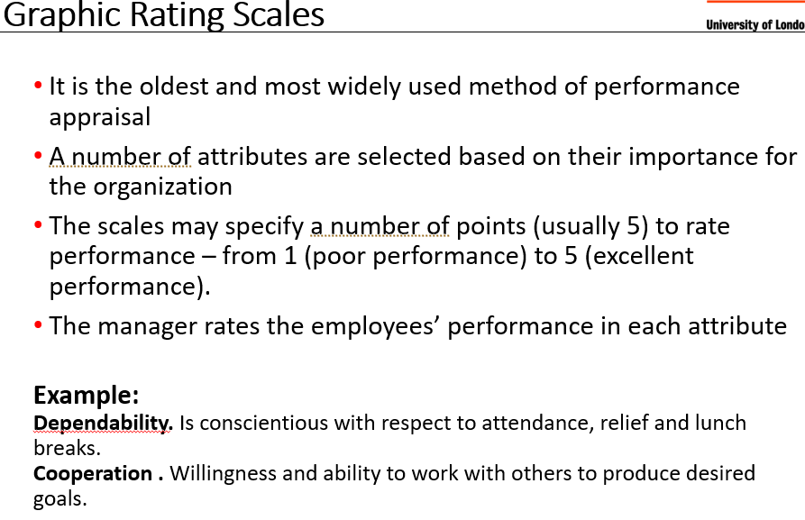

>e.g.

**PROS**:
- easy to evaluate;
- the same scale could be used across the company for different roles.

**CONS**:
- **Highly subjective**;
- Competences are hard to link to performance (someone with a competence may not display it via behaviour or performance);
- Does not offer ways to improve a skill.

---
Results:
---

1. the company establishes measurable performance targets and objectives
2. managers judge the extent to which the employee (or the team or whatever) achieved them over a specific amount of time.

**PROS**:
- subjectivity is reduced;
- it is easy to link individual performance to company's performance and that the link between employee performance and company's strategy is clear;
- managers have to deal with their employees on a daily basis and they have feelings, so assessing them negatively on behaviours is hard, but on achieved results is not.

**CONS**:
- Performance may be affected by factors out of employee's control (economic recession, or think of salespeople during COVID);
- individuals may end up focusing only on benchmarked aspects of their job;
- Employees' behaviours in achieving these results are not taking into consideration and they may have bad impacts on the team.

 

## Comparing Performance Between Employees
 
Often companies compare employees' performances with one another. 
They can either go from the best employee to the worst (**Simple Ranking**), or more generally divide them into groups (**Forced Distributions**) like top 10%(best), 11 to 20%, ... , 91+%(worst).

**PROS**
- Differentiate employees and helps decide about promotions or pay raises;
- Some managers may always rate their employees top performers, other may rate them always average performers. This approach eliminates this kind judgment.

**CONS**
- Someone allocates in the bottom 10% may be not far from someone in the mid 50%;
- Prone to suffer from “office politics”;
- Does not relate performance to objective employee outcomes;
- Does not relate performance appraisal to company strategy.

## Information sources

Information about the individual may come from:
**managers**
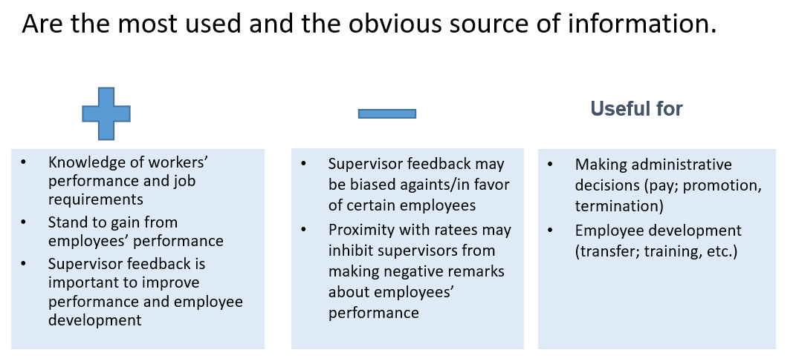

**peers**

**subordinates**
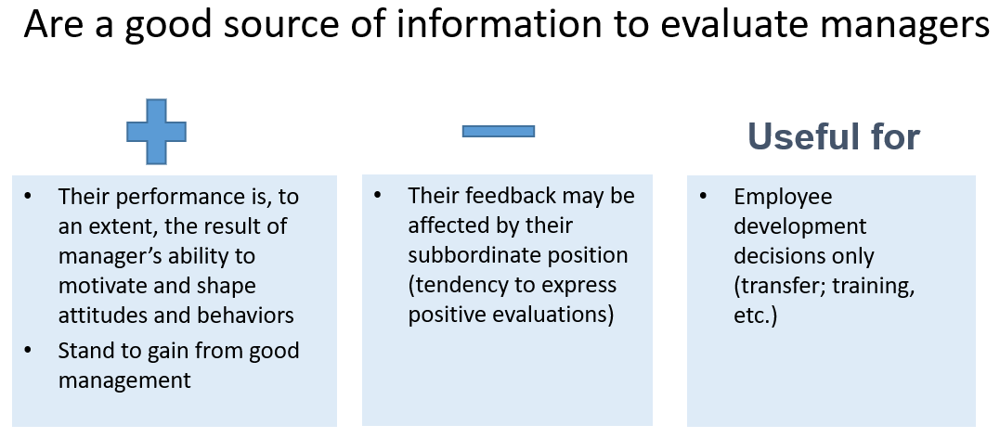

**self** (the subject **themselves**)

**clients** (or **external sources**)

The sum of all (or some) of these sources is called **360 degree evaluation**
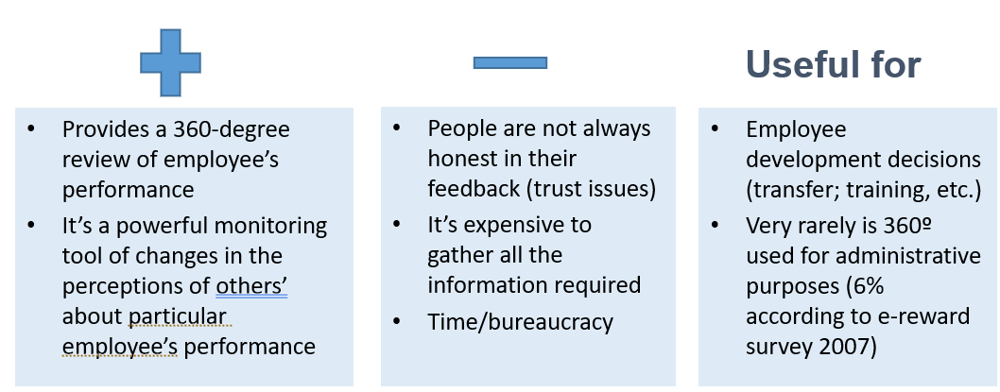

**REMEMBER** the point of evaluating employees is mainly to provide them with feedback in order to improve their performances and to citicise them.

# Week 8 - Reward Management

**Reward** is a “bundle of returns offered in exchange for a cluster of employee contributions” <cite>(Bloom & Milkovitch, 1996)</cite>

“**Reward management** is concerned with the formulation and implementation of strategies and policies in order **to reward people fairly, equitably and consistently** in accordance with **their value to the organization**”. <cite>(Armstrong, 2010)</cite>

> For the next part, the lecturer used the  CIPD (2019) report for the data.

**Fair**
- People should be treated justly in accordance with what is due to them because of their value to the organization. 
- People should be rewarded for the value they create.

> If you ask employees, their wage is not fair.

**Equitable**
People should be rewarded appropriately in relation to others within the organization and others doing similar work in other organizations.

We tend to compare our wage to those of other people covering similar roles inside and outside the organisation, and we expect to have a similar pay with respect to our contribution.

**Consistent**
Decisions on pay should not vary arbitrarily and without due cause between different people or at different times.

We want our salary to be stable.
- Rewards shape attitudes and behaviour in employees. An organisation that keeps changing is considered not stable
- This organisation is also likely to change the way they reward people or the standard use to judge who to reward, and those who joined the organisation based on some "rules", seeing them vanishing may decide to leave.

**Strategic** 
- People should be rewarded according to what the organization values and wants to pay for.
- The reward system should help to attract and retain high quality people.

This basically means that the reward strategy should be in line with the organisation strategy and proposition.

## Do rewards incentive people?
An MIT study case, with higher rewards for better performance, and lower, or no reward, for worse performance found out that:
- on jobs requiring mechanical skills, better rewards incentive people to work better, and their overall performance is good.
- on work that required even a little of cognitive skills (above rudimentary cognitive skills), the higher reward led to poorer performance.

A Little pay would not motivate people to work, so that is not a good idea, but overpaying them is not good either, in fact, as the many tests proofed, people perform worse.

This is because people have a purpose that motivates them which is not money. Atlassian gave their employee a whole free day to work on whatever they wanted. No bonuses were given to them whatsoever for their job, yet they came out with amazing ideas and work. Again, people need to feel self realised, and when they are paid the feel like they are not.

In essence, money should not be the only reward.

## Transactional Reward

<b>Transactional reward</b> (or total remuneration) is the value of all cash payments and benefits received by employees such as base pay or salary, contingent pay, cash bonuses, long-term incentives, shares, profit sharing and employee benefits which include pensions, holidays, health care,

**Base Pay**
It depends on different factors like:
- the importance of that role inside the company;
- the skills required for that job;
- market factors like supply and demand for that job; and so on.

The base salary is the starting point for deciding rewards, for example overtime work, sick pay, etc.

## Determining the base pay
The base salary can be defined base on:
- **Market factors** (external to the company)
  - **Extreme market pricing** -> market rates are the only thing taken into consideration;
  - **Market pricing** -> the job size is considered along side the market rate.
- **Internal focus** looks how jobs compare with each other in terms of value for the organisation.

## Pay determination

## Internal focus - Job Evaluation
Evaluating the size of a job by looking only at internal factors.
This methodology has been highly criticised as it is bureaucratic, 
time-consuming and irrelevant in a market economy where **market rates dictate internal rates of pay**, however, it is still widely practiced.

To mitigate bias, many people score the employee altogether.
 
## Contingent Pay
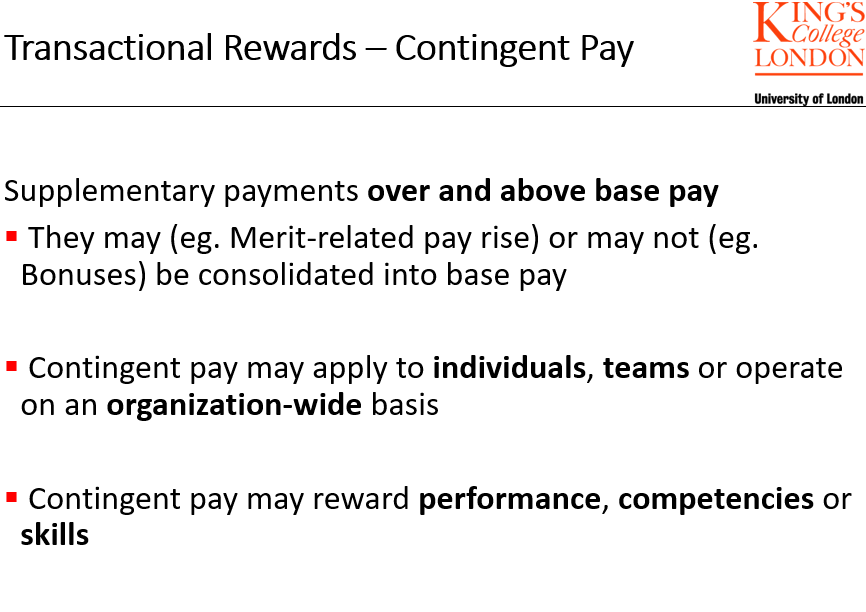

Pay increases are related to the achievement of agreed **results** defined as **targets** or **outcomes**.

Contingent pay is good to tell employees how they are performing, what the company is expecting from them, and also to motivate and retain them.

However, these benefits are normally small and do not impact significantly on the motivation. This system can also generate the opposite effect, i.e. dissatisfaction, if the criteria are not well specified.
Also, sometimes achieving results does not depend on the employee but on some environmental factors.

**Team-based pay** can also be considered:
- It would enforce the team spirit,
- But people may not feel as gratified as they should, or they may receive a lot of pressure from the teammates.

**Organisation wide bonuses**

## Benefits
Benefits are **non-monetary** bonuses with financial value, yet **very expensive**.

Their aim is not to directly motivate employees, but to create a working experience, to attract and retain.

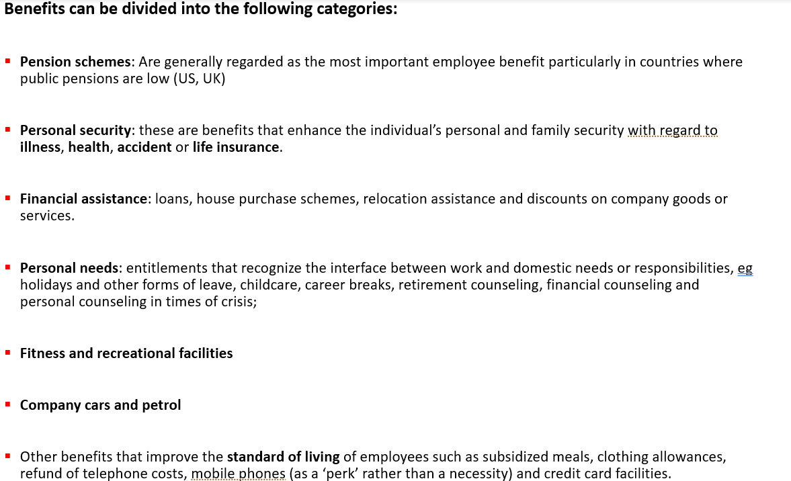

Employee may be able to decide their benefits to some extent. 
Degrees of employee freedom:
- Fixed menu (choice from a fixed list of benefits)
- Flexible menu (choice from a core list plus a wider list of other benefits - so-called core plus schemes)
- Total freedom (employees are free to choose up to their points/cash limit)

## Relative Rewards (non-financial)
Employees feel like bonuses are ought to them at some point, and cutting them could be bad. As financial benefits can be very expensive, consider about non financial ones:
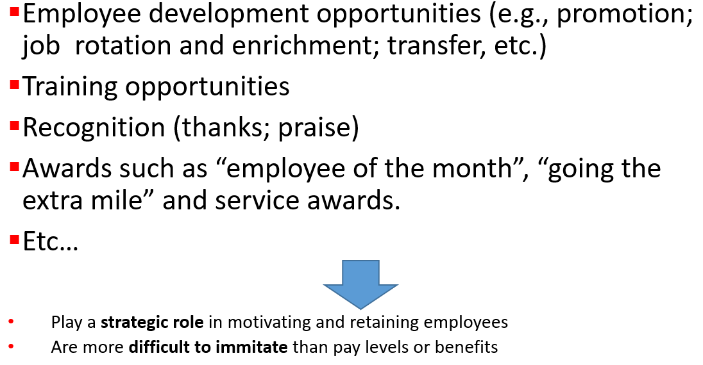

# Week 9 - Turnovers

<definition>
    <b>Employee Turnover</b> is the rate at which employee leave the company.  
</definition>

A turnover can be either:
- **Voluntary:** e.g. the employee wants to retire or change job; or
- **Involuntary:** the company fires the employee

Turnovers are generally associated with the **economy**: 
- During **recessions** voluntary turnover diminish and the involuntary ones increase.
- During **good times** the opposite holds true.

The turnover rate is not consistent across different types of job, for example **seasonal job** or hospitality display higher turnovers rate.

The formula for the turnover is simply
(# people who left during the year / avg. # of employee durint the year) x 100

This formula is however misleading as it does not consider what sector are leaving people from (HRM, salespeople, devops etc.)

---
**What do HR managers think about turnovers?**
Apparently, turnover is not seen as having meaningful negative impacts by HR managers, as the graph shows:

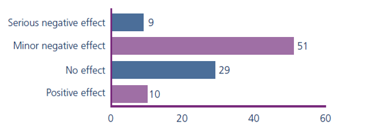

And, actually, managers are quite satisfied with the turnover rate:

In fact, 43% of them are ok with that rate and 14% would like to see an increase in this number.    

## Is turnover a bad thing?

**Thesis 1: No, it is not and it as actually a good thing**

1. As mentioned before, some sectors see a higher rate of turnovers, however, they still manage to be profitable.  
  Think about McDonald's or Burger king (which has a turnover rate of over 300%), they are incredibly profitable, yet employee leave and join steadily. 
  This businesses are called **businesses of numbers**.
 

2. There are plenty of jobs with **high retention rate** which offer poor services (e.g some **public sector organisation**)
 

3. High levels of turnover mean new employee with new ideas that can stimulate the company to come up with new products. (e.g companies in the Silicon Valley)
 

4. It allows to have control over the payrolls, in facts, laying off people allows companies to save money.

**Thesis 2: Yes, it is bad**

1. Is it **expensive** as you have to go through the recruitment and selection process, the induction (this refers to learning about the company structure and how things work), and the training again; also, consider the loss in productivity.
 

2. Turnovers are a **loss in human capital**. Consider that your employee may be skilled and hard to replace, or they may join your competitors benefitting them and, indirectly or directly, have a negative impact on your company.
 

3. loosing an employee may **put a lot of pressure on their teammates** who now have higher work loads. Some may argue that finding a replacement is a quick process, but still, the new employee may be "inept" and it takes them time become proficient.
 

4. High turnover rates reflect negatively on the company’s **reputation** with potential future employees and customers

**Conclusion**
High levels of turnover create instability and are expensive, but low levels of turnover are not desired either are the company does not get to recycle the skills, the mindset and the ideas.
So ideally, you should have reasonable turnover levels.

How do you decide the right amount?
This depends on several things like:
- the **sector**: you may look at your competitors to benchmark it;
- the **job category**, so are devOps leaving? and HR managers? etc.
- the **cost of replacing the leavers**, actual cost of recruitment process as well as the human cost -> are they available on the market?
- how **expensive is the training**, e.g. McDonald's has low training costs as compared to a hostess.
  

## Leaving Factors:

### Pull factors (it's not you, it's me)
- **Better Pay**;
- **Better Career opportunities**
- **Better work-life balance**

A company should not remain indifferent to these kind o turnovers and should diagnose the quality of their policies and practices:
- [Better payoff and opportunities] The organisation should **revise performance and reward management**: Are we paying the employees the right amount? How do we compare with our competitors? Shall we provide different rewards? What kind of rewards do our competitors offer?
- **Are we hiring the right people**? Are we making promises we cannot keep? Are turnovers a consequence of a poor recruitment process? Do we make promises we do not maintain? Are we looking for the wrong people or do we offer them the wrong tools?
- **Are we not investing enough (training and development) on them**?

> Turnovers are a good way to assess HR practices.

### Push factor (it IS you!!)
Employees are dissatisfied with the organisation culture, with their policies or their practices, etc.

The company should again come up with the same questions as before.

### Unavoidable turnover
People retire because they are too old, or ill or anything else that is entirely outside of the company control.

The company expects these turnovers to some extents and there is not much it can do.

### Involuntary turnover
The company is pushing its employee in to the market by reducing wages, terminating contracts etc. This generally happens during economic crisis.

In this cases, again, HR should questions the techniques used:
Did we make the right decision to hire people? Can we prevent this situation?

## Exit surveys
Right after an employee declares their intention to quit, or at least before they leave, the company should conduct an exit survey or interview. This survey should not be conducted by the line manager, rather, an external consultant or an HR manager should be in charge.

The information should be systematically gathered and used to diagnose HR policies

There are some issues though:
- Are the interviewees honest? Generally not, especially if the problem is their manager.
- People prefer to mention social reasons for leaving, like better pays or personal circumstances.
- Finally, people like to "leave the door open" even if they are joining another company as you never know whether you may want to come back. Even if this is not the case, people may not be brutally honest.

## Why do people stay?
It may be the case that the individual perceives to fit in the job, believes in the company's mission. 
Because leaving the company involves costs, job research and sacrifices, risking mobility for example.

It may also be that they feel they belong with the organisation community.

# Week 10 - Managing International Assignment (IA)
Multinational Companies send employees from their home country to a different country for business operations at overseas offices or subsidiaries. This practice is known as **International Assignment** and these employees are called **expatriates**.

There are different reasons behind this choice:
- there is a shortage of talents, which mainly happens in developing countries;
- expatriation allows for the development of a talent, in particular, their leadership skills;
- to integrate a subsidiary, and make sure that they are all aligned (adhere to standards).

There exist 2 types of assignment:
- **Learning-driven** where the employee is sent to develop themselves;
  > The assignee is expected to adapt to the new context and the new requirements to absorb it.
- **Demand-driven** where the employee is sent to control a subsidiary.
  > The assignee is expected not to change, rather the subsidiary should adapt to the expatriate.

IA can be:
- **self-initiated**, where the employee themselves is willing to move abroad; or
- **company backed**, where the company wants the employee to move.  

Expatriates may be self-driven, that is, they are the ones who want to change country, 
and companies may see a risk in that.

Sometimes, when expatriates come back, they may have integrated what are regarded as 
negative attitudes that the company may not like.

**Why do people take IA?**
- Career development: they see an opportunity to progress in the company. This is generally the case of company backed expatriates.
- Personal development: including the adventure of living off in a different country.
- Financial incentives: not as attractive as it used to be.
  
## Why do IA fail?
There is a very high rate of IA failing, that is, not completing their assignment and coming back home before the end of it.
They generally fail due to problems of living or working in the host country.

There are also people who complete their assignment, but without achieving the expected results, and this is also considered a failure.

### Language Issues
The language is often the main barrier to overcome as it makes it hard to communicate both at work and outside of it.

### Family Issues
People neglect the fact they may not be able to work after moving, but statistics show how about 66% of the people with a job who move abroad, end up being only 20% (of the 100% from the 60%) having a job.

People also have families and they have to keep that in mind too. 

### Keeping ties with the Head Quarter (HQ)
Some expatriates expect to escalate the rankings by taking an IA, but the truth is that is slows it down, and many of them are, in fact, worried about it: they lose their social network, the contacts with their colleagues.

Chines expatriates are very concerned with this issue. [Yao et al 2014]

### Expatriate Adjustment
Finally, some people cannot adapt to the new lifestyle:
- **Work Adjustment**, that is adjust to the new responsibilities, supervision and job expectations.
- **Interaction Adjustment**, socialising and speaking with nationals of the host country.
- **General Living Adjustment**, housing, food, shopping etc.

The quality of expat (and their families)'s adjustment is significantly associated with  the success of IA.

---

IA is very expensive for MNCs, but necessary to expand to other countries and/or control subsidiaries. The failure rate is however very high, so here is how to mitigate it. 

## Selecting the assignees
- Who to target?
  - Depending on the company strategy, for example the type of relationship the company want to build with the subsidiaries.
  - Talent availability.
  - Depending on the nature of the assignment, whether it is demanding or learning driven.

  

   
- What to tell them? (being realistic about what is expecting them)
  
- What criteria should the assignee meet?
  - competences,
  - skills,
  - personality.
  
  The selection process should not be much different from the normal hiring process, however, there are some critical elements to consider such as:
  - Personality characteristics
  - Language skills
  - Family circumstances
  - Prior International Experience

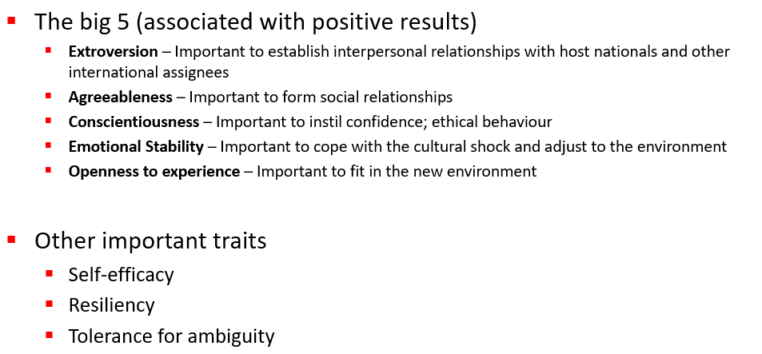

Language knowledge is fundamental, yet not necessarily sufficient to adjust and succeed.

Past international experience, on the other hand, would favour integration and adjustment.

Finally, family has to be taken into account as it can hinder or facilitate adjustment. In countries like UK it is illegal to ask about family circumstances for selection. 
The issue about family can be addressed by offering pre-departure training to family members.

## Key cross-cultural training interventions
Before leaving, there is a basic training provided:

### cross-cultural orientation
Aims to help an international assignee learn the ba sics to live and work comfortably in the host country: currency, working hours, public transports etc.

### Cultural awareness 
Expatriates gain awareness of their own culture as a means of helping them gain appreciation for the cultural differences they will face in the host country.

### Diversity training
Expatriates understand the different issues they are more likely to face.

### Traditional education in international management
Teaching people how to do business in other countries.

### Cross-national coaching or mentoring
A coach that assists you in order to help you adjust in the new cultural context. They provide help for general settlement as well as specific tasks work related.

### Language Training

## International Compensation
Benefits from IA are:
- **moeny** based rewards;
- **allowences**:
  - cost of living;
  - exchange rate protection programmes;
  - housing, education, relocation allowances etc.
- **benefits** like vacation and special leaves;
- **Foreign service inducement(incentivi)/ hardship premium (premi di disagio)** like increase of base salary.

### Hardship premium (premi di disagio)
1. **Remoteness** – geographical isolation, travel difficulties, lack of cultural and recreation facilities, unavailability and poor quality of food and other essentials;

2. **Climate and geophysical conditions** – extreme weather conditions, risk of natural disaster, pollution;

3. **Health risks** - lack or poor standard of medical facilities, risk of disease, poor infrastructure (e,g, provision of water, sanitation etc.);

4. **Political concerns** - government activities, terrorism, corruption, human rights infractions, scarce availability of home-country representation;

5. **Crime** - risk to individuals or property, quality of policing;

6. **Family-unfriendly conditions** - poor educational facilities, poor housing quality, poor communications infrastructure.

 
 
 
 
 
 
 
 
 
 
 
 
 
 
 
 
 
 
 
 
 
 
