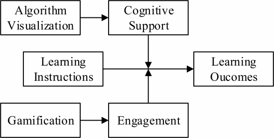

# Articles Understanding

## Extreme apprenticeship
> [Hellas, Arto & Paksula, Matti & Luukkainen, Matti. (2011). Extreme apprenticeship method in teaching programming for beginners. 10.1145/1953163.1953196.]

### Cognitive apprenticeship
>Cognitive Apprenticeship divides instruction into three stages: modeling, scaffolding and fading. In the **modeling stage** the teacher gives students a conceptual model of the process, with which an expert performs the task under study. One effective way of modeling is to base the lectures on worked examples [8] instead of concentrating on languages structures. A worked example shows e.g. completion of a programming task from start to finish. While completing the task, the teacher is thinking aloud all the time, explaining the decisions made during the process. After the modeling stage, students move to the **scaffolding stage**. Typically this means that the students are exposed to exercises that are made under the guidance of an experienced instructor. Scaffolding refers to the way support is given to the students. The key idea is that students are not given straight answers, but rather just enough hints to be able to discover the answers to their questions themselves. Scaffolding is based on Vygotsky’s idea that learning is most efficient when a student is given just enough information that is enough to boost the student’s ability to finish the task. When the student starts to master a task by himself, the scaffolding should be dismantled. This is the **fading stage** of apprenticeship learning.

**3 stages:**
- **modeling** is when an expert, usually a teacher, within the cognitive domain or subject area demonstrates a task explicitly so that novices, usually a student, can experience and build a conceptual model of the task at hand. While completing the task, the teacher is thinking aloud all the time, explaining the decisions made during the process.
  
- **scaffolding** typically this means that the students are exposed to exercises that are made under the guidance of an experienced instructor. Scaffolding refers to the way support is given to the students. Students are not given the answers, but the means to find it.
  
- **fading** is when the student starts to master a task by himself and the scaffolding should be dismantled.

> It has especially been shown that students who are performing activities for the activities themselves, i.e., intrinsically motivated students perform better than those who seek extrinsic rewards [17]. Giving too difficult programming assignments is a certain way to kill the motivation of weaker students, but suitably challenging and relevant exercises with short-term goals that students can achieve are known to raise intrinsic motivation [17, 26, 18].

> Their comfort level incorporates students orientation to themselves (self-esteem) and judgement of their capabilities to execute the required tasks (self-efficiency) [2,5]. According to Bandura [2], the most important source of self-efficiency is the student’s evaluation of the outcomes of his attempts to perform activities. Thus, suitable exercises with proper guidance and feedback are an essential tool for building students’ comfort levels

### Extreme Apprenticeship Method

> • **Learning by doing**.
> • **Continuous feedback**.
> • **Avoiding tons of preaching**. Since the effectiveness of lectures in teaching programming is questionable,the lecturing should cover only the bare minimum to get started with exercises.
> • **Relevant examples**.
> • **Start early**. Exercises start right after the first lecture.
> • **Help available**. Exercises are completed in a lab in the presence of instructors who are offering the scaffolding style of guidance.
> • **Small goals**. Exercises are split into small parts with clearly set intermediate goals.
> • **Exercises are mandatory**. 
> • **Train the routine**. The amount of exercises should be high and to some extent repetitive in their nature.
> • **Clean guidelines**. Exercises have to provide clear starting points and structures on how to start solving the tas
> • **Encourage to look for information**. While do-ing the exercises students are also required to find out things that are not covered during the lectures

> It is expected that students use most of the time they devote to the course in active solving of programming exercises. This trains the routine and gives a constant feeling of success by achieving small goals.

 
 
 
 
 

# Computational games in STEM courses: asystematic review of the literature [[link]](GAMES_STEM.pdf)
People often struggle with IT due to 
- demotivation,
- disinterest,
- learning difficulties, and even 
- the use of outdated teaching-learning methods.

If properly used, digital games can stimulate memory, creativity, socialization, and also incite curiosity. 
Among the arguments for using games stand out: the gain in cognitive skills, the possibility of using simulations, and the ease in understanding complex themes.

Besides, in [9] it is reported that the use of video games increases learning in STEM courses by 7 to 40% when compared to the traditional lecture course approach.

A questionnaire is the most used technique to measure the efficiency of games. Followed by questionnaires and the application of tests and the evaluation model of the educational game MEEGA [28]. The works that use tests as a metric of efficiency, were mostly evaluating, among other things, the acquisition of knowledge. (pre and post knowledge scoring of each individual)

**Cognitivism** says that knowledge is obtained through experience and reasoning, the way learners think is important to learn [37], [38]. 
**Constructivism** says the learners construct their own knowledge, that is based on the previous knowledge and experiences of the learners [39], [40]. 
While **interactionism** considers that the interaction between the individual and the environment in which he is inserted are essential to the learning process [41]. The most interesting is that all these theories postulate that knowledge is an objective/state to be achieved.

Only two studies were identified that used systematized efficiency metrics. In [28] To evaluate the game, use the MEEGA educational game evaluation model. In [33], the Freshman Engineering Chemistry Aptitude Test (FECAT) was used. It is vital that the process that evaluates the efficiency of a given scientific experiment is based on theories explicitly developed for efficiency metrics. These theories must be consolidated, structured, and tested. This brings more credibility to scientific work

# Sort Attack: Visualization and Gamification of Sorting Algorithm Learning [[Link]](https://ieeexplore.ieee.org/document/7295785)

### Section IV
The essential value of algorithm visualization is to deliver cognitive support. It means that the hidden or abstract parts of a concept are made concrete or visible, so learners are facilitated to access the concept. The visualization shows the process of algorithms to assist learners in comprehending how the algorithms work and their comparison. It delivers a visible illustration of the notion and procedures which are intrinsic in algorithms and depicts the dynamics of time-view progression

Through a literature study, games were identified as having a positive impact on knowledge acquisition, motivation, and engagement 

However, the capability of the visualization to portray abstract concepts will not automatically bring benefits if learners do not actively engage with the visualization [12].

To improve learners' engagement, one available approach is to use a game or game elements or gamification. 

 
While algorithm visualization attempts to deliver a cognitive support to improve learning outcomes, gamification seeks to leverage learners' engagement.

 
 
 

**Emotional Experience:** Challenges delivered should raise learners' tension during sorting the unordered numbers. Failure in completing the sorting should wake the curiosity of learners to try again and success should bring a feeling of fun, satisfaction, and curiosity of challenging the next level.

**Negotiable Consequences:** Learners that fail at one level can retry many times until they can complete the level. The unlimited retrial provides learners negotiable consequences to explore and then understand the sorting algorithms. Additionally, lives can also be perceived as a chance to explore the algorithms in a limited manner. U sing trial and error method, learners can test their understanding about the next correct step but limited to a certain number of mistakes.
 
 
 

# Do Algorithm Animations Aid Learning? [[Link]](https://smartech.gatech.edu/bitstream/handle/1853/3504/96-18.pdf)
A learner could certainly make predictions from a static textual/graphic presentation of an algorithm, but perhaps the advantage of an animation is that it will spontaneously encourage a learner to make the predictions without being prompted and will provide the learner with rapid feedback about the accuracy of his or her predictions. In addition, an animation might be more salient than a set of static images and thus, might help the student remember the algorithm better.

# AV (algorithm visualisation) effectiveness [[Link]](https://reader.elsevier.com/reader/sd/pii/S1045926X02902375?token=187878B0EF3E96BECD832DC446379894CB719B6C671C178E89F9E664BA9F3C53D7F7073C319BE180B9B6CDD603EEF472)

The following table provides a synopsis of these studies. For each experiment, 

| the factors(independent variables)| the measures (dependent variables)| a summary of the experiment’s key results
|-|-|-|
|*Data representation style*(horizontal/vertical sticks, dots)| Post-test accuracy| No effect|
|*Level of learner involvement*(study text/passively view animation vs. study text /actively view by constructing own input data sets)||Participants who viewed animations for which they constructed their own datasets  scored  significantly higher on post-test|
|*Representation color*(color vs. black-and-white) ||Participants  who viewed  black-and-white animations scored significantly higher|
|*Representation labeling*(algorithmic step labels vs. no labels)||Participants who viewed labeled animations scored significantly higher|
||Pre- to post-test improvement|Participants who learned with multimedia significantly outperformed participants who learned through the lectureSignificant interaction effect between cognitive style and learning medium:‘S’ participants performed significantly better with multimedia|
|||Animation group appeared to be highly motivated by the animation|

# Pavio's Dual Coding Theory DCT [[link]](https://citeseerx.ist.psu.edu/viewdoc/download?doi=10.1.1.329.7319&rep=rep1&type=pdf)
Learning via images is very effective as it creates a mental links to concepts which can then be retrieved with a stimulus that can be a word or a picture.

# Cognitive Load Theory and the Format of Instruction [[link]](https://www.tandfonline.com/doi/pdf/10.1207/s1532690xci0804_2?needAccess=true)
Pavio's Theory enhnancement, using images can be useful, but an integration with text, that is, a mixture of the two, is more effective. Images, however, are not always necessary, rather, they can produce the opposite effect distracting the learner "*If sources of information cannot be restricted to a single entity, they should be integrated into as small a number of units as possible. If conventional instructions consist of a source of information that is fully intelligible by itself, other related information, whether it be textual or diagrammatic, should be removed to prevent unnecessary attempts at [mental] integration.*"

# Construction and interference in learning from multiple representation [[link]](https://citeseerx.ist.psu.edu/viewdoc/download?doi=10.1.1.504.1059&rep=rep1&type=pdf)
"*This paper presents an integrated view of learning from verbal and pictorial representations. Construction of these representations includes information selection and information organisation, parsing of symbol structures, mapping of analog structures as well as model construction and model inspection. The findings [of some experiments conducted] indicate that the structure of graphics affects the structure of the mental model. They also indicate that presenting graphics is not always beneficial for the acquisition of knowledge. Whereas task appropriate graphics may support learning, task-inappropriate graphics may interfere with mental model construction.*"