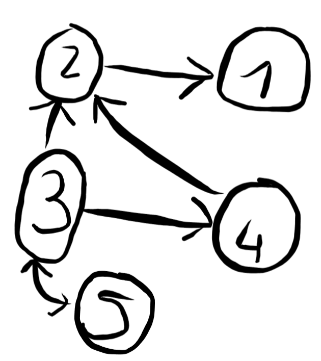
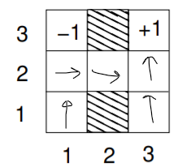

# 1
late = l, hot = g, crowded = c
$\qquad$P(l) = $\sum_{h, c}$ p(l | h, c) = 0.168 + 0.009 + 0.042 + 0.081 = 0.3

**P**(H | c) = 
$\qquad$<P(h | c), P(¬h | c)>
$\qquad$<(0.168 + 0.336), (0.042 + 0.084)>
$\qquad$<0.504, 0.126>

# 2
First off, the trolley problem, that is define what the agent (the car) should do in each circumstance. 
Second, as there are plenty if not infinite possible solutions, define a way to attribute a score to each solution in order to allow the agent to make a decision in each circumstance.

# 3

amazon doc(Alexa):
It uses a microphone to listen to the vocal input, and the wifi to connect to smart objects in the house and to fetch information on the internet.
It can listen, understand and smartly reply to questions, generate memo and alarms given a vocal input, search for data in the internet and control the house providing it is "smart". It operates in 2 environments:
- the house;
- the internet;

The environment is normally episodic as most of the actions it does do not have effects in the future, however, it may need so recognise your voice, find out about smart devices, and possibly keep track of some things (like you musical taste) which influence future decisions.

The Environment is not static as the internet changes everyday and in the house you may move, add, or remove the smart plugs which the doc connects to.

# 4
Hypertensions $\qquad$ Smoking
$\qquad\qquad$└ Stroke ┘

**Find the Noisy Or Model**

# 5

What does it mean if a set of arguments T ⊆ S is admissible?
A set $T$ is set to be admissible when all the elements in such a set are defended by $T$.

CF: {}, a1, a2, a3, a4, a5, a13, a14, a15, a145, a25, a45
A: a5, a31, a541
P: a31, a541

# 6

$P(¬b) = 0.01 \\
P(f | ¬b) = 0.99 \\
P(f | b) = 0.1$

$P(¬b | f) = \dfrac{P(f | ¬b)P(¬b)}{P(f | ¬b)P(¬b) + P(f | b)P(b)}$

$P(¬b | f) = \dfrac{0.99 \cdot 0.01}{0.99 \cdot 0.01 + 0.1 \cdot 0.99}$

$P(¬b | f) = \dfrac{0.0099}{0.0099 + 0.099} = \dfrac{1}{11} = 0.\overline{09}$

The chances of the battery being flat were not high at all, but given the fail that we have seen, the chances increased. Nonetheless, after calculating it, it is still very unlikely that the battery is the issue.

# 7
C = 7
S = -7
E = 2.6

The maximum expected utility is given by drinking a coffee.

Another option would be to use the minimax criterion wherein you consider only the the worst case scenario for each choice, and among them you pick the best. (note that this approach does not take into consideration the probability)

C = -5
S = -10
E = 2

The choice would be to eat

# 8 
|   | W | M | H | Weight |
|---|---|---|---|   ---  |
| 1 | T | F | T | weight = .7 |
| 2 | T | T | F | weight = .7 |

Result: $\dfrac{1}{2} \times 0.7 = 0.35$

# 9 

<figure>
    
    <figcaption style="text-align: center">PASSAPAROLA</figcaption>
</figure>

# 10

(D, R) is the only NE as, given just one player makes a move, neither has an incentive in moving away.

(U, L) maximises the welfare as 4 + 2 is the highest score obtaining by summing the payoff of each player in the same cell.

There is no direct links, however, when a cell has a very high social welfare is more likely to be a nesh equilibrium

# 11

Bellman's = $R(s) + \gamma \ arg\ max(\sum_{s}P(s' | s, a)U(s'))$

Given the above formula, the value iteration algorithms says that we have to apply it to each cell considering that the agent either:
- moves to an adjacent location (with probability = 0.9);
- or stays in the same cell (with prob. = 0.1)

For all the cells, you sum these 2 weighted options together for each direction, the best result (among these sums) - the reward of the state (which is fixed to -0.05) is the score of the cell.

Applying the iteration just once for the cell (1,1) we have:

> -0.05 + 1 * max(
>$\quad$(0 * 0.9 + 0 * 0.1), # north
>$\quad$(-1 * 0.9 + 0 * 0.1), # east
>$\quad$(0 * 0.9 + 0 * 0.1), # west
>$\quad$(0 * 0.9 + 0 * 0.1) # south
> )
>
> the result is -0.05 for all the directions but east, so that will be the new value of that state.

Policy iteration is very similar, you apply it using the same formula. (what does this question even mean????? Stupid Frederick)

# 16
K-means is ML unsupervised model to classify categorical data. 

K is an integer number that stands for the number of centroids we wind up having. This number should denote the number of classes (or labels) that the data set is likely to belong to. The best ways to choose it are:
- prior to running the algorithm, knowing the number of classes the data should belong to (for instance, if we have a data set made of cats and dog, we want k = 2);
- empirically decide it using the elbow method.

Each input instance of the data set is tuple made of features which have to be numerical (in case these are categorical, like Strings, there way to translate them into numerical).

The algorithm is the following:
1. Assign the centroids at random;
2. For each element compute the L2 (or Euclidean distance) from each centroids;
3. Gather up in sets the element sharing a centroid as the closest one;
4. Recompute the centroids so that their location is at the (Euclidean) centre of all the nodes having it as the closest centroid.
5. If at least one centroid changed its location repeat from step 2

Now the model has been trained and these centroids indicate the centre of a class: whenever you want to classify a new input element you just have to compute the Euclidean distance from all the centroids, and the class of the closest one is the output.

# 17
The issues I immediately come up with are about the bias. I would expect the model to be data-driven, as such trained by a CNN. 
It is known that DL models use a black box, as such, we do not really know how they are making their decisions. 
The result could be that there is an intrinsic bias in the input dataset, or that the DL algorithms introduced it, or that some supervising and feedback process did it.

As a result, there may bias against people wearing a hat, people with different skin tone, their gender etc.

So the 2 issues are that:
- the model may generate biases; and
- that you may not understand the model to fix these issues when they arise.

# 18

Briefly explain how policy iteration can be used to create a policy with
reference to computing π(1, 1).

The idea behind the policy iteration is to assign a score to each state based on:
- the possible moves it can operate;
- the probability of having the agent succeeding in the move it wants to operate (in other words, the determinism);
- the cost of each state (or the cost of making a move)

This process takes time as it you have to update the value of each cell in a sequence of iteration until convergence, but you end up having a nice score on each cell such that deciding the policy is pretty easy.

Say we have already operate the policy iteration, we should see a gradient ascend toward the positive reward +1.
In (1, 1) this flow should lead the agent to go either north or east in order to move closer to this reward, but as it cannot move east (since there is an obstacle), the policy $\pi$(1, 1) will lead the agent to move north.

# 19

No idea what it is asking for, I will just write down the complete extensions.

CF: {}, a1, a2, a3, a4, a1 a4, a3 a4
A: a2, a4, a3 a4
C: {}. a4 a3, a2

# 20

|   | J | K | L |
|---|---|---|---|
| 1 | T | F | T |
| 2 | F | F | F |
| 3 | F | F | F |

1 / 3

b. I do not know.