[TOC]

# 2016 exam

## 1.a
**i)**
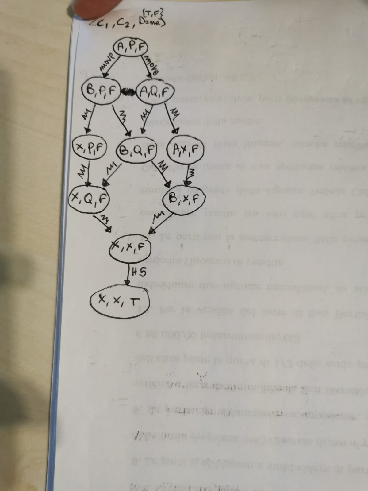

**ii)**
No idea

## 1.b

**i)**
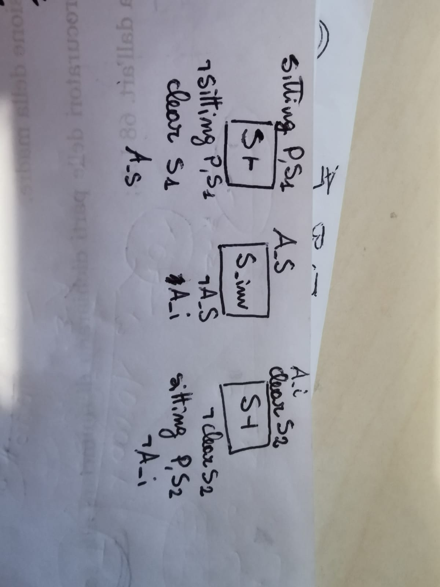

**ii)**
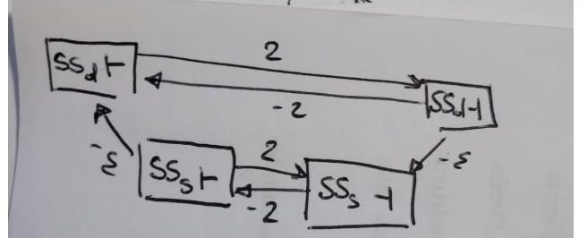

**iii)**
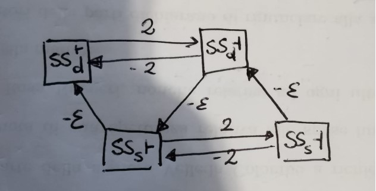
This is not temporally consistent as there exist a negative cycle:
2 - $\varepsilon$ - 2 - $\varepsilon$ < 0

**iv)** 
A compression safe action is an action which start and end snaps can be safely merged together. Compression allows the planner to reduce the search space as it considers just one snap (which is the compression action) instead of 2 (start and end).

For being compression safe, an action shall respect 2 rules:
- The are no delete effects at the end of the action;
- The invariant preconditions are also preconditions of the end snap action.
  
For `CLEAN SEAT` both these rules are respected, whereas for `SWAP SEAT` we have a delete effect at the end `(at end (not (clear ?seat2)))`, which breaks the first rule. Also, in swap seat, the preconditions for the invariant is $\emptyset$ but the end snap has preconditions, and this breaks the second rule

**iv)** 
The solution would be to call the swap action for both Steve and Dave in parallel, and, before the end of these 2 actions, to clean both the seats in parallel:

- (swap-seats dave A B) `START`  
- (swap-seats Steve B A) `START`
- (clean seat s1) `START`
- (clean seat s2) `START`
- (clean seat s1) `END`
- (clean seat s2) `END`
- (swap-seats dave A B) `END`  
- (swap-seats Steve B A) `END`

## 2
**a)**
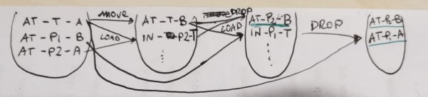

**b)**
load P~2~
move T-A-B

unload P~2~-B
load P~1~-T

unload P~1~-A

**c)**
The heuristics score is equal to the number of actions necessary to achieve the goal in the RPG, which is **5**.

**d)**
Helpful actions are actions which allow to achieve a goal state from the initial fact layer. In this case there are no such actions.
However, should this question refer to the fact layer obtained immediately after the initial fact layer (as the question mentions *"when expanding the initial state"*) We can call the `UNLOAD P2 B` action to achieve the goal `at P2 B`. Such actions requires 2 actions to be executed before itself, and these actions are `MOVE T A B` and `LOAD P2 T`.

## 3.a
**i)**
A* uses a heuristic function to be guided toward the goal state. A possible benefit of using A* is the time required to achieve the goal, in fact, a good heuristic would result in less states explored. However, the same heuristic can be regarded as a drawback as empirical analyses proved that planner spend most of the time calculating the heuristics for the states.

**ii)**
Don't think we did this.

**iii)** 
The roulette selection states that the process for selecting the next state to explore is not deterministic, but decided via probability. It sums together the inverse of the heuristic scores for the possible states, assign to each state the new score $s_{new} = h()^{-1} / sum(h()^{-1})$ and divide that score by the sum of all the $s_{new}$.

Say we have 3 nodes with $h()$ = 2, 2, and 4, and I want to find out the probability of the state with $h()$ = 4 to be selected:
1. h() = 2 + 2 + 4
1. sum = 1/2 + 1/2 + 1/4 = 5/4
2. P(h(s) = 4) = 1/4 / 5/4 = 1/5

[I am not sure she explained this, but logically this makes sense to me as h(s) = 4 should be half the chance of h(s) = 2]

**iv)**
We use *depth bounds* not to go too far away from the "current root".
The process is stochastic in order to reduce the risk of falling into a local minimum.

## 3.b

**i)**
When defining the goal for a problem, we may want to include some preferences which are nice to be achieved but not necessary to solve the problem. Hence, we assign a score to each preference, and instruct the planner to solve as many as possible in order to maximise the scores obtained achieving the respective preference. 

There are 2 types of preference: soft-goals and trajectory preferences.

The former are defined in the `:goal` section, whereas the latter are defined in the `:constraint` section and use special keywords like:
- at-most-once
- sometime-before 
- sometime-after
- always
- sometime

These preferences are associated to a name, and the (* (is-violated \<preference>) \<cost of the preference>) is triggered if such a preference is violated, resulting in a cost. 

The *forgo* and *collect* notation makes use of a special variable called "mode" which starts with value "normal" and is required as a precondition for all the normal actions in the plan. When the planner has reached the end of the plan, the mode value is set to "end" so that normal actions can no longer be performed, but 2 new actions "forgo" and "collect", which have as precondition the mode to be set to "end", become available.

These 2 actions, collect the score obtained by the achieved preferences (collect) or activate the violation cost (forgo) as defined in the problem file.

**ii)**
A after B graph

**iii)**
I don't really get the this question.

## 4

**a)**
There are 2 solutions:
- introduce an action that the agent can trigger to stop the refuelling;
- introduce an event that the world triggers as soon the fuel in the generator reaches a limit or the tank runs out of fuel.

**b)**
I will proceed with the event:

    :event stop-refuelling
        :parameters (?g - generator ?t - tank)
        :preconditions (or 
            (<= (fuelInTank ?) 0)
            (>= (fuelLevel ?g) (capacity ?g))
        )
        :effect (and (not (using ?t ?g)))
        
**c)**
As specified as a precondition in the event `stop-refuelling`, as soon as the level of fuel in the generator reaches or overcomes its capacity. 

**d)**
To make this working we just need to define the capacity for the generator (I will arbitrarily assign it to 90)

    :init 
        ...
        (assign (capacity generator1) 90) 
        ...

**e)**
It is possible to introduce a variable like `isBeingFuelled ?g - generator`
which is a precondition for fuelling to be false, and is set to true as an effect.

Of course, `(isBeingFuelled)` becomes a precondition for the event stop-fuelling and `not (isBeingFuelled)` is an effect.

**f)**
[0.00] generate G1 (START)
> first refuelling

[15.00] refuel G1 T1
[15.01] refuelling G1 T1 (START)
[16.01] stop-refuelling 
[16.02] refuelling G1 T1 (END)
> second refuelling

[25.00] refuel G1 T2
[25.01] refuelling G1 T2 (START)
[26.01] stop-refuelling 
[26.02] refuelling G1 T2 (END)

[100.00] generate G1 (END)

# 2017 exam

## 1.a

**i)**
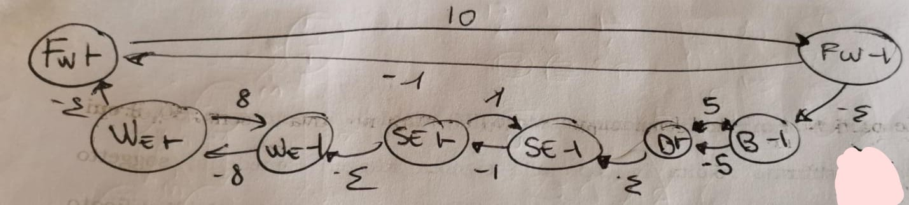

**ii)**
The plan is temporally inconsistent given this model and using CRIKEY3 to solve it as there would be a negative cycle given by 10 - $\varepsilon$ - 5 - $\varepsilon$ - 1 - $\varepsilon$ -8 - $\varepsilon$ < 0

**ii)**
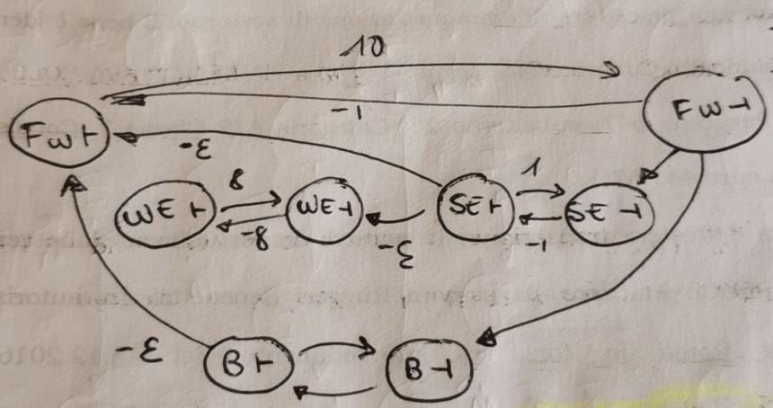

**iv)**
Yes, POPF is able to solve this problem as it allows to write the email before connecting to the wifi, so that there are no negative cycles.

**v)**
To convert a temporal problem into a non-temporal one there are some things to keep into account:
- actions are made of snaps (start, invariant, end), if an action is not compression safe, the invariant may hold important information which the planner has to protect; FF is not implemented to check that the invariants hold true all the time, as such it could not guarantee that the invariants of browse the internet and send emails are respected.
- Browse the internet and send-emails do not interfere with each other and can be performed in parallel in a temporal planner, but FF cannot deal with time ans, even after compressing them, they would not be performed in parallel.

## 1.b

**i)**
- A) (at end (got-opening-times))
- B) (sometime-before (bought expensive-gift) (checked-balance))
- C) (sometime-after (connected) (not-connected)) 

**ii)**
5 10 3

- Violation of **{D}**:
  1. (connect) 
  1. (send-email)
  1. (check-bank-balance)
  1. **(buy-cheap-present)**
  1. (look-up-opening-times)
  1. (disconnect)

    > Cost: 4
    > distance: 6

- Violation of **{C}**:
  1. (connect) 
  1. (send-email)
  1. (check-bank-balance)
  1. (buy-expensive-present)
  1. (look-up-opening-times)
  1. **~~(disconnect)~~**

    > Cost: 3
    > distance: 5

- Violation of **{C, D}**:
  1. (connect) 
  1. (send-email)
  1. (check-bank-balance)
  1. **(buy-cheap-present)**
  1. (look-up-opening-times)
  1. **~~(disconnect)~~**

    > Cost: 7
    > distance: 5

- Violation of **{B, C, D}**:
  1. (connect) 
  1. (send-email)
  1. (check-bank-balance)
  2. **(buy-cheap-present)**
  1. **~~(look-up-opening-times)~~**
  1. **~~(disconnect)~~**

    > Cost: 17
    > distance: 4

## 2

**a)** 
- move T1-locA-locB
- load P1-T1-locA
- unload P1-T1-locB

**b)** The heuristic is given by the count of the actions required to achieve the goal, in this case **3**.

**c)** There isn't any action such that it can be achieved from the initial state and lead to a goal, hence, there isn't any helpful actions.

**d)**
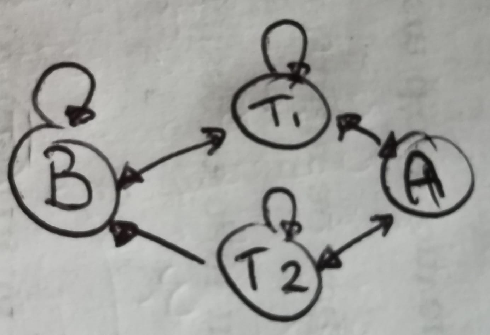

**e)**
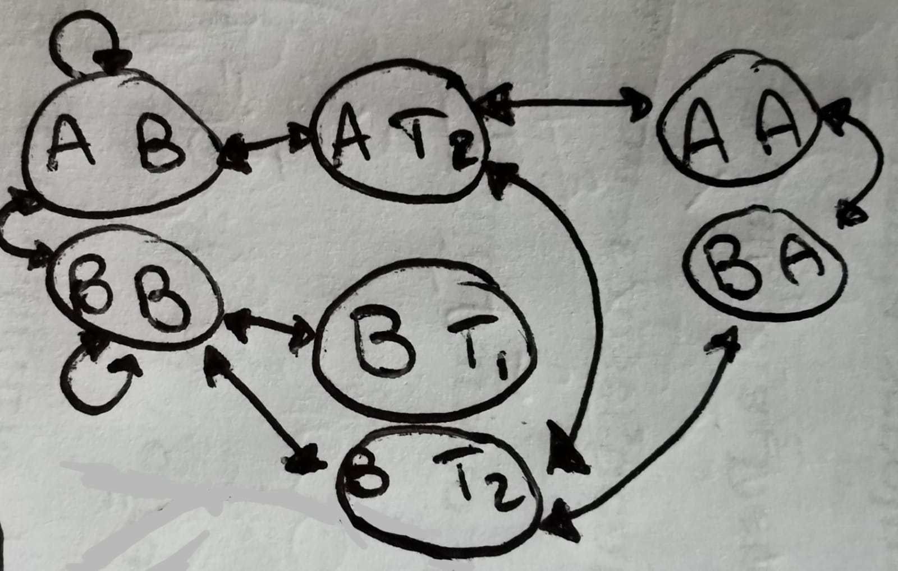

**f)**
> (Package, Truck1, Truck2)

$h_{package}(ABB)$ = 0 (this is probably a typo, but package P should be at A, which is already its locations)

$h_{package,truck1}(ABB)$ = 1 (same as before, plus we have to drive the Truck1 from B to A, which is 1 action only)

## 3.a

**i)**

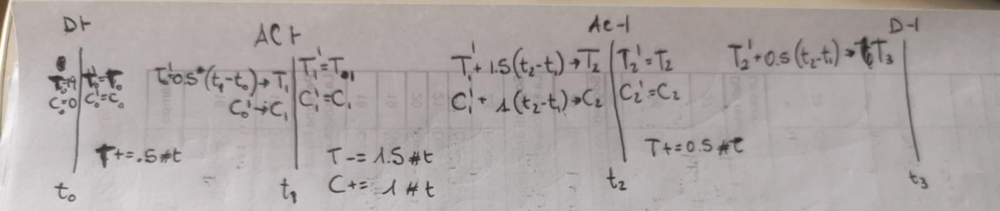

**ii)**
[0.000] Day-time (START)
[5.000] Air-conditioner (START)
[7.000] Air-conditioner (END)
[12.000] Day-time (END)

**iii)**
CoLin only checks that a constraint on a variable is respected for snap actions `start` and `end`. Using linear functions we know that if a constraint is respected for both these snaps, then such a constraint is also respected for the invariant. Using a non-linear function, the aforementioned checking is not longer promised to be enough (consider $f(x) = sin(x)$).

## 3.b
A planner is said to be domain independent when it can solve any problems without having specific prior knowledge.

The benefit of this approach is universality, in fact any problems, even from different domains, can be solved for as long as it is encoded correctly.

A drawback is that some domains may have highly specific pitfalls or tricks, and a domain-independent planner may be not be able to "spot" them and struggle to find a solution, which is not guaranteed to be optimal nor to be found at all.

## 3.c
**i)**
Dual open-list can lead to very good results because 2 heuristics combined together (even when one of them is just a random picker) as it can easily avoid local minima and plateau.

The way it works is simply by alternating the use of the two. 

**ii)** 
I believe we have not done this.

## 4

**a)** 
The solution is to turn the actions *accelerate* and *decelerate* into durative actions which can either last for a fixed time or have duration boundaries (which makes more sense in a real life example). For the sake of simplicity I will stick to the original idea of an increase of 1, which means fixed duration.

    (:durative-action accelerate
        :parameters()
        :duration (= ?duration 1))
        :condition (and 
            (overall (running))    
        )
        :effect (and 
            (increase (a) 1)
        )
    )

    (:action decelerate
        :parameters()
        :duration (= ?duration 1))
        :condition (and 
            (overall (running))    
        )
        :effect (and 
            (increase (a) 1)
        )
    )

**b)** A not safe way would be to brake immediately as soon as the distance covered is 100 or more:

    (:event brake
        :parameters()
        :preconditions (and (>= (d) 100))
        :effect(and
            (assign (a) 0)
            (assign (v) 0)
            (not (running))
        )
    )

> this action can be improved by making a computation over the current acceleration and velocity of the car on the preconditions so that it reaches distance 100 at speed 0 and acceleration 0.

**C)**
The process `moving` should include as a precondition the fact the current velocity cannot exceed a maximum speed:

    
    :precondition (and 
        (> (max-speed) (v)) ;ADDED    
    )

or creating another process which triggers as soon as the velocity overcomes a "safety speed", which ideally should not be 200 itself, but something lower - like 185 - and this process "fights" the acceleration by decreasing the speed at the same rate as moving would increase it. 

Another option is to create an event that triggers as soon as the safety speed limit is reached and sets the acceleration to 0.

**D & E** Topics not covered.

# 2018 Exam

## 1.a

**i)** 
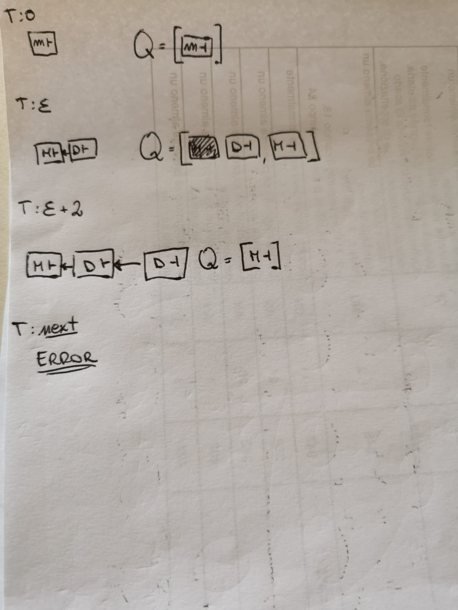

> state **(S~0~)**

> I had to include also the state **(S~1~)**
> - D_start
> - D_end
> - M_start

The plan is not solvable:
- in **S~0~** this happens because the door opens after the move action starts, but it also finishes before the move action ends, which is a necessary precondition for the latter.
- in **S~1~** the door opens and closes before anything else. This is an issue, as this action can happen only once and will then prevent move_end to be achieved.

**ii)**
Contrarily to Decision Epoch planner, CRIKEY3 puts a constraint on the distance between to snap actions which is **at least** - $\varepsilon$, whereas for the former it **must** be - $\varepsilon$.

Although this plan is not temporally consistent (there is a negative cycle) it propositionally sound because the M_end happens between D_start and D_end.

**iii)** 
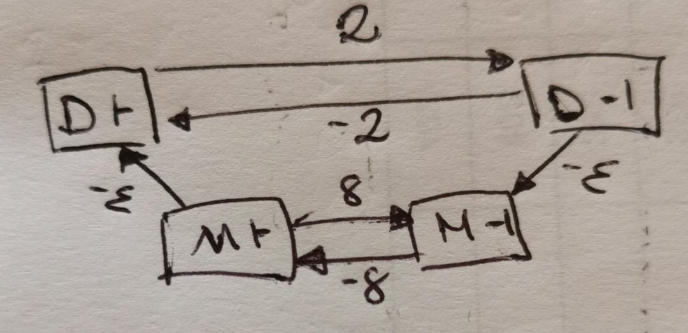

**iv)**
You can deduce the plan is temporally inconsistent as there exist a negative cycle:
D_start $\rArr$ D_end $\rArr$ M_end $\rArr$ M_start $\rArr$ D_start = 
    $2 - \varepsilon - 8 - \varepsilon = - (6 + 2\cdot\varepsilon)$

## 1.b

**i)**
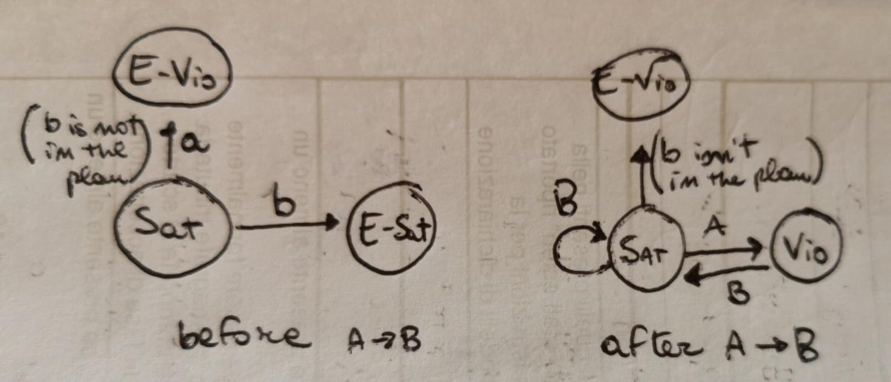

**ii)**

In order to satisfy both these preferences the cat must sleep and [have dinner, and then sleep again] as many times as it wants (even 0) or, in RegEx style:

S (HD S)*

As this formula suggests, the cat has to sleep both before and after dinner (if it has dinner). 

However, if the cat does not have dinner, but sleeps some, the plan still achieves both the preferences, yet the cat had no dinner. Depending on the way you want to interpret the question, it is either True or False.

**iii)**
- sometimes (had_tuna)
- sometimes-after (been_cute) (had_tune)

## 2
**a)**

    (:durative-action generate
        :parameters (?g - generator)
        :duration (>= ?duration 0)
        :condition (and 
            (at start (safe ?g))
            (over all (>= (fuelLevel ?g) 0))
            (over all (safe ?g)))
        :effect (and 
            (decrease (fuelLevel ?g) (* #t 1))
            (at start (increase (power-supplied) 10))
            (at end (decrease (power-supplied) 10))
            (at end (not (safe ?g)))
        )
    )
            
**b and c)**
You can introduce an action which is triggered as soon as the fuelLevel in the generator reaches an upper bound or when the fuel in the tank reaches a lower bound, like:

    (:action stop-refuel
        :parameters (?g - generator ?t - tank)
        :preconditions (and
            (using ?t ?g))
        )
        :effect (and 
            (not (using ?t ?g)) 
            (available ?t)
        )
    )

**d and e)**

You can introduce an event which is triggered as soon as the fuelLevel in the generator reaches an upper bound like as follows:

    (:event stop-refuelling
        :parameters (?g - generator ?t - tank)
        :preconditions (and
            (using ?t ?g))
            (>= (max-fuelLevel) (fuelLevel ?g))
        )
        :effect (and 
            (not (using ?t ?g)) 
            (available ?t)
        )
    )

**f)**
I would introduce a variable called `is-being-fuelled ?g` which indicates whether or not a specific generator (assuming more than one can exist) is being fuelled.

This variable has to be false as part of the preconditions of the refuel action ans set to True at the start. Vice versa, the event stop-refuelling and the action stop-refuel have it as True in the preconditions and set it to false as an effect.

**g)**
I have literally just explain where this should be done.

**h)**
The function power-supplied already does what the function **demand** describes, I am confused about this one. 
Maybe the question intends to say that the goal is to have power-supplied to meet the demand, in such a case I would write this: 

    :goal (and (= (demand)(power-supplied)))

## 3.a

**i)**

    (handle_angle) h~0~ = 0

> turn handle (START) **t~0~**

    h~0~' = h~0~ + 60

 

    h~1~ = h~0~' - (10 * t~1~ - t~0~)

> open door (START) **t~1~**

    h~1~' = h~1~
    
 [overall h~1~' >= 0]

    h~2~ = h~1~' - (10 * t~2~ - t~1~)

> open door (END) **t~2~**

    h~2~' = h~2~

 

    h~3~ = h~2~' - (10 * t~3~ - t~2~)

> open door (END) **t~2~**

## 3.b

**i)**
A landmark is something that must be achieved in the plan in order to complete the plan. It not specified by the problem, rather it is a logical intuition (over the the possible states) that the planner infer.

A fact is a landmark if it has to be True at some point; an action is a landmark if it has to be performed. 

Note that there exist disjunctive actions landmarks, meaning that at least one action, over a set of actions, has to be performed.

**ii)**
Landmarks are either actions or facts that must be achieved during the planning. Considering them as subgoals it is possible to lead the planner to the solution. 

Landmarks alone can be so useful to be used both as a guide to the next actions to perform as heuristic to assign scores to the states.

The main drawbacks are the cost of finding landmarks (Which can be as hard as finding the solution to the problem) and the Sussman anomaly that may arise if one tries to achieve landmarks independently.

## 3.c

**i)**

The main issue of searching backwards is that the same variable may assume different values (as more than one value can lead to a state we cannot exclude any), this inevitably leads to difficulty in finding good heuristics which can lead the planner to the solution.

**ii)**
Suppose the case in which the heuristic acted like a gradient descent, leading the planner always closer to the goal state, but at some point the heuristic get stuck into a local minimum, so a plateau.

EHC would use breadth first search, which is notoriously expensive, and as soon as a state with heuristic score strictly lower than the state of the plateau is found. This solution is not guaranteed to lead the planner to select the best next state, and if you give it one more chance, it would just repeat the same mistake.

The idea of restarts allows the planner to try again as many times as it wants, and in case the state explored turned out not to be good, it tries again with another state **starting from the state of the plateau** rather than from the initial state.

The intuition is to use the heuristic scores not to decide the best one, rather to assign a probability to that state of being explored. This way, a heuristic with a high score (which would normally not be considered) may be selected.

# 2019

## 1.a

**i)**
If the fact was not a precondition for the action, the robot could perform the same action in parallel multiple times, and worse, the last time this action would be right before this action was called the first time. Obviously, the same goes in case such a predicate is not deleted immediately after the start of the action.

**ii)**
Deleting such a fact at the end rather than at the start of the action leads to the aforementioned problem (i). Depending on the planner, this could have different grades of "damage" time-wise, but generally speaking, it is similar to have tons of time the same action (supposing $\varepsilon$ is the minimum distance of time between 2 snaps actions) we would have so many more snaps for the planner to consider (FORMULA: the time duration (22 - 0.01) times 2 (snap start and snap end) over the duration of espilon) as compared to the original 2 (snap start and snap end) of the problem.

## 1.b
The main weakness of the decision epoch planner is to enforce a constraint of EXACTLY $\varepsilon$ between the end of an action and the start of another one. In other conditions this is a huge problem as the planner is not able to solve problems which are in fact solvable. In this case, that is not a problem in itself, however, due to the fact that between an action and another there must be $\varepsilon$ time difference, the plan to solve this problem would be inconsistent as the time required to complete the actions:
- move (10)
- open-door (2)
  - take-photo (1 but happens in parallel with open-door)
- move (10)

is already 22, plus 3 $\varepsilon$ is more than the time allowed by `exposure window`, hence the plan is not temporally consistent.

## 1.c
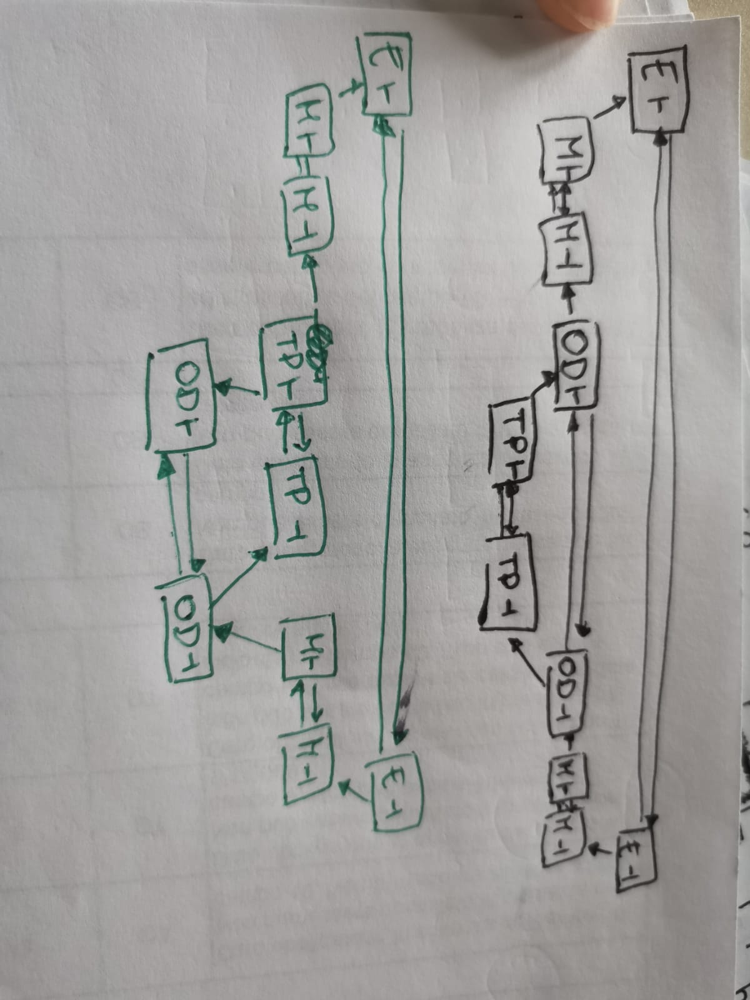

(assuming the action `exposure_window` reached the end)
This is not a valid temporal plan as there exists a negative cycle
E_start -> E_end -> M_end -> M_start -> OD_end -> TP_end -> TP_start -> OD_start -> M_end -> M_start -> E_start

This cycle has value **$- 4 \varepsilon$**

## 1.d
POPF is better than CRIKEY3 as it removes the unnecessary temporal dependencies (the link between a snap start and a snap end of 2 actions which are not temporally dependent on each other).

In this problem, for example, the `open_door` action does not require the robot to be at the reactor, as such, I can say that `take_photo_START` happens after `move_END` (and delete the edge with `open_door_START`), so that the action of opening the door can happen in parallel with the move action, and ends after the photo has been taken.

This way, POPF can solve the problem.

## 3.a
A static fact is a fact that never change its value during the execution of a plan. 
Since we are guaranteed it will never change, we can ignore it as precondition whenever the precondition requires it to assume its current value, and also not take into account the actions which require it to assume a different value (as we know its value will not change, those action cannot be performed).

## 3.b

e~0~ = 0
> move [START] t~0~

e~0~' = e~0~
e~0~' <= 27

---

e~1~ = e~0~' + 1 * (t~1~ - t~0~)
e~1~ <= 27

[t~1~ - t~0~ >= $\varepsilon$]
> open door [START] t~1~

e~1~' = e~1~
e~1~' <= 27

---

e~2~ = e~1~' + (3 + 1) * (t~2~ - t~1~)
e~2~ <= 27

[0.01 <= t~2~ - t~0~ <= 22]
> move [END] t~2~

e~2~' = e~2~
e~2~' <= 27

---

e~3~ = e~2~' + 3 * (t~3~ - t~2~)

[t~3~ - t~2~ >= $\varepsilon$]
[t~3~ - t~1~ = 2]
> open door [END] t~3~

e~3~' = e~3~

> The time constraints can easily be respected, and the exposure does not reach (or overcome) the limit of 27 imposed by the move invariant, so the the partial plan is feasible.

## 3.c

    (preference p0 
        (sometime-before (have_photo_inside reactor2) 
                         (have_photo_inside reactor1)
        )
    )

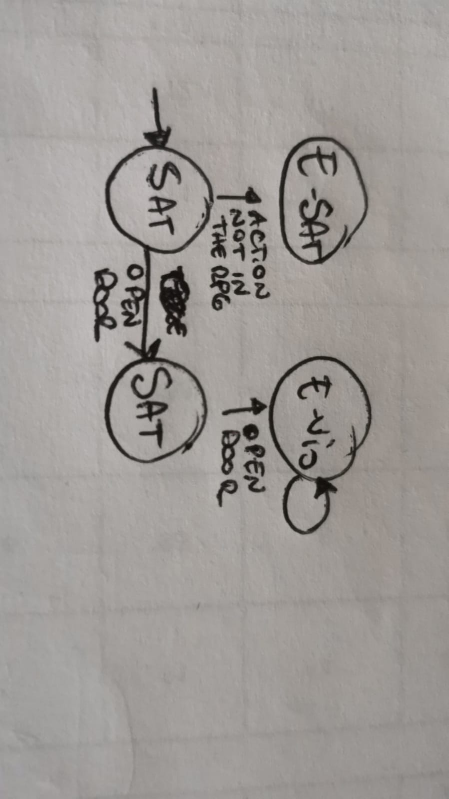

## 4.a & b

We can add an event (that is an action that triggers automatically), which activates as soon as the tank runs out of fuel or the generator is full. This event would set the precondition for `refuelling` (using ?t ?g) to false. 

In alternative, we can create ourself an action which we trigger arbitrarily (no preconditions on the level of fuel in either the generator or the tank).

    (:action stop-refuelling
        :precondition (and (using ?t ?g))
        :effect (and (not (using ?t ?g)))
    )

## 4.c
To do this we should add a new predicate unique for each generator. Such a predicate is set to True in the `:init`, is required as a start precondition to start the generator (`generate`), and the very same action sets it to false at start.

    :init
      ...
      (first-generation ?g)   
      ...

    (:durative-action generate
        :parameters (?g - generator)
        :duration (>= ?duration 0)
        :condition ( and 
                        (over all (>= (fuelLevel ?g) 0))
                        (over all (safe ?g))
                        (at start (first-generation ?g)) ;NEW CHECK
        )
        :effect (and 
                    (decrease (fuelLevel ?g) (* #t 1))
                    (at start (increase (power-supplied) 10))
                    (at end (decrease (power-supplied) 10))
                    (at start (not (first-generation ?g)))
    )

## 4.d

    (:durative-action refuel
        :parameters (?g - generator ?t - tank)
        :duration (>= ?duration 0.01)
        :precondition (and 
            (at start (not (using ?t ?g)))
            (at start (available ?t))
        )
        :effect (and 
            (at start (using ?t ?g)) 
            (at start (not (available ?t)))
            (at end (not (using ?t ?g)))
            (at end (available ?t))
            (increase (fuelLevel ?g) (* #t 2))
            (decrease (fuelInTank ?t) (* #t 1))
        )
    )

Being a durative action means that we can trigger it arbitrarily, so we can call it whenever we believe this is needed, as well as stop it whenever we want, so we are in control and in charge of the action and of the duration.
We also have to define a duration for this action, which, in my minds, only needs a lower bound, but the upper bound should not be limited.

For the planner this is more hustle as it has to check continuously when the action should be triggered (as opposed to being trigger as soon as the preconditions are met) and it has to decide how long it should last for.

## 4.e 
For as far as I know, any actions, once started, should be ended as well in the final plan. This makes it impossible to achieve a goal where the demand function can ever be met unless the starting supplied power already meets such a demand.

Should the original power supplied be inferior to the demand, the gap between the production of power from the generators at the start, and the vanished power at the end, should be positive and greater than 0.

In other words:

    :action generate
        ...
        :effect (and 
                    ...
                    (at start (increase (power-supplied) X))
                    (at end (decrease (power-supplied) Y))
                    ...
        )

in the above plan **X** should be strictly greater than **Y** in order to achieve a power supply which is at least as big as positive (greater than zero) `demand`.

 
 
 
 
 
 
 
 
 
 
 
 
 
 
 