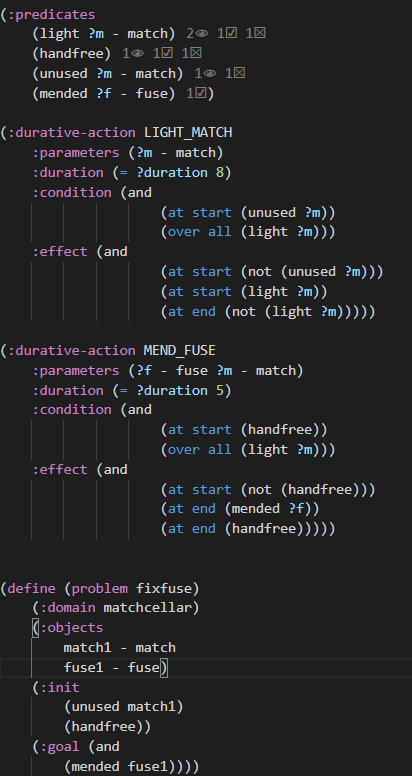
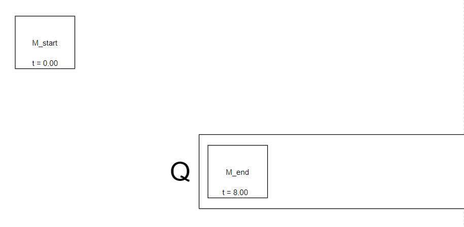
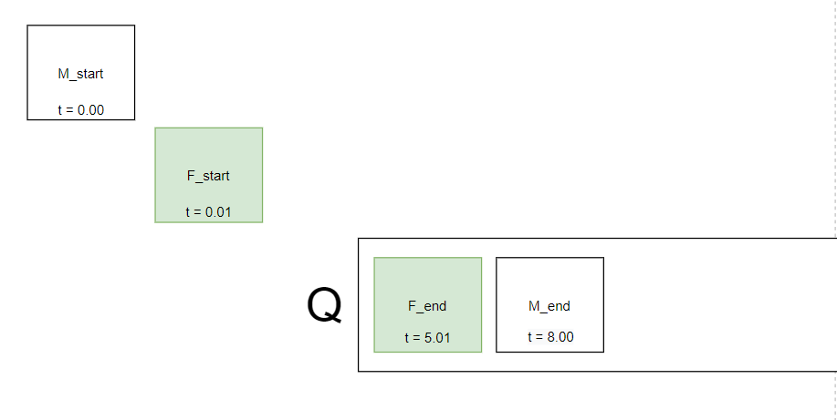
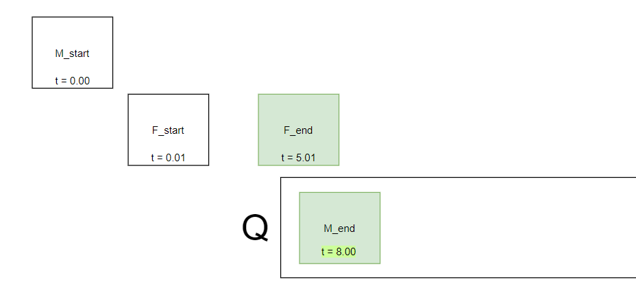
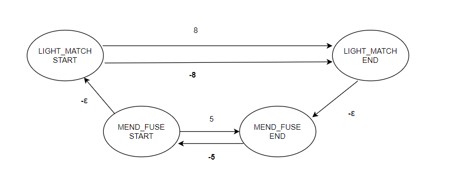
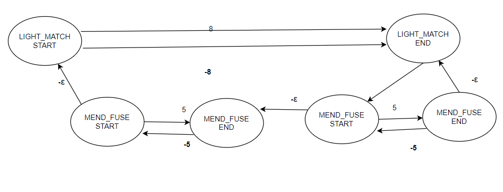

a) the A* algorithm is base on the distance from the initial state plus the heuristic value assigned to S. In case h(S) = 0 for all the state, A* behaves like a breadth first search. So, it would find the optimal solution.

b) Being disoriented by a false heuristic value, it's unlikely (yet not impossible) for the algorithm to find the optimal solution.

FOR THE NEXT 2 ANSWERS I WILL ASSUME UNSATISFIED GOALS ARE THE MID GOALS AS IN EXERCISE 2

c) The idea to use unsatisfied goals might seem nice, however, imagine some of these goal act like local minima/maxima: this would trick the algorithm and have it believe the solution is, respectively, closer or further than it actually is. So, depending on the problem, this is not guaranteed to find the optimal solution.

d) Honestly, I have no idea what the second precondition of the question means. I guess it refers to the the current state.
In that case, like for the previous one, the algorithm might be tricked by an action which reduces the number of achieved goals, but the is like a local minimum, and from that state, the solution is exactly one action away. So, the optimal solution is not guaranteed in this case either.

----------------------------------------------------------------

4) A fact is static when it is part of the initial state and no operator can delete it.

4.a) Any initial predicate can be deleted, as such, none of them is static.

4.b) Static fact can sometimes be removed both from the initial state and from the action preconditions. So doing, each state can be regarded as "smaller" memory wise, and the time required to check that such precondition is true reduces to 0.
However, there are some other facts that, yet being static, may describe a property of an object, like a colour, and need to be there. In that case, what mentioned before doesn't count anymore.

-------------------------------------------------------------------------

# Week 7 - Temporal planning

1) What are the preconditions and effects of the start and end snap-actions for the LIGHT_MATCH and MEND_FUSE actions?

LIGHT_MATCH:

    start_preconditions:
        unused ?m
        
    start_effects:
        not (unused ?m)
        light ?m
        endable_LIGHT_MATCH

    end_preconditions:
        endable_LIGHT_MATCH

    end_effects:
        not (endable_LIGHT_MATCH)
        not (light ?m)

MEND_FUSE:

    start_preconditions:
        handfree
        
    start_effects:
        not (handfree)
        endable_MEND_FUSE

    end_preconditions:
        endable_MEND_FUSE

    end_effects:
        not (endable_MEND_FUSE)
        mended ?f
        handfree

2) What would happen using a decision epoch planning approach for solving this problem? Could the goal be reached? Sketch out the state-space for this: the actions applied, and in each state, the queue of unfinished actions.

3) There is one (hopefully obvious) solution to the problem – light the match, then whilst the match is lit, mend the fuse. Sketch out the STN for this. (Don't forget epsilons.)

4) If there were two fuses, there is a logically feasible solution – light the match, then whilst the match is lit, mend both fuses. Sketch the STN for this. Is it a temporally feasible solution? If not, why not, and how does the STN show this? Could there be any other solution?
<!--  -->

   It is not feasible as the match lasts for only 8 seconds whereas each fuse requires 5 seconds (8 < 5 + 5)

   It is shown by the fact that the last mend_fuse_end snap happens after the light_match_end snap.

   It would be feasible in the case these actions could be performed in parallel, but one more freehand is needed.
   
5) Sketch the temporal relaxed planning graph for the initial state for the version of the problem with two fuses. Could a relaxed plan be found? If yes, why? If no, why not?

