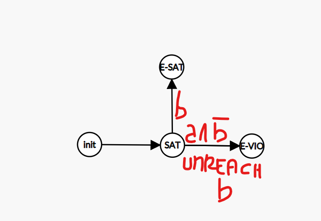
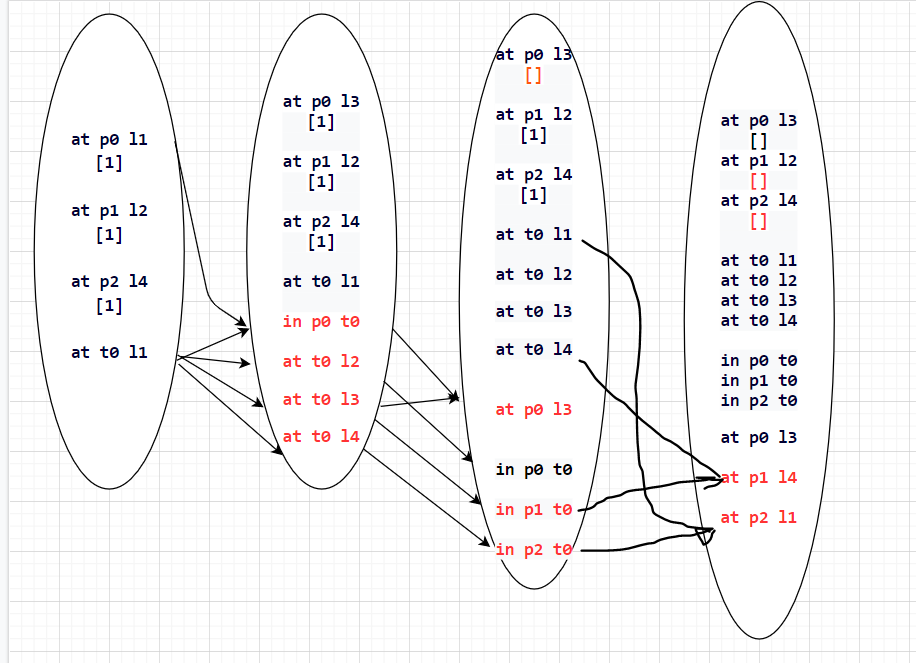

#### 1) For each of the following, what form of preference would you use?
+ Go to your friend's house at some point today
> (preference x (**at-some-point (at my_friend_house)**))
+ Before you go to your friend's house, buy vodka
> (preference y (**sometime-before (at my_friend_house) (buy vodka)**))
+ If you go to your friend's house, make sure you get home afterwards
> (preference z (**sometime-after (at my_friend_house) (at my_home)**))
+ Don't finish the day with a traffic cone in your house
> (preference a (**at end (not (at cone my_home))**))

---

#### 2) Sketch the automaton for (sometime-before (in-bed) (brushed-teeth))
> a = `Go to bed`  &nbsp; &nbsp; &nbsp; b = `Brush teeth`

E-SAT can be reached by applying **B** before **A**.
E-VIO can be reached by applying **A** before **B** or if **B** is nor reachable

---

#### 3) Consider the following simple logistics problem:
- There are four locations: loc1, loc2, loc3, loc4
- There is one truck, starting at loc1 (i.e. '(at truck loc1)')
- The truck doesn't need a driver, and can drive from anywhere to anywhere, e.g. (move truck
loc1 loc2)
- There are three packages, which can be loaded or unloaded from the truck.
    - pkg0 starts at loc1
    - pkg1 starts at loc2
    - pkg2 starts at loc4
- Each has a goal preference that the plan can meet, and there is a cost of 1 for each goal
preference not met:
    - pkg0 needs to get to loc3
    - pkg1 needs to get to loc4
    - pkg2 needs to get to loc1

