# FreeCell

With cg plans tend to be shorter but the states expanded (and inevitably also the evaluated) are way more:

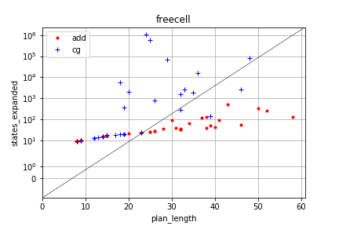
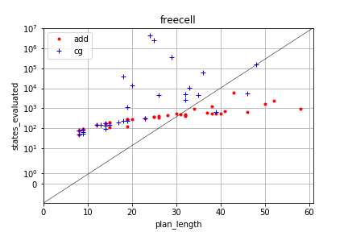

This leads to longer time spent searching:

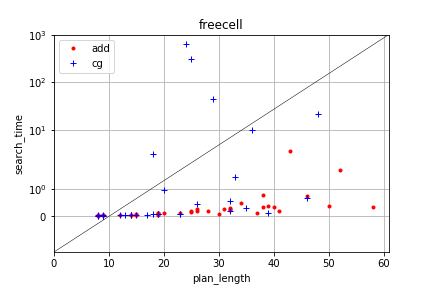

# Blocks World

Same as for FreeCell, but notice the elbow that is made when x = search_time:

This happens in all the plots having search time on the X axis, indicating that at some point, the search time increases way more than anything else.

I assume that getting this problem longer would lead to a point where the time is spent mostly on searching.

Both the heuristics seem to be affected, but the cg is still way more expensive

One thing to notice is that the total time spent is mostly just searching time.

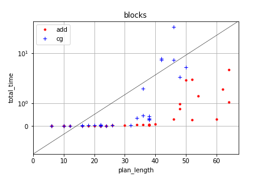

The plan cost is definitely higher in h_add but the search is less expensive.

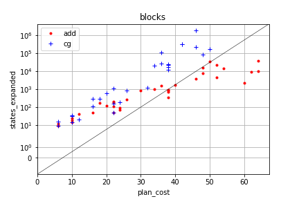
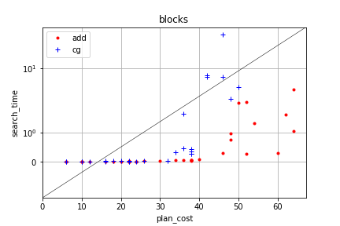

This can be become an issue if there is a time constraint on the search as the difference becomes huge on larger problem:

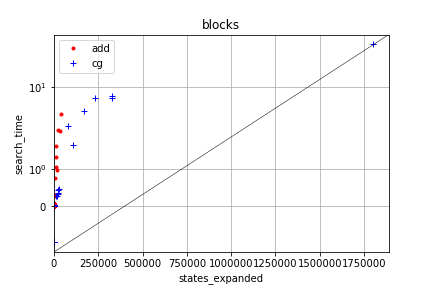

# Depot 

In this case, once again, cg is more complete, but the number of states expanded is not as bad as for blocks world:

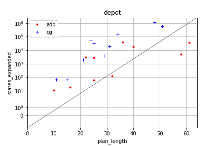
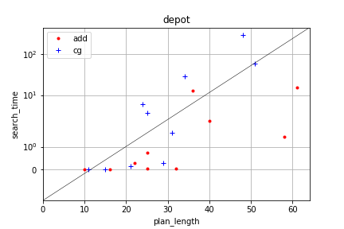

# DriverLog

In the driver log, just like the Depot, h_cg finds cheaper solutions and it the search time is not that bigger:

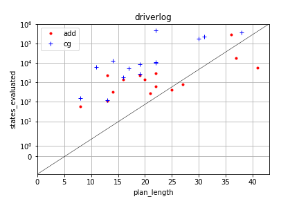

Nonetheless, the states expanded are way more:
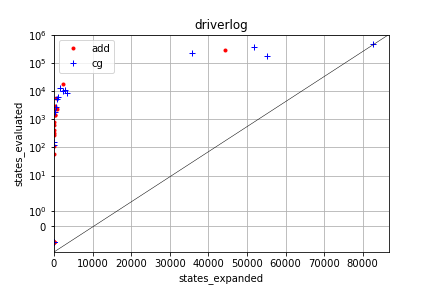

## About h$^{ADD}$
hadd is notoriously inadmissible, but works pretty good in absence of local minima as it performs a sort of gradient descent.