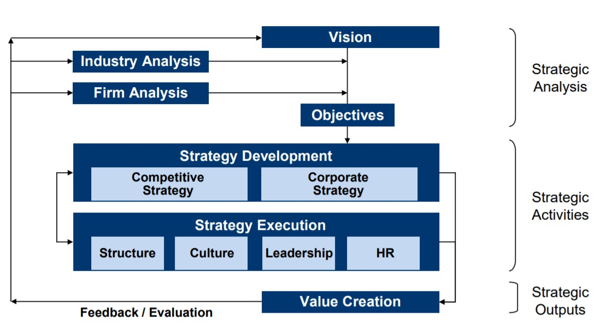
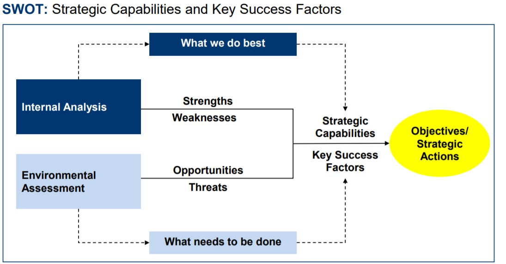
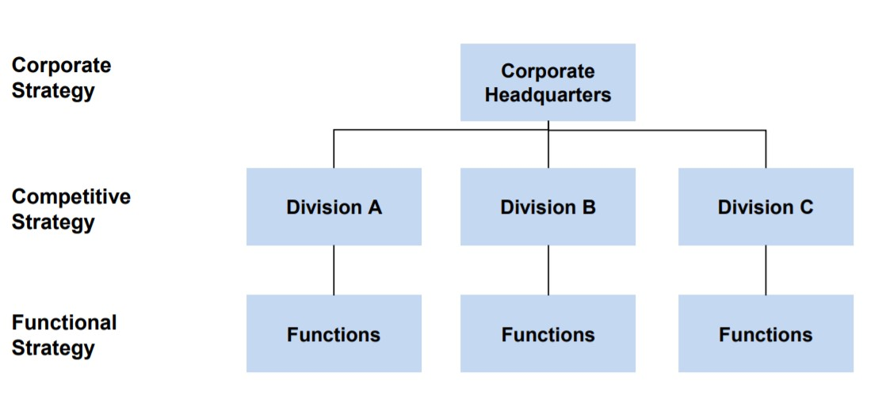
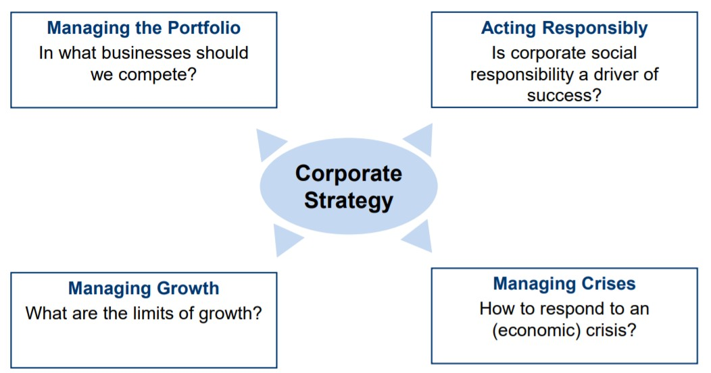

[TOC]

# 1 - Introduction to Business Strategies
<v>1</v>

## The Strategy process

1. **Strategic Analysis**
Vision and Objectives are informed by industry analyses.

2. **Strategic Activities**
Develop concrete strategies and implement or execute them.

3. **Strategic Output**
The value created by this firm. This step provides feedback to start over a new strategic analyses.

<definition>The <b>attractiveness</b> of a an industry is the potential to achieve profitable financial returns.</definition>

## Strategic Analysis - Objectives

There exists 2 types of analyses about a company that provide insights:
- **internal** (or firm) analyses;
- **external** (or industry) analyses
  
The two of them are combined together by the **SWOT** (strengths, weaknesses, opportunities, and threats) analyses.

SWOT provides a means to determine whether a firm has necessary resources and competences to face a changing environment.

First, it is necessary to identify important evolutions in the environment.
Seconds, identify the resources and competencies of the organisation (**strategic capabilities**).

Third, compare the strategic capabilities of that firm with the key success factors to compete in that environment.

The goal is to achieve a balance between the 2 aforementioned things. To do so, a company may **modify the strategic capab.** (developing or acquiring new competencies or resources) or **entering/leaving** a market. 

## Strategy Development

- **Corporate Strategy**: affect the whole organisation. For instance, social responsibility tasks. 
- **Competitive strategy**: affect a sector. For instance, car maker which makes limousines as well as trucks, the decisions cannot be the same.
- **Functional Strategy**: such as HR or Marketing. [NOT TO BE DONE IN THE COURSE]

<definition><b>Higher perceived value</b> == <b>competitive advantage</b> == <b>higher prices</b></definition>

To have a **competitive cost advantage** means that the expenses for a company are lower as compared to those of the competition.

### Corporate Strategy

- **Managing the Portfolio** is particularly important for multi-company dealing with different businesses.
- **Managing Growth**: growth by developing new products or are there fast-pace acquisitive growth? 

### Competitive Strategy

Companies seek 2 main strategies to win the market share:

- **COST LEADERSHIP** means to offer goods and services to at a significantly lower price (EasyJet, Wish, Ryanair, Wallmart)
  In terms of resources and capabilities, such a firm focuses heavily on cost efficiency to lower the cost.
   

- **DIFFERENTIATION** when a company differentiate to the competition to create a **higher perceived value** than their competitors. This can happen by tackling a luxury market, as well as when the company deals with mass market such as Coca Cola.

 
 
 
 
 
 
 
 
 
 
 
 
 
 
 
 
 
 
 
 
 
 
 
 
 
 
