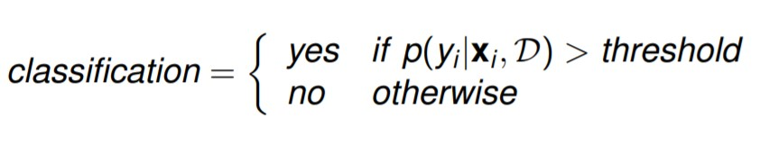
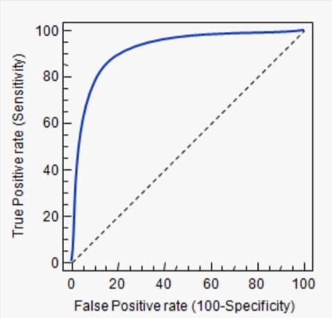
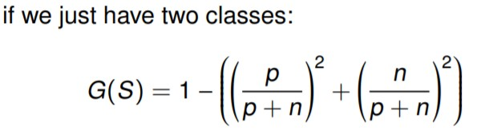
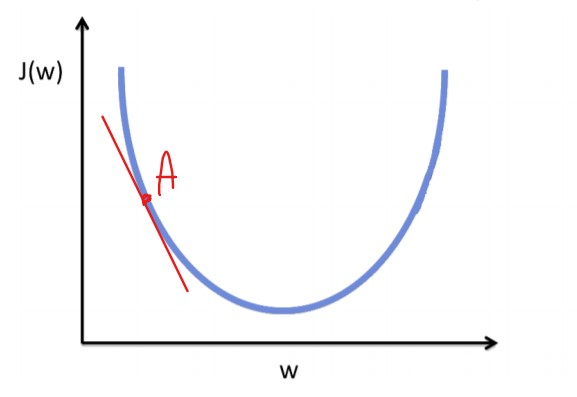
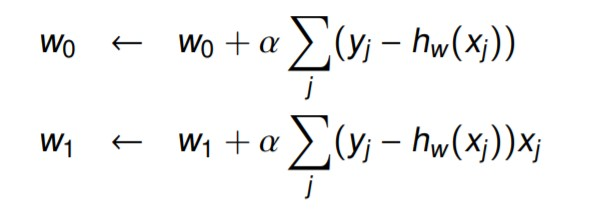
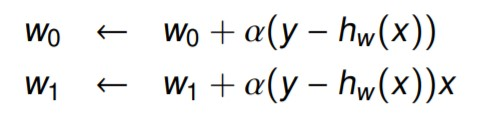
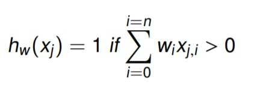
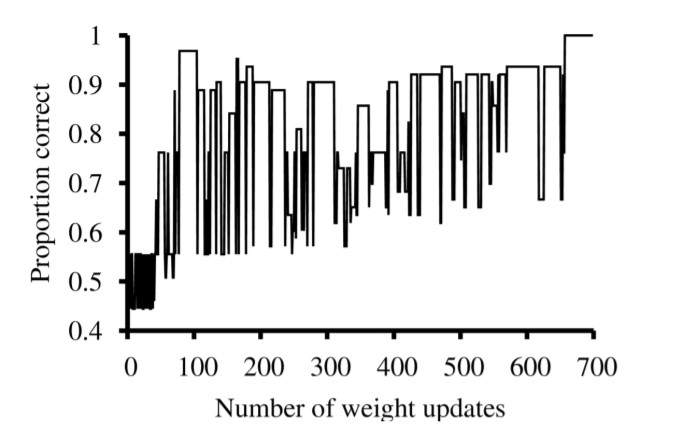
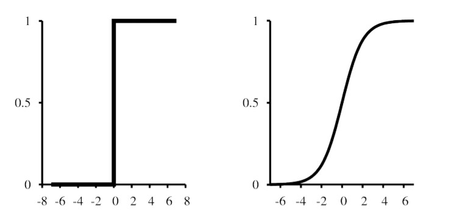

[TOC]

# 1 - Introduction

## Supervised Learning
<v>2</v>

<definition>**x** (bold) it means it is a vector of features.</definition>
<definition>D is the input data</definition>

<b>Generalisation: </b>we want our model to generalise because of the **long tail** problem
<v>3</v>
- **Classification** or **Pattern Recognition** (Virginica, Setosa, Versicolor)
- **Regression** (1 to 10)
- **Ordinal Regression**: Elements are discrete (grades A to F), but they are in order (imagine a regression and then you do the batching).

Given a function f(**x**) = y [A function which maps our inputs to the right output], we want to create an approximation function denoted as f_hat, and the output is y_hat.
> <yhat></yhat> = <fhat></fhat>(x)

We do not map the function to an exact output, rather, we use probability in the form:

$p(y_i | \textbf{x}_i, D)$
> the probability of being in each class, given the input and the set of training data

The previous formula is the same as $p(y_i | \textbf{x}_i, D, M)$. The latter only specifies the model used (M), but the result is the same.

Given the probability notion, the prediction formula is:

<yhat></yhat> = argmax~c~(y = c| **x**, D)

> c is the class, and we repeat probability for all the classes in C (note: c (lowercase) is the class, C (capital) is the set of all the classes)

<v>4</v>

In unsupervised learning you want to find the probability of 
p(**x**| D)

> **Note:** that you find a multivariate distribution as opposed to supervised learning probability.

<definition>Model selection means finding the right parameters for a model</definition>

In **Clustering**, as we want to find the right **K** we use the formula:

K = argmax~k~ p(K | D)

<v>5</v>
A model is said to be **parametric** when we make assumptions about the data.
> e.g. In a clustering model, if we make the assumption that each cluster has a Gaussian distribution, the model is parametric.

**non-parametric** models are more flexible and simpler to compute, but are also more innacurate.

<v>6 & 7 from precision</v>

**Misclassification rate** = $\dfrac{1}{N}\sum{(misclassified)}$

**Accuracy** = $\dfrac{TP + TN}{TP + TN + FP + FN}$

**Precision** = $\dfrac{TP}{TP + FP}\quad$ [or &nbsp; P(v | t) ]

**Recall** = $\dfrac{TP}{TP + FN}\quad$ [or &nbsp; P(t | v) ]
> Also called sensitivity or true positive rate

## The F score 

The F~1~ (or simply F) score is simply the formula:

F~1~ = $2 \times \biggl( \dfrac{precision \times recall}{precision + recall}\biggr)$

The formula can use different values to weight precision differently:

F$_\beta$ = $\beta^2 \times \biggl( \dfrac{precision \times recall}{\beta^2 precision + recall}\biggr)$

F~2~ and F~0.5~ are also commonly used:
- β = 2 weights **recall higher**
- β = 0.5 weights **precision higher**.

## ROC Curve (receiver operating characteristic)
Given the formula to classify inputs in 2 possible classes:

We plot pairs of TP and FP (as we vary the threshold)

- Dotted line is performance of a random classifier (on average)
- For a good system, the graph climbs steeply on the left side.
- Area under the curve is related to the probability that the classifier will correctly classify a randomly chosen example

If the data is **unbalanced**, you may want to replace the *Specificity* with the *Precision*

As data is often unbalanced in the real world, we prefer Precision and Recall to Accuracy

# 2 - Decision Trees

<v>1</v>

## Plurality Classification
Using a decision tree you may end up in a leaf node with no examples. In such a case you can use the **Plurality Classification** (the best guess is based on the parent node).
- could be **majority**, ie., Yes if most examples at the parent node are classified “Yes”.
- could be **random pick**, weighted by ratio of examples at parent node.
- could be a **probability**, based on the ratio of examples at parent node

Another situation could be that you still have examples, which are not homogenous, but no more features to use. Again you can use the **plurality classification**, but on the node itself rather than the parent node.

<v>2</v>

## Impurity Measures

To measure the impurity of a state $S$ there exist different techniques/

### Entropy

The formula 
> $H(S) = H(\braket{P_1, ...\ , P_n}) = - \sum^{n}_{i=1} P_i \cdot log_2(P_i)$

expresses the entropy of a state. It ranges **from 0** *(heterogeneous)* **to 1** *(homogenous)*.

### Information Gain
Comparing the *entropy* of a state with its parent node, we can tell how much we improved, or *how much information we gained* **(information gain)**.

Given the feature $A$ used to split the state $S$ into subsets $S_i$ (each $S_i$ is a new branch with its own entropy):
> $Gain(A, S) = H(S) - \sum_{i} \dfrac{|S_i|}{|S|}H(S_i)$ 

The issue with the information gain formula is the bias. *Gain* favours features that have a lot of values (the name of a restaurant which is unique, but technically irrelevant, is subject to high bias and uniquely identify each case).

The solution is to introduce a metric which penalises features with many values. This is the **Split Information** formula:
> $SplitInformation(S, A) = \sum^{c}_{i=1} − \dfrac{|S_i|}{|S|} \cdot log_2\dfrac{|S_i|}{|S|}$

Now, we can calculate the final formula that we use:
> $GainRatio(S, A) = \dfrac{Gain(S, A)}{SplitInformation(S, A)}$

**Note:** when the splitInformation increases, the GainRatio is smaller, so features with many values are less relevant.

## Gini
Gini impurity is the probability of this classification mislabelling
a randomly selected example.

It ranges **from 0** *(homogenous)* **to 0.5** *(heterogeneous)*.

Given a set of classes $c$, Gini index is given by the probability that a random example belongs to class $i$ ($\sum^c p_i$)
times the probability it would be misclassified ($1 - p_i$)
> $G(S) = 1 - \sum^c p_i^2$

> e.g. 

Gini impurity is derived from the formula:

> $G(S, A) = \dfrac{|S_i|}{|S|} G(Si)$

The lowest the Gini impurity, the better.

<v>3</v>

## Tree pruning
A tree $d$ **overfits** another tree $d'$ when $d$ error is smaller on the training set, but larger on the test set than $d'$.

There are 2 options:
- Stop training at some point;
- Allow for full training (possible overfit) and then **prune** [generally performs better than the other option].

### Reduced Error Pruning
For each branch, prune that branch and test the tree without it. If after the prune the tree performs better on some validation (or development) set keep it pruned, otherwise go back to the previous tree state.

Stop this process when no improvements can be made.

### Rule post-pruning
In case you have a small dataset, you want to approach the problem differently. The **rule post-pruning** considers each node as a logical comparison (WEATHER = {Sunny, cloudy, rainy}) and for node different from the root, these comparison are joint together using AND logical operators.
This comparisons are eventually called **rules** and the tree can prune them instead of branches.

## Linear Regression
<v>4</v>

$\omega_i \larr \omega_i - \alpha \dfrac{\delta}{\delta \omega_i} Loss(\omega)$

The derivative indicates the slop:
- if the slop is negative, the converge comes by increasing $\omega$

> 
> J(w) indicates the Error.
> 
> In this case, when $\omega$ = A, the derivative has a negative slop, so we increase $\omega$. 

There exist 2 gradient descent algorithms:

- **batch gradient descent**: 
guaranteed to converge, but slow as it computes the error on all the inputs together.

- **stochastic gradient descente**
much faster, but updates $\omega$ on one input at the time, hence, if learning rate is constant, may not converge. Can often be made to converge by decreasing the learning
rate over time.

> note that, for both the approaches (in the pics) the first formula updates w$_0$, hence there is no $x$ involved. However, having x~0~ = 1 creates 2 parallel vectors **w, x** of equal length. 

<warning>
    The gradient descent always updates the parameters <b>simultaneously</b>.
</warning>

The final function, the one that will map the input x to a predicted y is:
$h_w(x) = w_1x + w_0$

This function is called **univariate** as there is just one input variable (x).

<v>5</v>

## Logistic Regression

Suppose that instead of a function which predicts the output, you use a **discriminant function** (classes are supposed to be linearly separable).

The result is a inequality such as:
> $w_0 + w_1\cdot x_1 + w_2\cdot x_2 > \theta$
>
> [ **Note** that x~2~ is not x^2^, rather, the feature no 2. ]
> or 
> 
> 

To update **w** we use the same technique of updating the wights based on the error, and it is common to use the stochastic gradient descent (which explains why error is so unstable during the learning process).

> 

This boundary is very hard, and an input is labelled either classes with confidence = 100%. 
The logistic curve, instead, assign a percentage score which is not that drastic.

**Logistic Function**:
> $h_w(x) = \dfrac{1}{1+e^{−w·x}}$

<v>6</v>

## Ensembling

A single predictor model could present some error. To reduce it, we can combine multiple predictor models (using different techniques of course) so that each of them "votes", and the prediction is equal to the majority of the votes.

### Boosting
**Boosting** is a type of ensembling. Samples come with a weight, and the higher the weight, the more important is the sample during training.

It works this way:
- Starts with all examples of equal weight, and learn a **classifier h1**.
- Test it.
- Increase the weights of the misclassified examples and learn a new **classifier h2**.
- Repeat.
- Final ensemble is the combination of all the classifiers, weighted by how well they perform on the training set.

### AdaBoosting
A commonly used boosting algorithm is the **AdaBoosting**.
Given an initial classifier that is slightly better than random (weak model), AdaBoost can generate an ensemble that will perfectly classify the training set.

### Bagging
**Bagging** create multiple training sets from the original training set and uses them to generate multiple classifiers that are ensembled together.

<question> Is the splitting the same as the K-fold cross validation?</question>

Ensembling results can be combined using voting, or averaging, or weighting.

### Random Forest
Makes use of *bagging* applied to decision trees (using bagged training subsets). PLUS, a random selection of features is used for each tree in order to push decision boundaries away from each other.

### Random sub-space method
Is the technique used to split the training set into multiple subsets by using random features. This technique is used for Random Forests, but other algorithms make us of it as well.

> In essence, you do not just split the training set X_train, but you also split the features that compose it, leaving some of them out. [If I got this right]. 

 
 
 
 
 
 
 
 
 
 
 
 
 
 
 
 
 
 
 