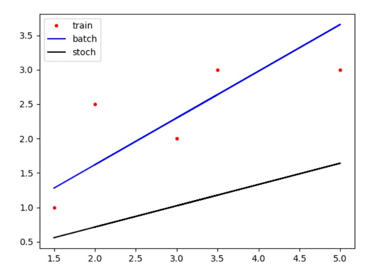

# 1
(a) Describe how a decision tree could be learnt from this data.
> Input = "Example" & Output = "Streamed"
> Given the features (New Release, Language, Type) we can create a tree which, at each node, splits the input data based on any of these features. For example, given the language feature, we can create 3 sub-branches.

(b) Show how the idea of entropy could be used to pick the first node in the decision tree.
> When we use a selection tree, at each node we aim to reduce the impurity, that is, we want to increase the rate of any label over the others, so that the path to such a node better predicts the label of unseen data. The entropy can be used as a good index to make this decision, in fact, we can use it to measure how much impure a node is (0 = perfect, 1 = max impurity). If we make a weighted sum of the generated nodes, and compare that sum for each feature we can use, it will be indicative of the best feature to use.

# 2
Answer 1.b using Gini impurity rather than entropy.
> The idea is the same. Gini tells us how impure a node is, but ranges from 0 (perfect) to 0.5 (max impurity).

# 3 
(a) What does the term “linearly separable” mean with respect to a data set?
> Given some data, we can define a linear function (I am not considering the kernel trick here) which separates all the data perfectly: on one side of the function all the elements belonging to a specific class, on the other side, all the elements belonging to other class. Note, this discriminant function separate data that belongs only to 2 possible classes. 

(b) Give an example of a data set that is linearly separable and one that is not. For this exercise find an example online that is different from the one that I showed you in the lecture.
> A non-linearly separable set could be any containing more than 2 classes. A linearly separable one could be whether or not a person has more than 70. As long as this example is stupid, it perfectly describes what linearly separable is in a context of continuous value.

(c) If you had to design a classifier to work on a particular dataset, how would the knowledge that the dataset was not linearly separable affect the method that you chose to use?
> It really varies on the dataset. I could opt for a polynomial linear function which still manages to correctly classify the data. An SVM could still do the trick. I could use the Kernel trick, clustering (perhaps using DBSCAN), or introduce the notion of probability, which means that I am aware that the data will hardly be always correctly classified (outliers always exist), but I express a probability which defines how sure the model is about the prediction.

# 4

# 5 
I would do the same as a polynomial regression, that is, update all the parameters contemporary. Consider the formula:

> $z = ax + by + c$

The **W** vector would be [w~c~, w~b~, w~a~], and I would just update all of this values at the same time, just the same way as a univariate linear regression.

Alpha would do the same as for the linear regression.