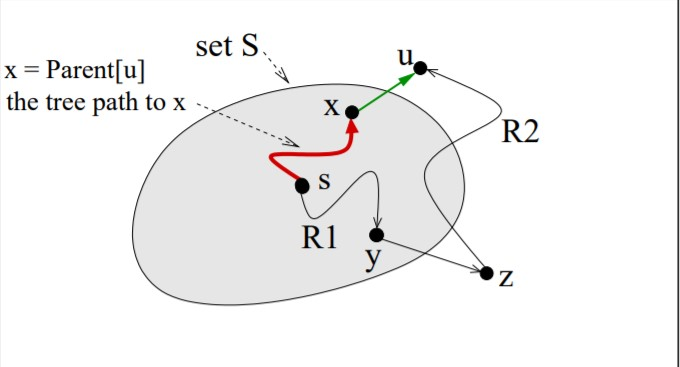

[TOC]
# 1 - Shortest Path
<v>1</v>
<definition>A path is said to be <b>simple</b> when it contains no cycles </definition>

Given a digraph $G = (V, E)$, we denote:
- $w(u,v)$ => the weight of a path;
- $s \in V$ => the source vertex
- $\delta(s, v)$ => the weight of the shortest **paths** from $u$ to $v$

## useful rules
1. A subpath of a shortest path, is in turn a shortest path.
2. **Triangle inequality**:
    For each edge $(u, v) \in E, \delta(s,v) \le \delta(s, u) + w(u, v)$
    > In a shortest path, summing the sumpaths must lead to a result not better the total shortest path (or possible substitutes edges).

To map a graph where you should multiply the elements when you traverse an edge, to one where you sum them (currency exchange rate graph) use a logarithm.

Given a graph with a starting point $s$ and a destination $v$, we assign to each edge the weight obtained from the shortest path. 

- If the node is not reachable, its weight is $+\infty$
- If there exists a negative cycle, the interested nodes have weight $-\infty$ [like at the bottom]

<info>
    In graphs with negative cycles, we do not ask our algorithm to deal with them as no efficient algorithms exist to find even simple paths.
</info>

<v>2</v>

A meaningful way to represent shortest paths is to use **shortest-path tree**. In shortest path trees, we store the elements with a reference to their parent
> e.g. PARENT[x] = y

The source node, as well as all the nodes not included in the tree (because not reachable from the source) have PARENT[node] = Nil.

Using the array of parents makes the storage required **linear: $\Theta(n)$ (memory)**

<warning>From a source $s$ to a node $v$ there may be multiple shortest path. In this module, we are interested in finding just one. Using the shortest path tree having $s$ as a source, we have just one shortest path to each node $v$ reachable from $s$.</warning>

Should we want to use an explicit representation instead (for each node, we include the path from the source) the memory required increases and becomes $\Theta(n^2)$.

## Relaxation technique
> not specified, but $u$ comes before (is the parent of) $v$ usually.

Consider the graph:

1. **INITIALIZATION**
    - Assign a score of $s = 0$ and $v = +\infty$ to all nodes but the source. 
    - All the nodes' parent is $Nil$.
    You should have the following table:
    

2. **RELAXATION** 
    
    Given the shortest path for 2 linked nodes ($d[u], d[v]$) reachable from a source, and the weight of the edge between them $w$:
    **if** the shortest path to $v$ is greater than the shortest path to $u$ + the weight of their edge, **then** the shortest path found so far for $v$ is not optimal and it is replaced by the shortest path to $u$ + the said edge. 

<v>3</v>

## Relaxation properties
1. **Non increasing Shortest Path estimate**: During the computation a shortest path can only decrease the estimate (and does that in the relaxation phase)
2. The **shortest path estimate $d[v]$** can only be $\infty$ or **the weight of some path from $s$ to $v$**

3. **Upper Bound Property:** the estimate for a node ($d[v]$) is never better the actual shortest path($\delta(s, v)$:
    $d[v] \ge \delta(s, v)$

4. **No-path Property**: If there is no path from $s$ to a node $v$, the SP = estimate = $\infty$
    $d[v] = \delta(s, v) = \infty$

5. **Convergence Property**: if a path to a node is already the shortest path, its estimate will never decrease. 

6. **Path-relaxation Property**: Using recursion (applying the convergence property) if a path is the shortest path (and the path starts from $s$ to $v$) then $d[v] = \delta(s, v)$

=== Parents properties ===

7. $d[u] + w(u,v) \le d[v]$ in the current subgraph

8. If there are no negative cycles, the parent subgraph is a tree $T$ and $d[v] \ge$ the path from $s$ to $v$ in $T$

9. When all the nodes in the tree are linked to $s$ from a SP, no further updates can be performed and the tree is the shortest-paths tree.

<definition> An effective <b>delete relaxation operation</b> is a relax operation which decreases the estimate of a node.</definition>

10. The delete relaxation can progress until the SP hasn't been reached yet. This happens when:
    - There exists a vertex $x ∈ V$ such that $d[x] > δ(s, x)$, (OR)
    -  There exists an edge $(u, v) ∈ E$ such that $d[v] > d[u] + w(u, v)$ (that is, another effective relax operation is possible).  
    
If there is a **negative cycle** on the path to a node $x$ reachable from $s$, we know that $d[x] = -\infty = \delta(s, x)$, but (from property 10), $d[x] > \delta(s, x)$, hence, we can keep relaxing this forever.
By checking (periodically) if there is a cycle in the PARENT array, we can detect the presence of a negative cycle. This way we can avoid infinite loop, so we can turn any relaxation technique computation into an algorithm 

<v>4</v>

## Bellman-Ford Algo

This algorithm runs in $\Theta(n\cdot m)$ where $n$ is the number of nodes and $m$ the edges.

If there are no negative cycles, the first loop (`1:`) achieves the shortest paths for all the nodes.
> If the length (the number of edges) of a shortest (simple) path from $s$ to a node $v$ is $k$, then at the end of iteration $k$ (of the main loop 1) in the Bellman-Ford algorithm, $d[v] = δ (s, v)$.

### Speeding up the algo

- The loop 1 runs at most $n - 1$ times, but it can be speeded up. If for a whole iteration the nothing gets relaxed anymore, the algo can exit the loop. (in case of negative cycles this is ofc not possible).

- If a path to a node (called **active**) gets relaxed in a previous iteration (of the outer loop), it makes sense to propagate the effect to all its outgoing edges (direct children), but not to its ancestors.
    > a vertex is **active** if the edges outgoing from it has not been relaxed since last time its estimate was decreased.

- Using a **Queue** wherein you pop the top element and apply the RELAXATION step to all its children.
If the SP of any children decreases this way (and that node is not in the Queue already), add that child to the queue.
In case of negative cycle, the queue is never empty and the loop goes forever. To prevent this, check periodically if there are cycles in the PARENT array.
Even this approach runs in $\Theta(m\cdot n)$

# 2 - Dijkstra

<v>1</v>

## Dijkstra Algo

**Crucial assumptions**: all edge weights are ***non-negative***.
> For convenience, assume that all nodes are reachable from $s$.

Dijkstra algorithm deals with directed acyclic graphs (DAG), more specifically, there are no negative edges.

For all graphs where Dijkstra can be used, Belmann-Ford algo may also be used, but it would be slower.

**Process:**
1. Create a ***priority queue*** where the key is the estimate distance (0 for $s$, $\infty$ for the other nodes).
2. Create the shortest path tree $S$, which is originally empty. 
3. pop the first element $u$;
4. if $u$ is not in $S$, add it;
5. using relaxation, update the shortest path to all the nodes reachable from $u$;
6. if the Queue is not empty, repeat from **3**.

At any point:
- the nodes already popped are in $S$;
- the nodes reachable from any nodes in $S$ have distance < $\infty$.

An algorithm to find the shortest path is said to be **correct** when all the shortest path estimates at the end are equal to the shortest paths, and the parent subgraph is the *shortest path tree*.

### Proving Dijkstra's Algo
The prof is from induction

**Inductive hypothesis**
All the nodes in $S$ are shortest path

**Inductive Base**
Node $s$, which is first added to $S$, is the shortest path to itself

**Inductive Step**

The next element we would add to $S$ is $u$.
Because of our hypothesis, we know the $d(x)$ already is the shortest path since it is in $S$.

We need to prove that $d(x) + w(x, u)$ is shorter than any path $R$ we can find that goes from $s$ to $u$.

As any alternative path to $u$ having the same length as $s\rarr x\rarr u$, but heavier weight, would be discarded as we only take the shortest path, in order to exist $R$, it has to be longer, that is, passing by a node ($z$) which is reachable from $S$, and from such a node we reach $u$. 

We have that $R = R_1 \rarr y \rarr z \rarr R_2$, so

> $w(R) = w(R_1) + w(y, z) + w(R_2)$

By our inductive hypothesis, the path $R_1$ cannot be shorter than $d[y]$, ( **R~1~ ≥ d[y]** ) so

> $w(R_1) + w(y, z) + w(R_2) \ge d[y] + w(y, z) + w(R_2)$

The path $y \rarr z$ has to be shortest path connecting R~1~ to R~2~, ( **d[y] + w(y, z) ≥ d[z]** )

> $d[y] + w(y, z) + w(R_2) \ge d[z] + w(R_2)$

<v>2</v>

Dijkstra's algo can be implemented as a priority queue using either:
- **unordered list** $O(n^2)$ 
- **heap** $O(m$ log $n)$
    > Note that $n -1 \le m \le n (n - 1)$, so 
    $O(m) \gt O(n)$  

When the graph is **dense**, that is 
> $m = \Omega(n^2/$ log $n)$ 

the unordered list performs better than the heap in the worst case.
> This is because the heap has $\Omega(n^2)$, whereas the unordered list has $O(n^2)$.

When the graph is not dense, the heap performs better in the worst case.

As in most of the applications using Dijkstra's algo, the graph is not dense, the heap is preferred.

When using the heap, it can be implemented as an array (which explain why the initialisation is $\Theta(n)$ rather then $O(n$ log $n)$).

The array contains pairs $(u, d[u])$ (node, and its estimates), but we also need a parallel array:

<question> Why do we need a second array?</question> 

> **Writing down the heap property for which none of the descendant of a node can have higher values**: $A[i] > A[2i]\quad$and $\ A[i] > A[2i + 1]$.

<v>3</v>
In a DAG, Bellman-Ford algo runs in $O(n^2)$, but given the acyclic property, a better algo running in $O(n + m)$ can be used.

Imagine a temporal problem where all the tasks come some time (weight) after another one.

These tasks can be displayed in topological order (all the arrow pointing to the same direction).

<question>
    <b>Why is it O(m + n) rather than O(n * m)?</b>
    The pseudo code repeats the relaxation O(1) for each edge O(m), and does is for each node O(n), so it should be O(1 * m * n) = O(m n)
</question>

 
 
 
 
 
 
 
 
 
 
 